# 线性代数  
线性代数的全部内容  
矩阵+行列式→n维向量  
矩阵+行列式+n维向量→线性方程组  
矩阵+行列式+n维向量+线性方程组→相似对角型  
矩阵+行列式+n维向量+线性方程组+相似对角型→二次型  
## 一 行列式  
#### 1、行列式的概念  

- 首先注意解二元一次方程组的要求和其解的形式：  

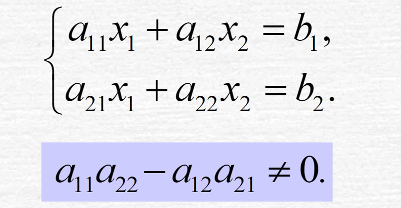
  

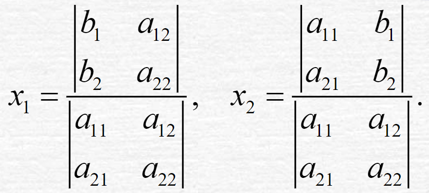
  

其要求行列式≠0，将其与日后矩阵的要求联系起来  

- 三阶行列式要手动记住解法  

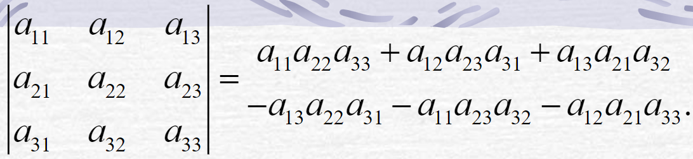
  

#### 2、n阶行列式  
n阶行列式及其计算，主要记住余子式M（正）、代数余子式A（可正可负），那么n阶行列式可以表示成一系列行列式元素及其代数余子式相乘之和：  

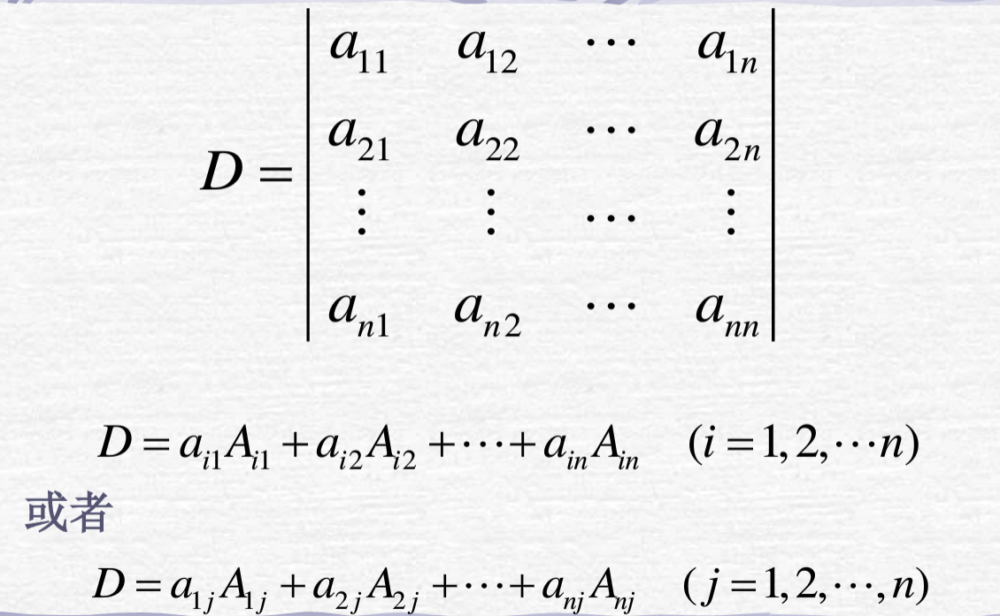
  

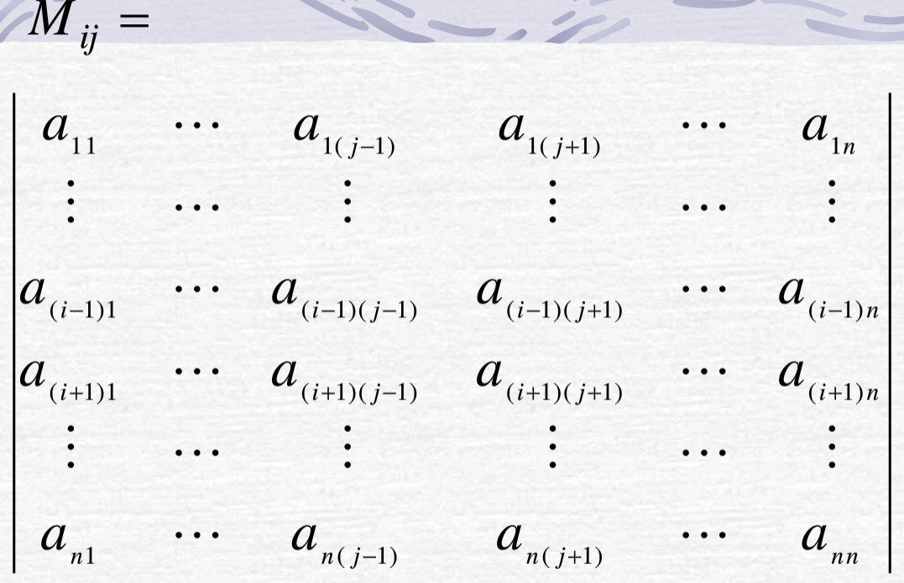
  

其中，Mij就是删掉i行j列后余下的行列式，Aij=(-1)i+jMij  
#### 3、特殊行列式计算  
只需要记住，对角行列式上三角和下三角行列式（|\|）就是对角线元素乘积，斜三角行列式（|/|）对角元素乘积需乘上-1n(n-1)/2
#### 4、行列式运算性质及计算  

- D=DT  
- **互换两行，行列式变号**  
- 行列式有两行元素相同，则行列式为0（上一条性质证明）  
- 推论：行列式的某一行×其他行的代数余子式的和为0（上一条性质证明）  
- **k×||=||的某一行×k后的行列式**（证明：按此行展开）  
- 某一行的所有元素的公因子可以提到行列式符号的外面（上一条）  
- **行列式某一行元素，加上另一行元素的k倍，行列式的值不变**（按此行展开，k×零一行的展开为0）  
- 行列式某一行元素都是m个数之和，则可以拆成m个行列式的和（按此行展开，再拆开相加）  

计算行列式就可以利用上述性质，交换行，行相加等构造三角行列式求出结果  
#### 5、克莱姆法则  

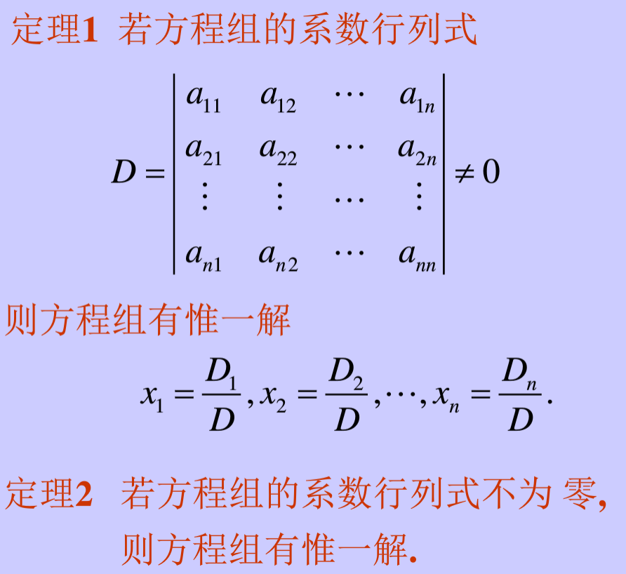
  

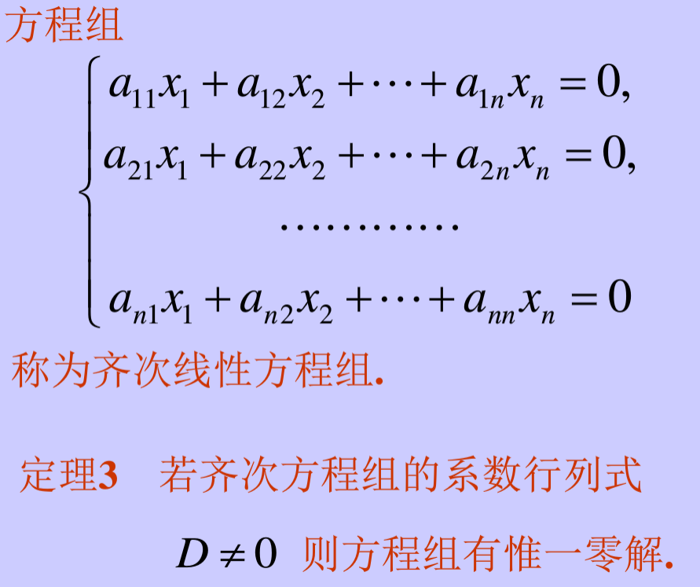
  

因此，要想齐次线性方程组有非0解，需要行列式=0  
克莱姆法则计算价值小，但是理论价值很大，通常使用定理二来阐述，一和三都是定理二的特殊形式  
#### 6、范德蒙行列式和逆序数  
眼熟就行了  

  

逆序数是用来按全排列展开行列式的，用来证明行列式展开定理用，理解其意思就行了  
## 二 矩阵  
1、对角矩阵→要有对角线→必须是方阵  
2、矩阵相乘不满足交换律、消去律，并且有非0的0因子  
3、只有方阵才有正整数幂的概念  

- 若A为方阵，B为方阵，当且仅当AB=BA时，(AB)k=AkBk  
证明：(AB)k=ABAB...ABAB=A(BA)k-1B=A(AB)k-1B，以此类推，(AB)k=AA(AB)k-2BB=AAA...BBB...=AkBk  

4、(AB)T=BTAT可以从定义去证明，也可以这样理解，A是m×s，B是s×n，AB是m×n，(AB)T是n×m，BTAT是n×m，猜也猜得到  
5、任一方阵都可以分解为对称阵和反对称阵的和A=(A+AT)/2+(A-AT)/2  
证明(A+AT)/2为对称阵，(A-AT)/2为反对称阵即可：((A+AT))T=AT+ATT=AT+A，所以为对称阵；(A-AT)T=AT-A=-(A-AT)，所以为反对称阵  
#### 6、方阵的行列式  
奇异方阵：方阵行列式为0（对应的线性方程组不具有唯一解）  
非奇异方阵：方阵行列式不为0  
|kA|=kn|A|  
A、B为同阶方阵，则**|AB|=|A||B|**  
证明：  

- 若A或B为奇异的，则|A|=0或|B|=0，上式相等  
- 皆为非奇异的，则可以分解成一系列的初等矩阵的乘积，|AB|=|P1P2...Q1Q2...B|=|P1||P2...Q1Q2...B|=|P1||P2|...|Q1||Q2||B|=|P1P2...Q1Q2...||B|=|A||B|  
#### 7、伴随矩阵  
伴随矩阵就是为矩阵相乘得到单位阵而生的  
注意看伴随矩阵的排列顺序  

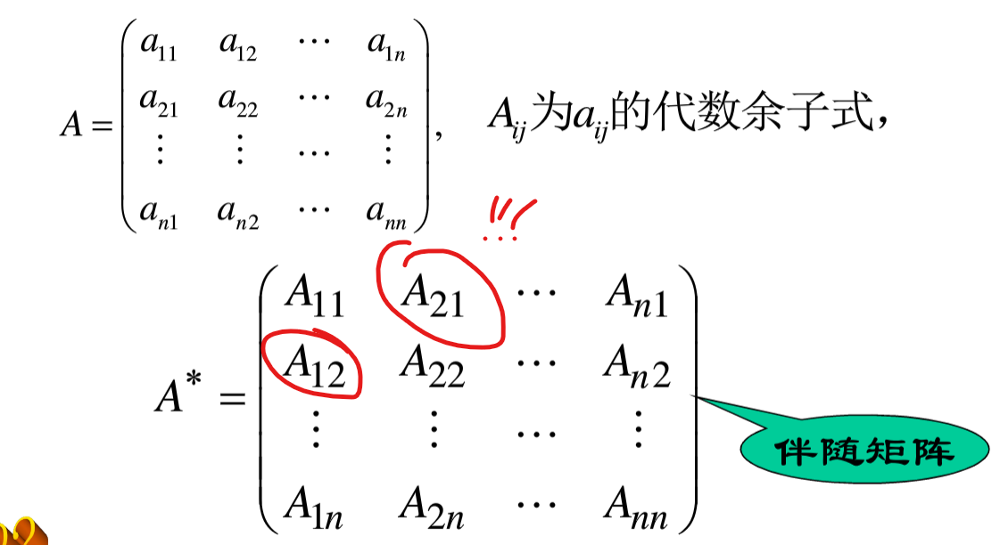
  

把伴随矩阵A*和A相乘就知道伴随阵有什么用了  

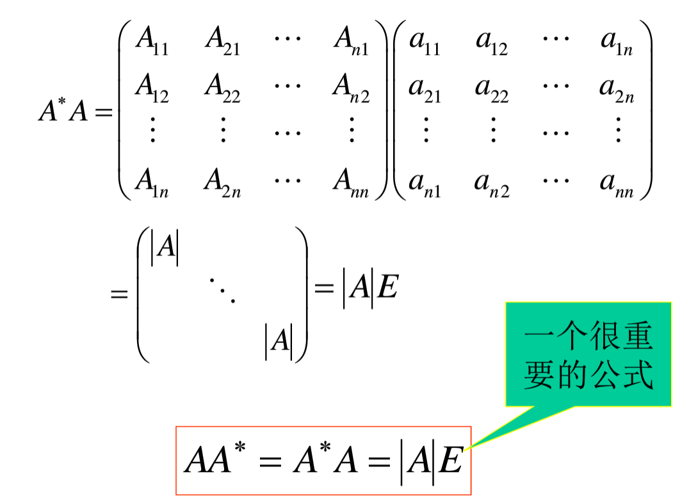
  

一切都是为了AA* = A*A = |A|E  
#### 8、利用初等变换将矩阵变换为等价标准型  
说白了就是利用三种初等变换（换行，行乘系数，行相加）将矩阵变成等价标准型  

  

想一下，如果换成行列式，那么按照三种初等变换，就会变号，×k，不变，对应着行列式的值是会改变的  
#### 9、矩阵的秩  
矩阵的秩→矩阵的最大的行列式不为0的k阶子式的阶数k→初等变换并不影响行列式是否为0，只会改变其倍数，正负，因此初等变换并不改变矩阵的秩→那么矩阵的秩经过初等变换后更容易看出来，即不为0的梯形的行数→满秩矩阵必是方阵，说明了矩阵所对应的行列式不为0，所以其是非奇异方阵，因此**满秩→行列式≠0→方阵为非奇异方阵**  
两个矩阵等价→可以化为相同标准型→具有相同的秩→这是个充要条件  

#### 10、初等矩阵  
对单位阵E做一次初等行（列）变换得到初等矩阵→初等变换不改变秩，因此初等矩阵满秩→初等行（列）变换就是左（右）乘初等矩阵→因此，A满秩，代表A与E等价，A非奇异，A可以表示为一系列初等矩阵的乘积  
矩阵等价的一个推论以及秩的关系，核心思想就是**满秩矩阵可以表示为一系列初等矩阵的乘积**  

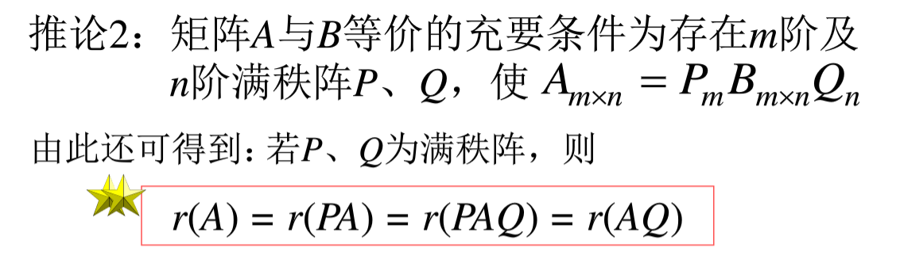
  

#### 11、逆矩阵的定义、性质及求法  
1、设方阵A,AB=BA=E，则称B为A的逆矩阵，称A为可逆的，逆阵唯一，**并非所有方阵都可逆**  
2、现在想想就知道为什么要学习伴随矩阵了AA* = A*A = |A|E，
那么A-1=A * /|A|，前提是|A|≠0  
3、现在可以总结一下了，|A|≠0↔A可逆↔A满秩↔A非奇异↔A的方程组有唯一解  
4、逆阵的性质  

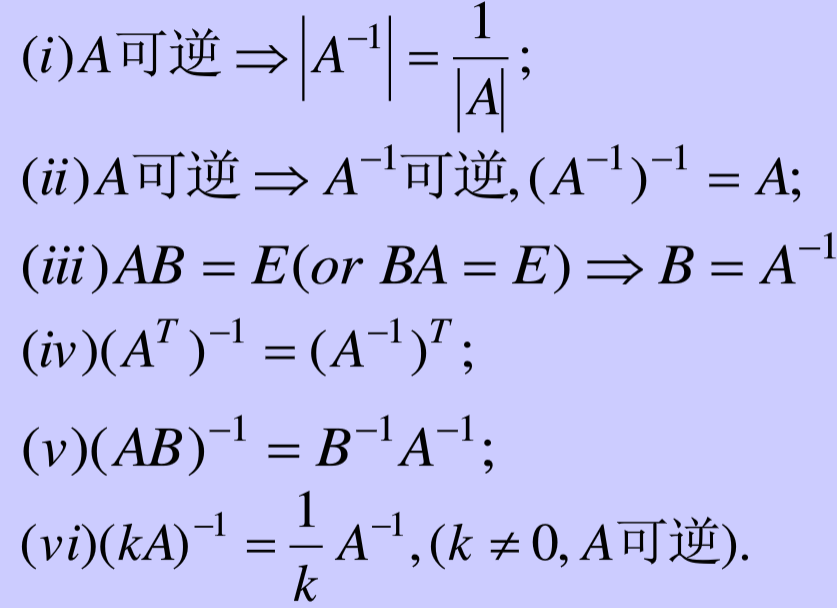
  

- 证明|A-1|=1/|A|：|AA-1|=|E|=1=|A||A-1|，可以看出，|A* |/|A|n=1/|A|，所以|A*|=|A|n-1  
5、逆矩阵的求法  

- 使用伴随矩阵根据公式求解  
- 初等变换法（初等矩阵的逆阵仍为同类型的初等矩阵）：  

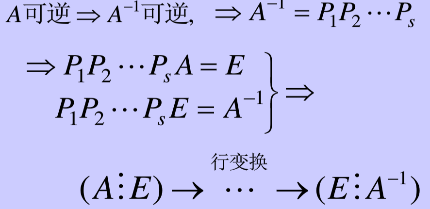
  

- 用定义求，AB=BA=E，则B就是逆阵  
- 证明定义成立，即AB=E成立，则证明B是A的逆阵  

#### 12、分块矩阵  
分块矩阵主要就是查看几种特殊类型的分块矩阵：准对角阵、分块三角阵和斜三角阵，统一特点是求逆阵好求  
#### 13、矩阵方程  
很明显，矩阵的逆就是为解矩阵方程而生的  
## 三 n维向量  
#### 1、向量及其线性运算  

- 记住αT是列向量，只要模是1，那么他就是单位向量，ei表示其是单位向量，且i维是1  
- 记住线性组合的定义，以及特殊地，每一个向量其实都是ei的线性组合：α=(a1,a2,a3...)=(a1e1,a2e2,...)  
- 若两个向量组互相可以线性表示，那么称两个向量组等价  

#### 2、线性相关性  

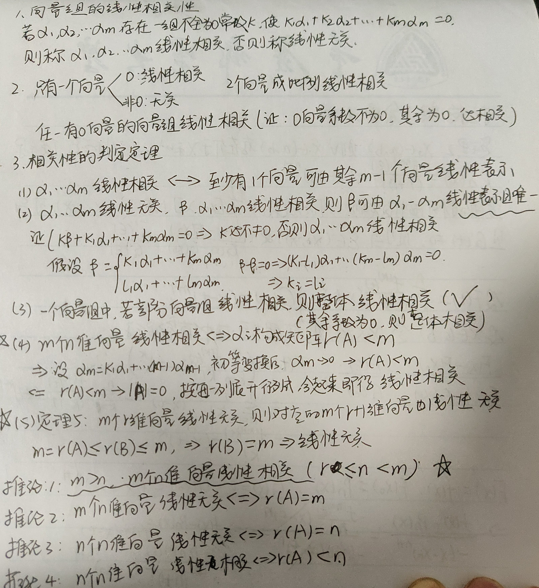
  

#### 3、极大无关组与秩  

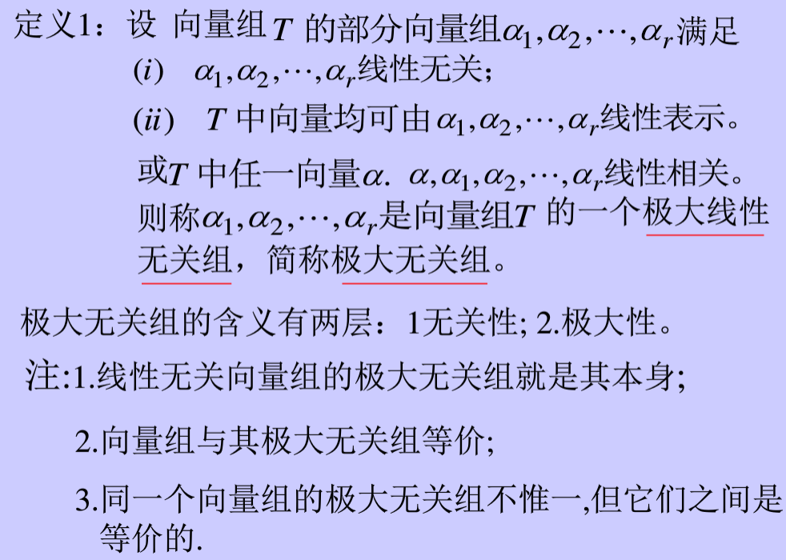
  

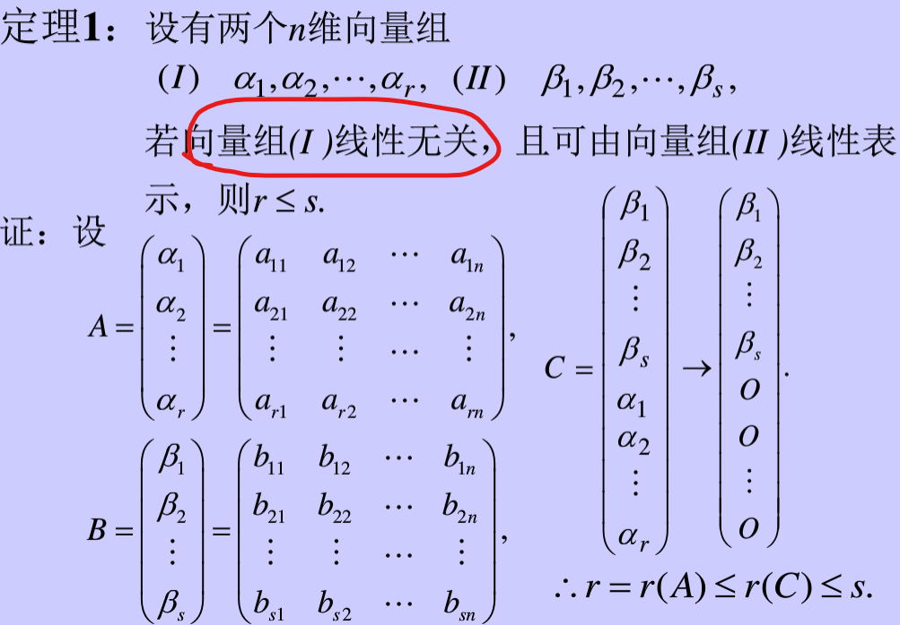
  

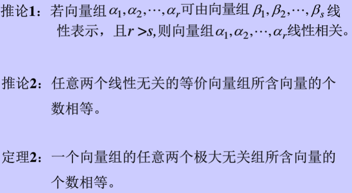
  

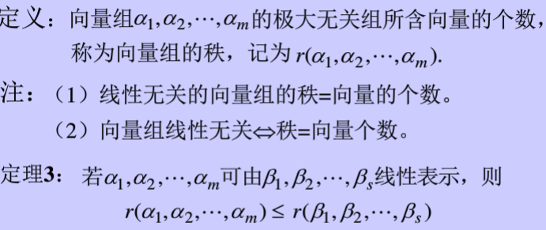
  

等价的向量组有相同的秩  
向量组的秩等同于矩阵的秩，先求矩阵秩就得到向量组的秩，极大无关组也得先求秩  

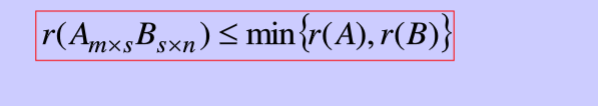
  

#### 4、向量空间及正交  
向量空间的基就是向量组的极大无关组，即线性无关且空间中所有向量都可由该基表示  
线性无关向量组可以将其单位正交化  

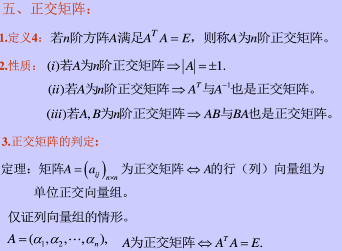
  

正交矩阵的定义及性质  

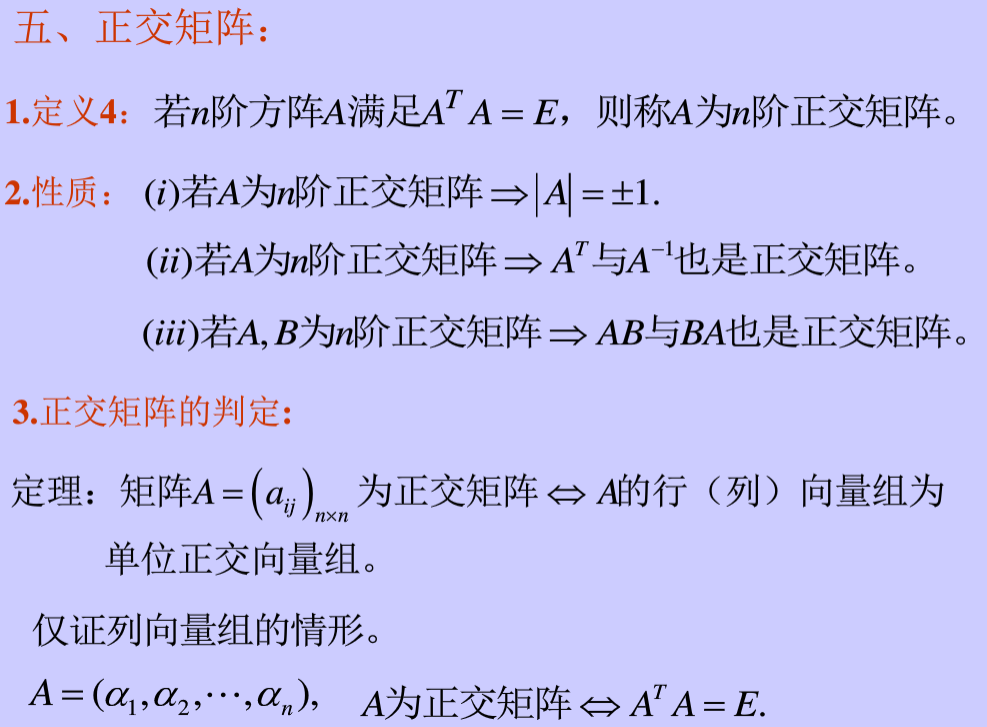
  

## 四 线性方程组  

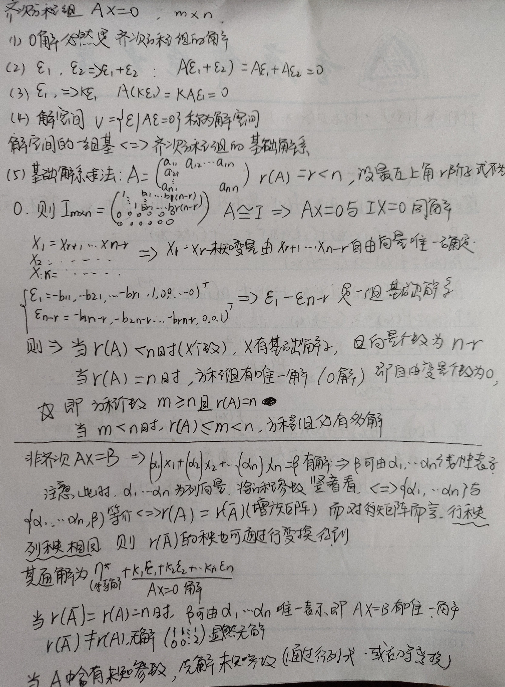
  

## 五、相似对角型  
#### 1、矩阵的相似性  

- 首先看定义：A和B都是n阶方阵，当若存在n阶可逆阵P，使得B=P-1AP，则称A和B相似，即为A～B  
- A～B，必然A和B等价（具有相同的等价标准型），必然A能够通过一系列等价变换到B（P为可逆阵，可逆阵行列式≠0，满秩，可分解为一系列初等变换矩阵乘积），但这是充分条件，不是必要条件，即等价不能推出相似，因为相似比等价要求更高，**即左边的行变换要和右边的列变换互逆**  
- 相似矩阵的性质：秩相等（上述）；|A|=|B|（|A|=|P-1BP|=|P-1||B||P|，而|P-1||P|=1，因此|A|=|B|）；AB可逆性相同，且若可逆，则A-1～B-1；f(A)～f(B)  

#### 2、特征值和特征向量  

- 首先看定义：A是n阶方阵，λ为一个数，若存在**非0向量**α，使Aα=λα，则称λ为A的特征值，α为A的特征向量  
- 如果要求特征值和特征向量，将其按定义转换为线性方程组：(A-λE)α=0，这不就是一个齐次线性方程组嘛，要有非0解α，就是(A-λE)秩<n，就是不满秩，就是|A-λE|=0，解出λ后，解处α对应基础解系就可  
- 性质及证明如下： 

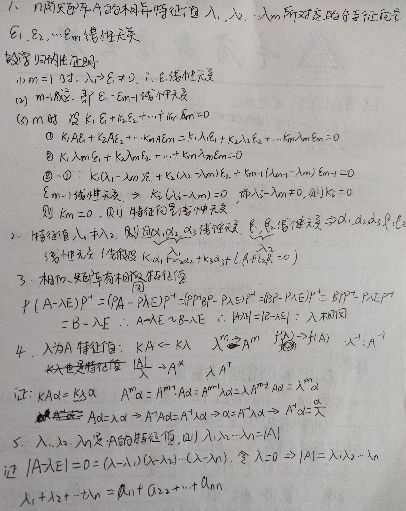
  

#### 3、一般矩阵和实对称矩阵相似对角化  

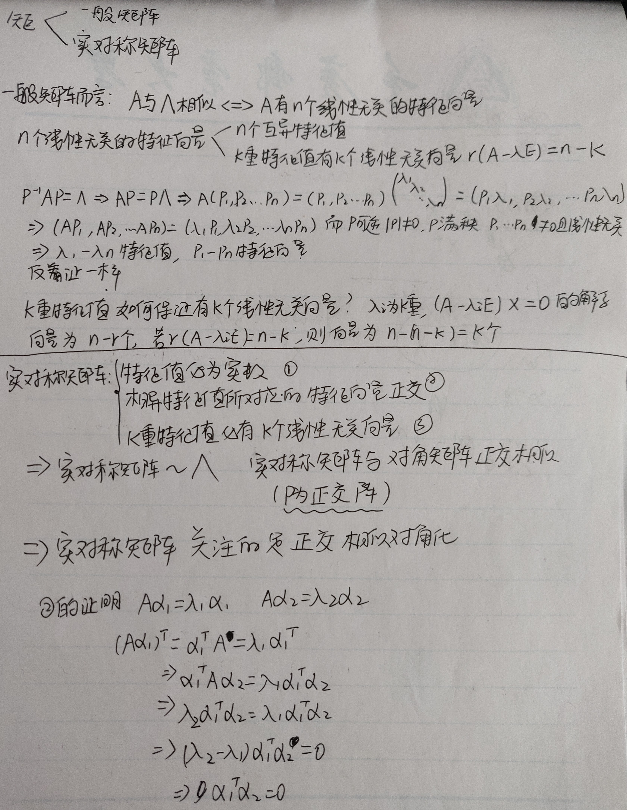
  

正交矩阵是列向量为单位正交，不仅正交，还要单位化，就是施密特单位正交化  
## 六、二次型  
#### 1、二次型的定义  
二次型：就是一个**多项式**，n元二次型就是含有n个变量的二次齐次多项式，简称二次型  

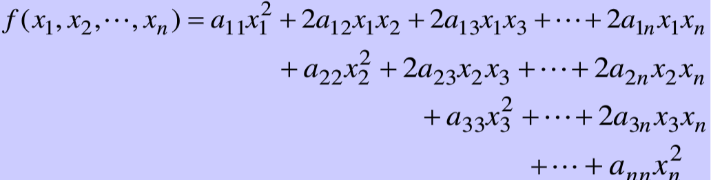
  

标准型：只含平方项的多项式：f(x1,x2,...,xn)=d1x12+d2x22+...+dnxn2  
二次型可以用矩阵进行表示：  

  

注意：二次型可以用无数种矩阵表示，但是最特殊的当然是对称矩阵，且二次型与对称矩阵一一对应  
对称矩阵A的秩：称为二次型的秩  
可逆线性变换：若Y=CX，C为可逆矩阵，则称为可逆线性变换  
正交变换：若C正交，则成为正交变换  
合同：若存在可逆阵P，使得A=PTBP，则称A与B合同（合同必等价，必秩相等）  
延伸：正交阵AT=A-1，则正交相似与合同一致，即实对称矩阵一定与对角矩阵正交相似，即合同  
定理一：二次型经过可逆线性变换后得到新的二次型，且矩阵秩相等  

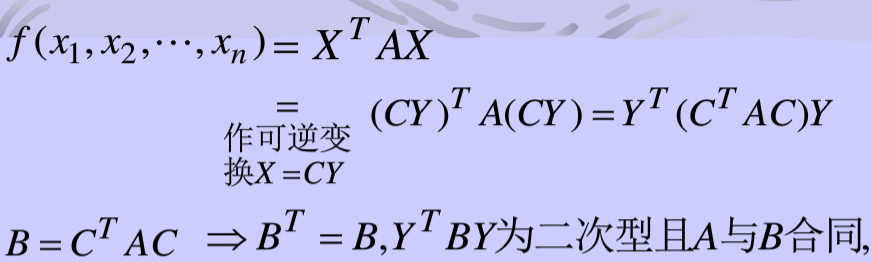
  

#### 2、二次型化为标准型  
一定是可行的：二次型的实对称矩阵A一定和对角阵正交相似即合同，则一定可以化为标准型  

- 正交变换法：则将二次型转化为标准型的一种方法是通过正交变换X=QY，将f=XTAX转换为YTΛY，A与Λ正交相似，且Λ为特征值组成的对角阵  

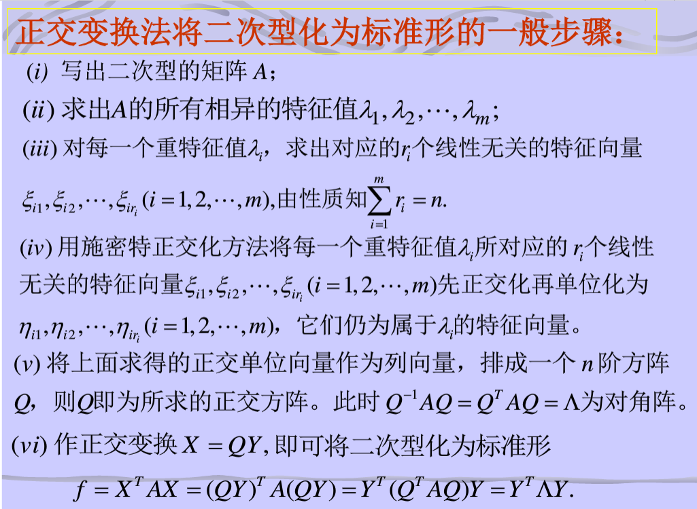
  

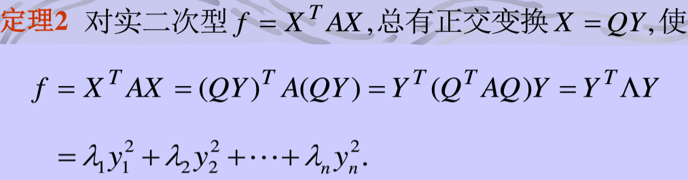
  

说白了就是实对称矩阵相似对角化的延伸  

- 配方法：通过配方依次消去xi  

#### 3、二次型的分类  

- 矩阵的正定和负定：f=XTAX是二次型，对于任意非0向量c，均有f(c)>0，则称f为正定二次型，同时A称为正定矩阵；<0就是负定；>=0就是半正定（准正定）；<=0就是半负定；正负不统一则为不定  

**只有对称矩阵才会考虑正定和负定**  
判别方法：  

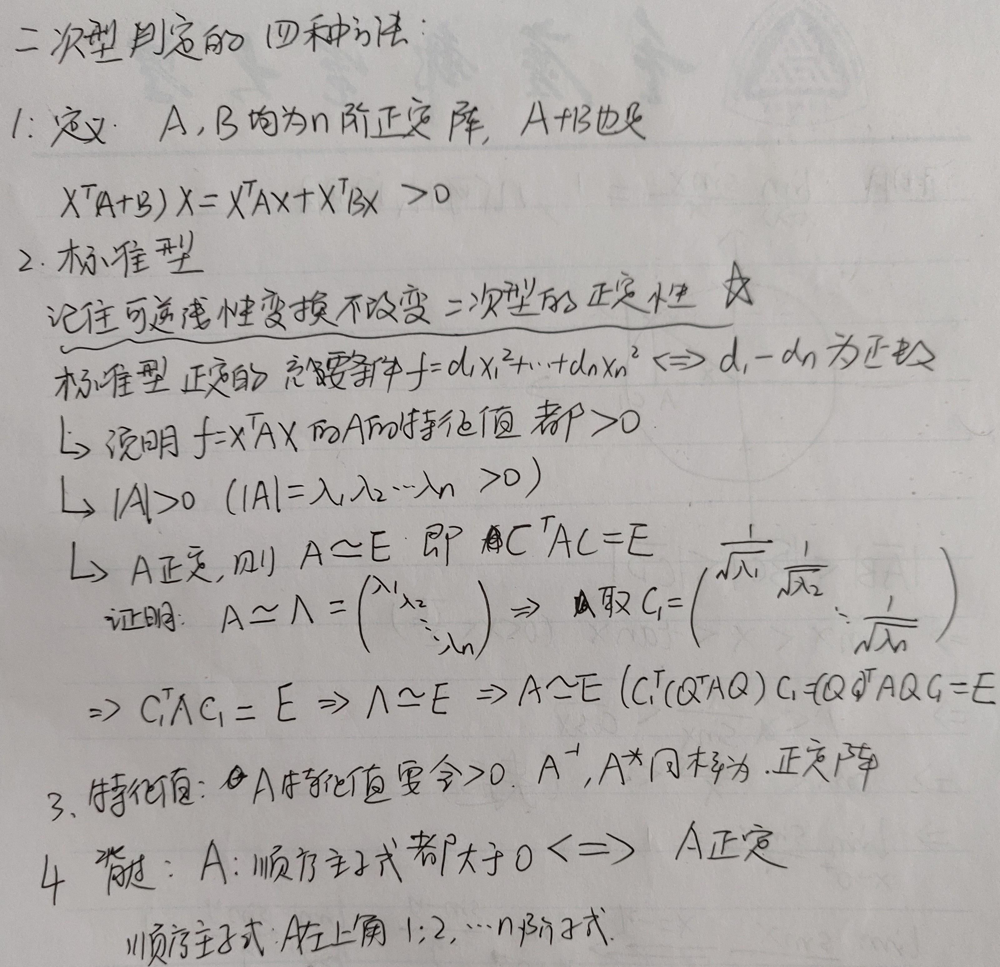
  
