# 高等数学  
主体就是微积分  
## 一、微积分  
微积分：微分加积分  
微积分产生于：变化率问题以及微小量的积累问题  
微积分：以直代曲  
积分求曲面图形面积  
微分求瞬时速度以及切线  
无穷多个数求和  
### 数学素质：  
从实际问题抽象出数学模型的能力  
计算与分析的能力  
了解和使用现代数学语言和符号的能力  
使用数学软件学习和应用数学的能力  
## 二、mathematica软件  
## 三、集合与映射  
集合：将具有某种特定性质的对象的全体   
元素：组成集合的对象  
集合的关系：子集、相等、空集  
复数集：C  
集合运算：并集、交集、差集、补集  
运算性质：交换律、结合律、分配律、对偶率  
直积：笛卡尔积A×B={(x,y)|x∈A,y∈B}  
实数的性质：有序性、完备性  
连续性公理：一个非空有上（下）界的实数集必有上（下）确界  
连续性公理是极限理论的基石  
邻域：以点a为中心的任何开**区间**U(a)  
映射：f:A→B（A元素在B中的元素唯一确定）  
集合的比较：等势：两个集合存在一个一一映射  
无理数比有理数要多  
## 四、函数  
迪利克雷函数：x为有理数时为1，无理数时为0，不能画出图像  
函数的四则运算：不能在运算后确定定义域  
有界前提是有上界和下界  
单调性：严格单调必有反函数  
奇偶性、周期性  
## 五、初等函数  
双曲正切函数：tanhx=(exp(x)-exp(-x))/(exp(x)+exp(-x))  
## 六、曲线的参数方程  
### 1、曲线的参数方程及极坐标方程  
直角坐标方程转换为参数方程：与所学重要性不大  
常见的曲线的参数方程、圆锥曲线  
## 七、数列极限  
微积分的中心思想就是极限  
数列：按一定规律排列的无穷多个数  
数列要有通项  
数列极限的严密定义：对于数列{an}，若存在常数a，对于任意给定的正数ξ，均存在正整数N，当n>N时，恒有|an-a|<ξ，成立，则称数列存在极限或收敛，常数a即为数列的极限，为lim(n→∞)an=a,或an→a(n→∞)  
圆周率的计算公式由割圆术推出，六边形、十二边形、二十四、、、  
## 八、数列极限的性质  
唯一性  

  

有界性

  

保号性

  

四则运算（对于收敛数列而言）  

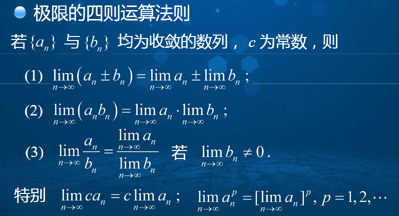
  

## 九、数列收敛的判定方法  
夹逼定理（将数列放大缩小并证明极限相等）、单调有界定理（数列单调增加有上界必存在极限）、区间套定理  
区间套定理：寻找一些特定点  

  
  
  

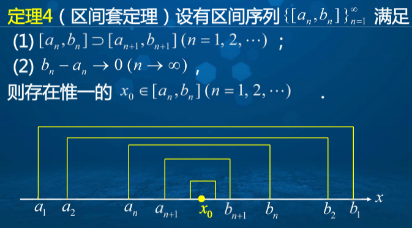
  

## 十、子数列与聚点原理  
子数列：原数列中按顺序选取无穷多项  
定理一：原数列收敛，则任何子数列收敛；子数列发散，则原数列发散；子数列极限不同，原数列发散。  
拉链定理：**数列收敛的充要条件是它的两个子数列收敛且极限相同**   
聚点原理：任何有界数列均存在收敛的子数列  
**柯西收敛原理：数列收敛的充要条件是：对于任意正数ξ，存在正整数N，当m,n>N时恒有|an-am|<ξ**  
**柯西收敛原理等价形式：数列收敛的充要条件是：对于任意正数ξ，存在正整数N，当n>N时，|an-an+p|<ξ，对一切p=1,2,...成立**  
## 十一、无穷级数的概念  
二项式定理：(x+y)n展开  
无穷多个数的和可以是有限的  
无穷级数：就是无穷多个数的和（**数列用逗号隔开，级数用加号相连**）  
定义1：对于级数，若其部分和数列收敛，且极限为S，则称级数收敛，S为该级数的和。  
调和级数时发散的  
**定理一级数收敛的必要条件：如果级数收敛，那么其通项的极限为0**  
对于发散的级数不讨论和的问题  
**定理二：对于两个收敛的级数，其和或差收敛，为级数和的加减。**  
定理三：级数乘以非0常数不改变其敛散性。  
定理四：增加或减少级数中的前有限项，不改变级数的敛散性。  
定理五：对于收敛级数，不改变级数项前后位置条件下，任意结合级数的有限项得到新级数也收敛且和不变。  
**柯西收敛原理用在级数上：级数收敛的充要条件时：对于任意正数ξ，存在正整数N，当n>N时，不等式|an+1+an+2+an+p|<ξ，对任意p=1,2,...成立**  
## 十二、正项级数收敛性的判别方法  
部分和无法计算时该如何做？如何判断级数的收敛性？  
**正项级数（各项均>=0）的收敛的充分必要条件：级数的部分和数列{Sn}有界，即不存在依赖于n的正常数M，使得Sn=a1+a2+...+an<=M(n=1,2,...)**  
正项级数比较判别法：当两个级数均为**正项级数**，且an<=bn(n=1,2,...)，则当bn收敛时，an收敛；当an发散时，bn发散。  
正项级数比较判别法的极限形式：  

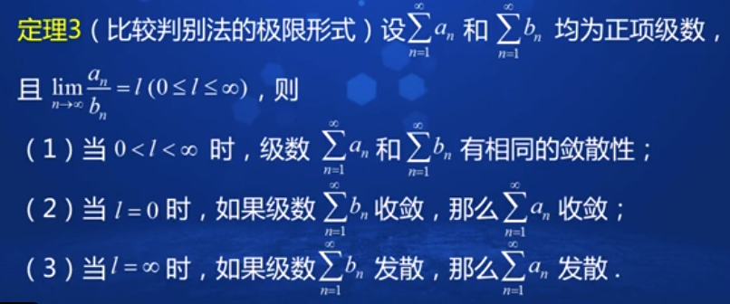
  

定理4：比值判别法：设an为正项级数，且lim(an+1/an)=q，则有：  
当0<=q<1时，级数an收敛；当q>1时，级数发散。  
定理5：根值判别法：设an为正项级数，且limn次根号an=q，则有当0<=q<1时，级数收敛；当q>1时，级数发散。  
## 十三、变号级数的收敛性  
交错级数-正负项交错出现的级数 莱布尼茨判别法：  
如果交错级数满足an单调减少，且极限为0，则级数收敛，且级数和<=a1 变号级数：定理1：若正项级数|an|收敛，则级数an收敛，且其级数和小于正项级数和。  
绝对收敛：级数lim|an|收敛，称级数liman为绝对收敛  
条件收敛：an收敛，|an|发散，称liman为条件收敛  
定理2：级数绝对收敛，其满足交换律。  
定理3：两级数若绝对收敛，其相乘后也收敛。  
**级数收敛的一般性判定准则：**  
1、看通项  
2、是否是正项级数（比较判别法、根值判别法、比值判别法）  
3、绝对值是否收敛  
4、是否是交错级数  
5、利用其他性质  

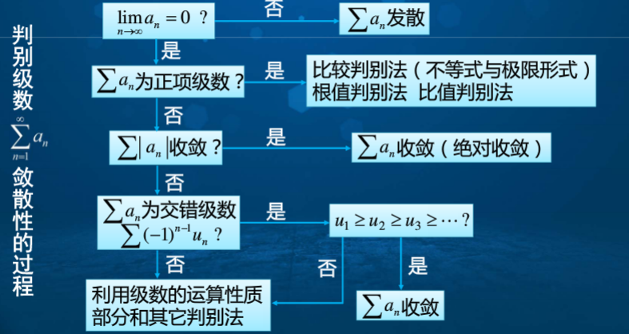
  
## 十四、函数极限  
函数自变量的六种变化形式：  

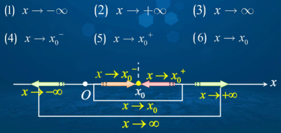
  

函数在无穷远处极限定义（当说函数在无穷大有极限时，正负无穷大极限须相等）  

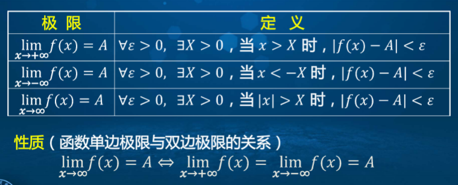
  

函数在有限点处的极限  

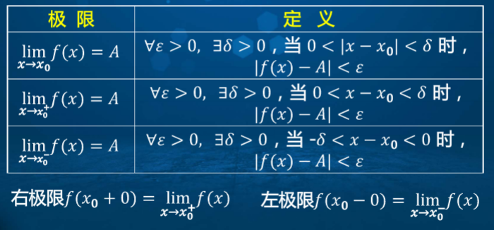
  

单侧极限与双侧极限的性质：  

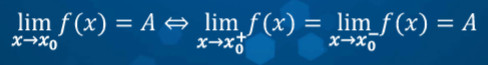
  

## 十五、函数极限的性质及运算法则  
函数极限的唯一性、保号性、有界性  

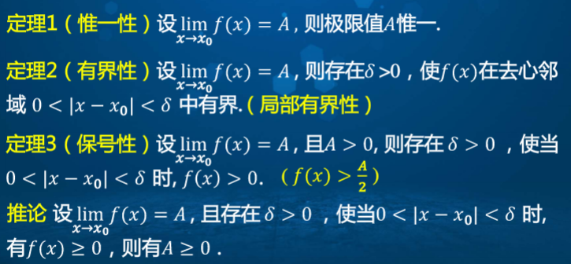
  

极限运算法则，**注意是在同一变化过程下**：  

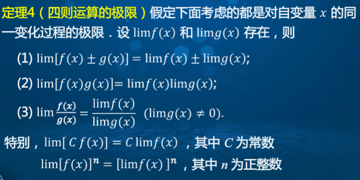
  

复合函数的极限：  

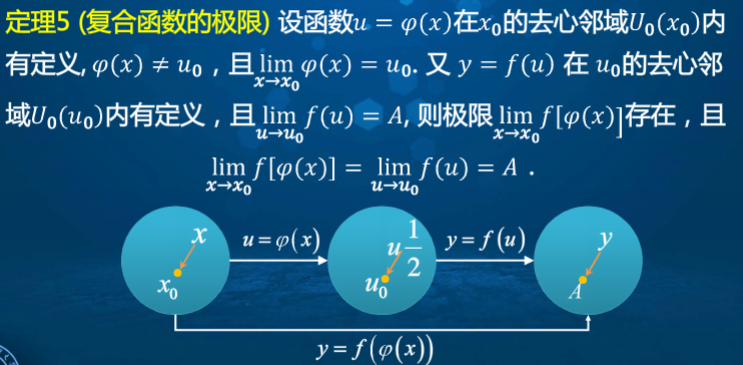
  

## 十六、函数极限存在的判定准则  
函数极限与数列极限的关系  
定理一：  

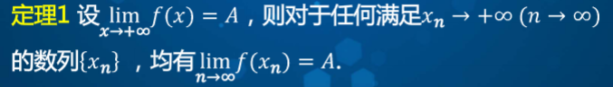
  

定理二：  

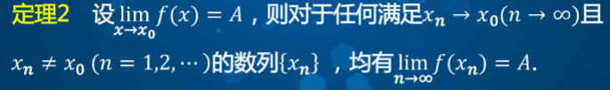
  

海涅定理：  

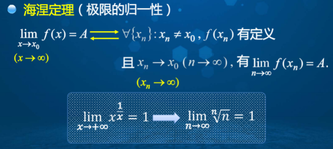
  

夹逼定理：  

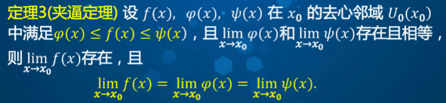
  

夹逼定理得到两个重要极限  

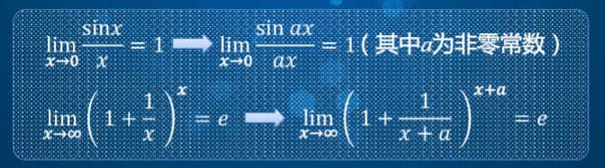
  

## 十七、无穷小量与无穷大量  
无穷小：若函数在六种极限形式之一下等于0，则称函数是该过程的无穷小。  
定理一：无穷小与函数极限的关系  

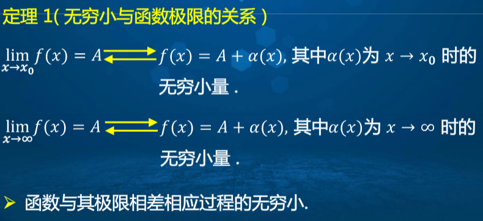
  

无穷小的运算性质  

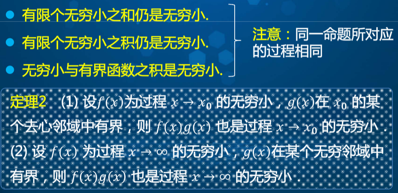
  

无穷大：  

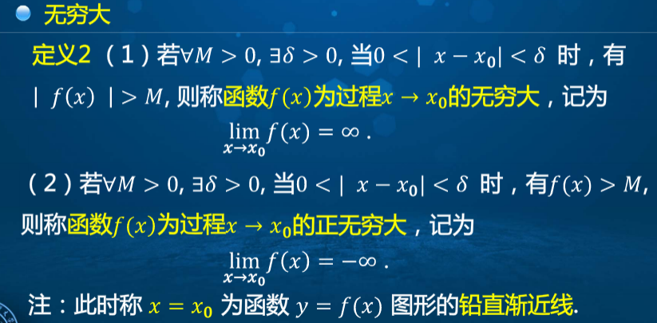
  

无穷大与无穷小的关系  

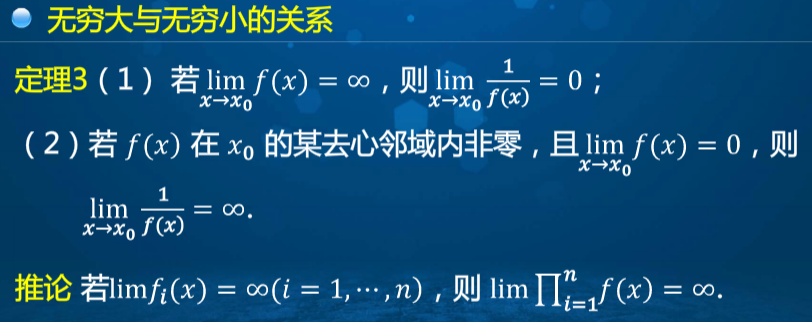
  

无穷小相比较  
高阶无穷小、低阶、同阶、等价  

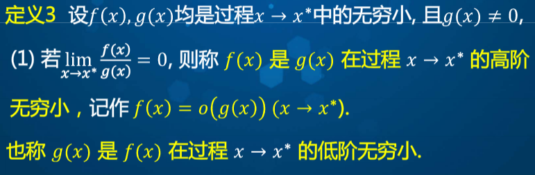
  

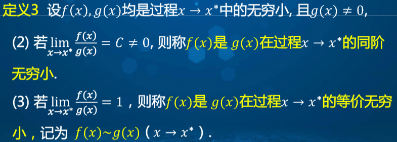
  

等价关系  

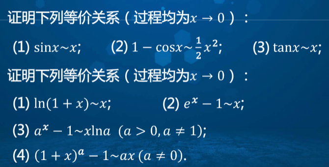
  

同一过程的等价无穷小具有传递性  
**无穷小的等价代换：**  

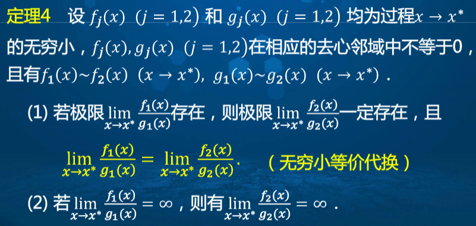
  

## 十八、连续函数的概念  
1、函数连续的定义：  

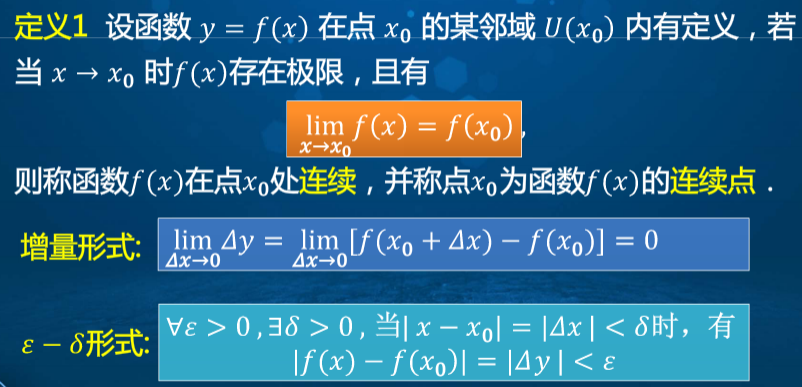
  

2、函数在某一点连续，需要满足三个条件：  

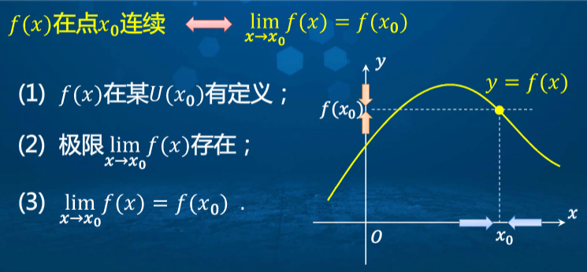
  

左连续、右连续、以及连续的意义  

  

间断点：  

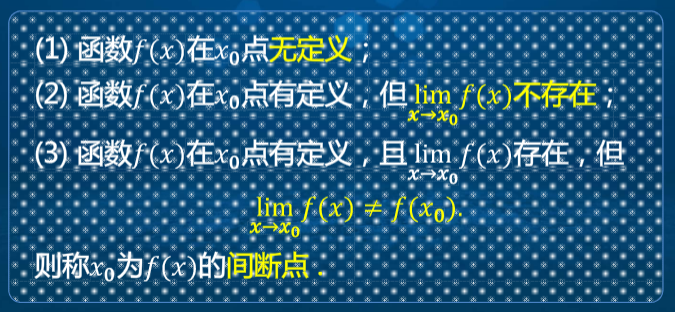
  

间断点的分类：  

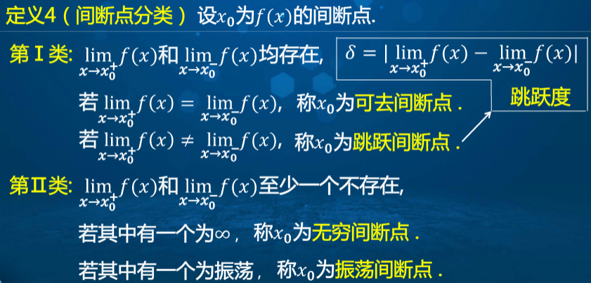
  

## 十九、连续函数的运算  
连续函数的四则运算法则指的是，连续函数通过四则运算后，是否依旧是连续函数  
定理一：函数f(x),g(x)在x0点连续，则函数的加减乘除后，在点x0处连续。  
定理二复合运算：  

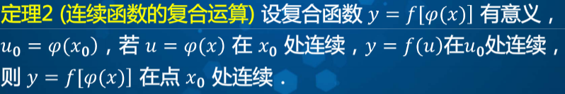
  
  
  

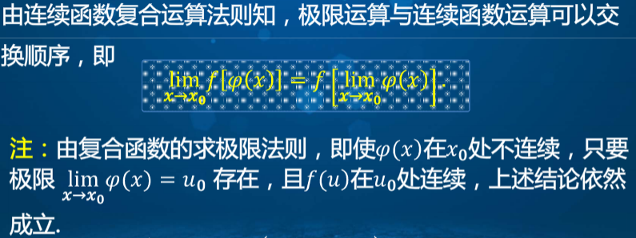
  

定理三求逆运算：  

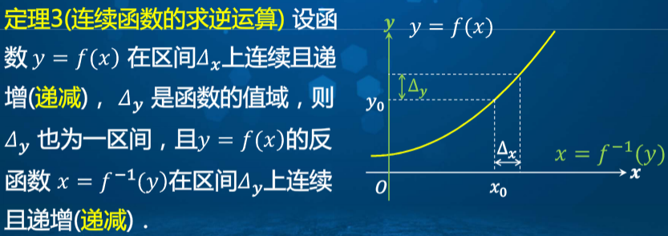
  

**基本初等函数**  

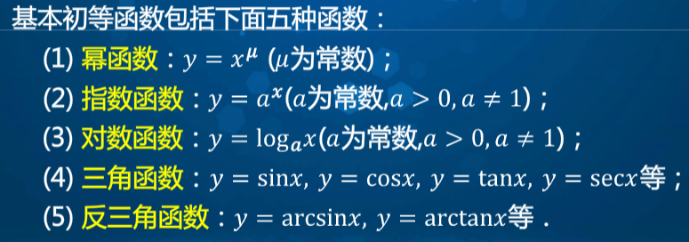
  

一切初等函数在其定义区间内连续，而不是定义域  

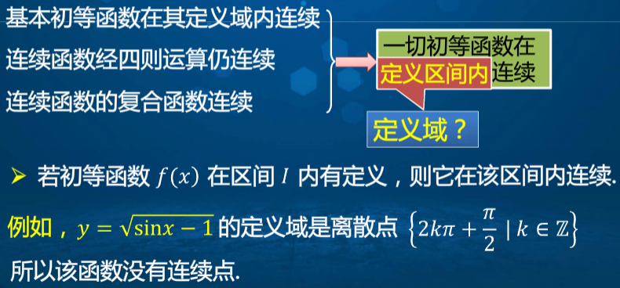
  

连续函数与数列极限的关系  

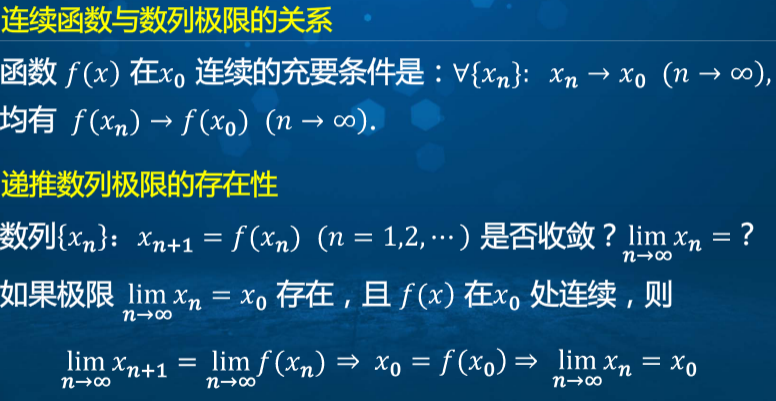
  

压缩映像原理  

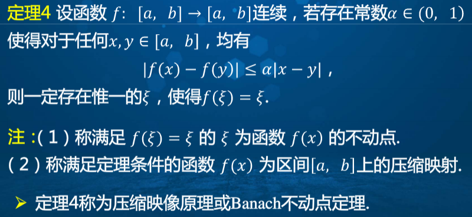
  

## 二十、闭区间上连续函数的性质  
最值定理：  

  

零值定理  

  

介值定理：  

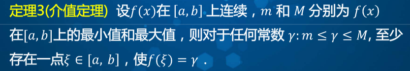
  

## 二十一、函数的一致连续性  
一致连续性定义：  

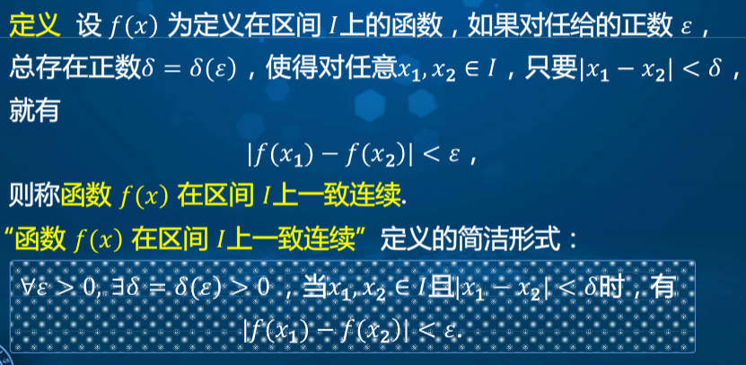
  

一致连续与连续的关系  

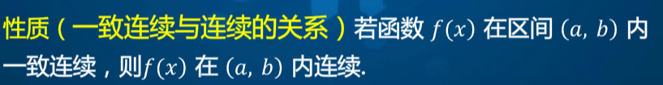
  

一致连续的几何解释  

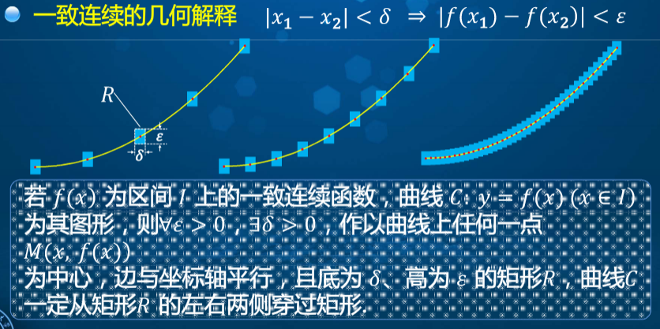
  

康托尔定理：  

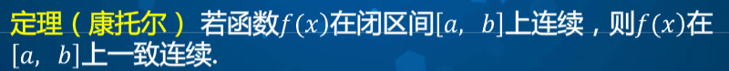
  
