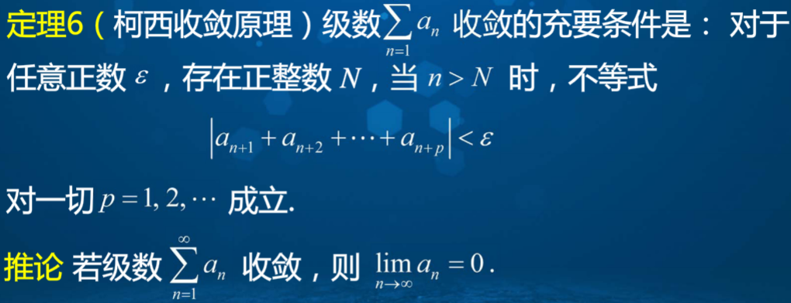

### 1.3 集合  
1、分配律：A∩(B∪C)=(A∩B)∪(A∩C) A∪(B∩C)=(A∪B)∩(A∪C)  
2、对偶率  

  

3、连续性公理：一个非空有上界（下界）的实数集必有上（下）确界  
4、集合等势：AB存在一个一一映射，必等势（**等势表示两个有限集元素个数相等**，因此偶数与自然数的个数是相等的）  
### 1.4 函数  
1、定义域需要在函数间进行四则运算前确定  
2、严格单调增加：与函数单调增加相比，就是>=和>的区别  
3、双曲函数（双曲正弦、双曲余弦、**双曲正切**、双曲余切）  

  

&emsp;&emsp;4、双曲正切函数与双曲余切函数的图像  

  

### 1.8 数列极限的性质  
1、定理：设数列{an}的极限为a，且a≠0，则存在正整数N，当n>N时，恒有|an|>|a|/2  
2、二项式定理  

  

### 1.10-11 子数列与无穷级数
数列收敛的柯西收敛原理  

  

级数收敛的柯西收敛原理  

  

### 1.16 两个重要函数极限的证明以及数列极限存在性证明  

  

  

  

### 1.19 连续函数的运算  
幂指函数求极限  

  

### 2.1 导数概念  
1、可导一定连续，连续不一定可导，具体如f(x)=|x|  

2、导数运算法则证明  

  

### 2.8 拉格朗日中值定理  
1、拉格朗日中值定理证明  

  

2、拉格朗日中值定理还可以写成：Δy=f'(x+θΔx)﹒Δx；因此其给出了自变量取有限增量Δx时，函数增量的准确表达形式，又称有限增量定理  
### 2.10 函数的多项式逼近  
1、泰勒多项式及麦克劳林多项式推导过程  

  

### 2.11 泰勒公式  
拉格朗日中值公式是泰勒公式的n=0时的特例，拉格朗日余项的证明如下  

  

### 2.16 牛顿迭代法  
证明如下：  

  

### 2.19 积分函数  
变限积分函数的证明：  

  

### 3.1 微分方程模型与基本概念  
1、微分方程的通解不一定包含微分方程的所有解  
### 3.7 向量积  
1、两个向量的向量积即外积、叉积，仍是向量，与前面两个向量相垂直  
### 4.3 偏导数  
1、定理1：若函数z=f(x,y)的两个混合偏导数fxy和fyx在点(x0,y0)处连续，则二者相等  

  

### 4.5 可微性  
无论是一元函数还是多元函数，说函数f在某一点可微，即该函数在该点处可局部线性化近似（一元直线，多元平面），或者说，Δy与线性化函数的delta的差是无穷小。可微一定可导，且连续。连续不一定可微或可导。  
### 4.7 隐函数存在定理  
存在定理的证明  

  

### 4.9 方向导数和梯度  
方向导数和梯度的理解：  
首先理解方向余弦  
