## 一、微分方程模型与基本概念  
实际问题→数学建模→数学结论→实际预测  
1、常微分方程（微分方程）：含有自变量、未知函数以及未知函数导数或微分的关系式（只有一个自变量及未知函数）  
2、一阶微分方程-含有一阶导数；二阶-二阶；  
3、n阶微分方程的隐式表达式为：  

  

4、n阶线性微分方程（左端是关于未知函数y以及未知函数的各阶导数的线性表达式）：  

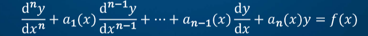
  

5、微分方程的解：  

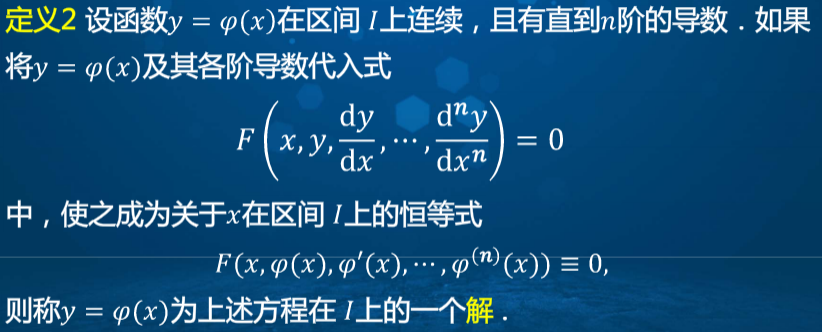
  

6、微分方程的通解（其中的每一个常数对解的影响是其他常数所不能代替的）：  

  

7、微分方程的特解：其通解中确定了任意常数的解  
8、初值问题（柯西问题）：  

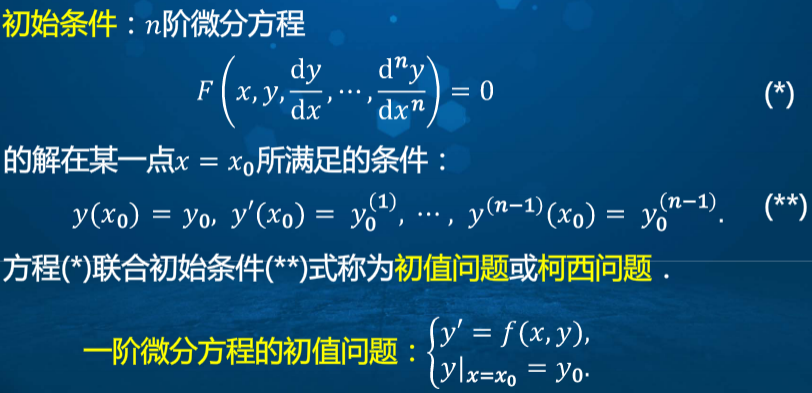
  

9、显式解和隐式解：φ(x,y)=0是隐式解，如果是通解的话就成为隐式通解；y=φ(x)就是显式解。  
10、积分曲线：微分方程的解所对应的曲线；通解对应着积分曲线族  
11、**注意：微分方程的通解不一定包含微分方程的所有解；有些初值问题的解可能不止一个，即解不是唯一的。**  
## 二、一阶微分方程的求解  
1、一阶微分方程的几种情形  

  

- 可分离变量方程：f(x,y)=g(x)h(y)  
- 齐次方程：f(x,y)=φ(y/x)  
- 线性方程：f(x,y)=p(x)y+q(x)  
- 伯努利方程：f(x,y)=p(x)y+q(x)yn(n≠0,1)  

2、解可分离变量方程  

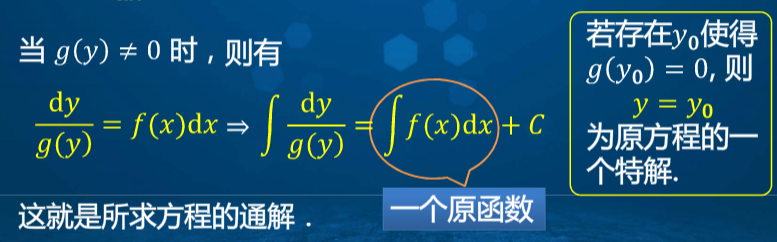
  

G(y)=F(x)+C就是通解的原因：  

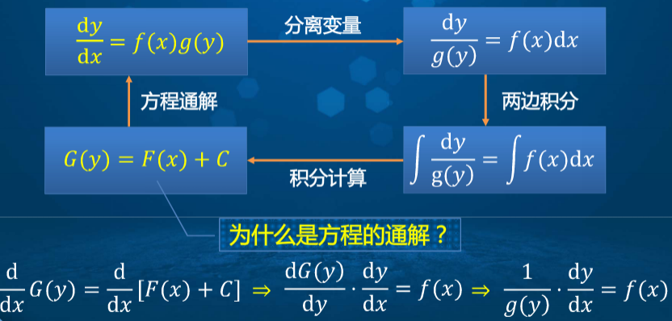
  

3、解齐次微分方程（换元变为可分离变量方程）  

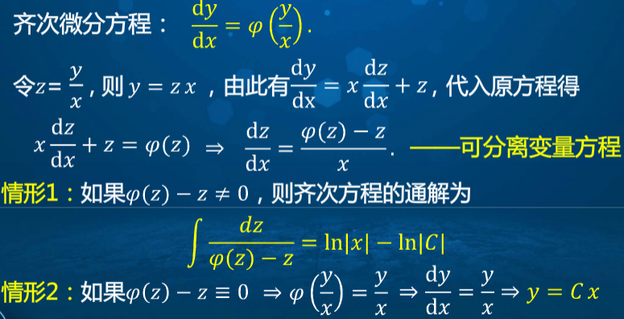
  

4、一阶线性微分方程的标准形式为：  

  

若q(x)=0，则称为一阶齐次线性微分方程；否则称为一阶非齐次线性微分方程  
5、一阶齐次线性微分方程通解（变为可分离变量方程）：  

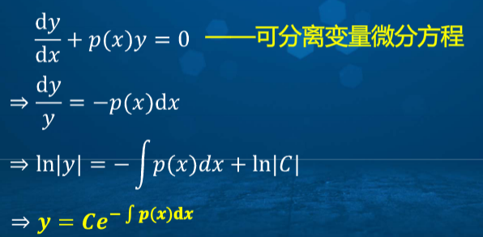
  

6、常数变易法求解一阶非齐次线性微分方程：  

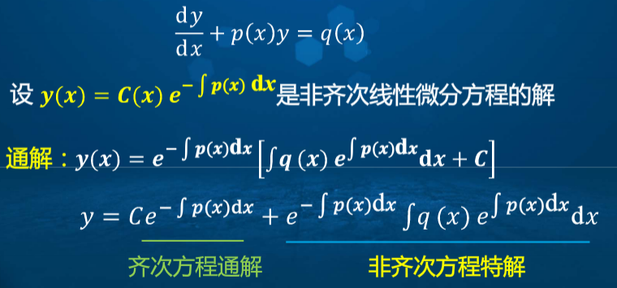
  

7、伯努利方程（将伯努利方程变换为线性方程）  

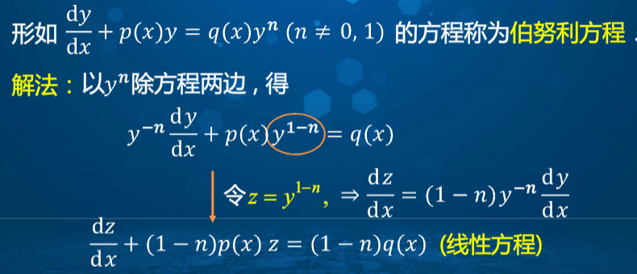
  

##三、可降阶的高阶微分方程  
一共就三种：  

- y(n)=f(x)  
- y''=f(x,y')  
- y''=f(y,y')  

第一类解法（逐次降阶）：  

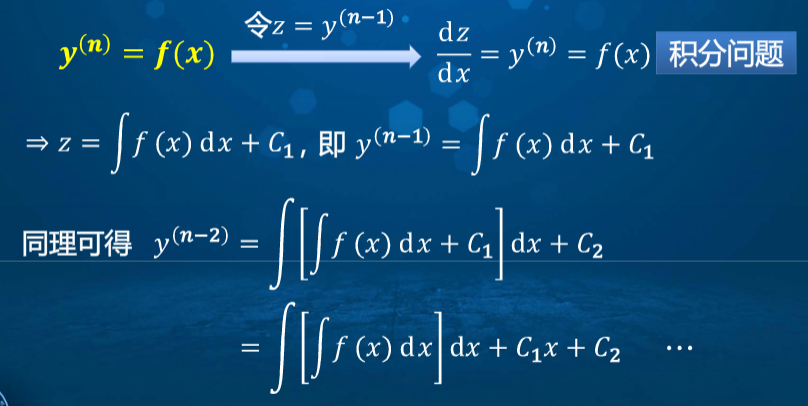
  

若函数在无穷区间上具有n+1阶导数，且导数为0，则函数为次数不超过n的多项式  
第二类解法：  

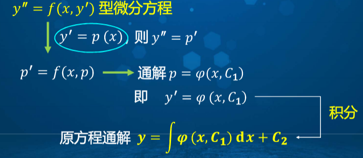
  

第三类解法：  

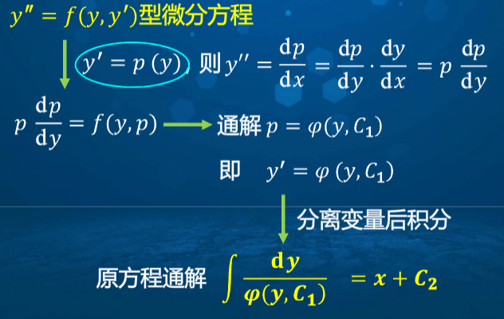
  

第二类第三类的区别是p分别是x和y的函数  

## 四、高阶线性微分方程  
1、n阶线性微分方程的一般形式：  

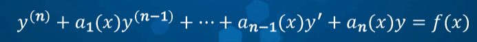
  

2、二阶线性微分方程：  

  

3、**二阶齐次线性微分方程**的叠加原理：  

  

4、函数组的线性相关和线性无关  
线性相关：有n个函数，若存在不全为0的n个常数，使得在函数区间上，有k1y1+k2y2+...+knyn=0，则称这n个函数在区间内线性相关。  
线性无关：不存在这样的常数，即当且仅当n个常数全为0，使上式成立。  
由此可得两个函数线性相关的充要条件：函数之比为常数；线性无关的充要条件为函数之比不是常数  
5、**二阶齐次线性方程通解结构**：找两个线性无关的特解y1y2线性相加即可：y=C1y1(x)+C2y2(x)就是通解  
6、**二阶非齐次线性方程**的通解结构：先找二阶非齐次线性方程的一个特解y#，再找二阶齐次线性方程的通解Y，则y=Y+y#就是通解  
7、**二阶非齐次线性微分方程**的叠加原理：  

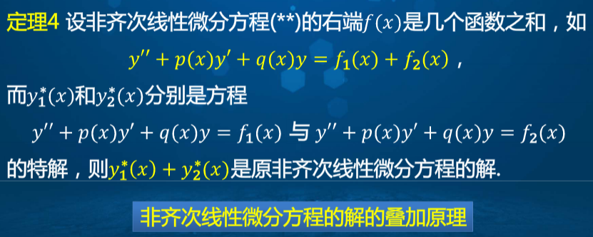
  

8、推广-n阶齐次线性方程的通解：找n个线性无关的解  

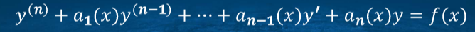
  

9、推广-n阶非齐次线性方程的通解：n阶齐次线性方程的通解（找n个线性无关的解），再找非齐次线性方程的一个特解即可  

  

10、特殊情况：二阶齐次线性微分方程的一个非0特解y1已知，则可求另一线性无关的解y2，用**刘维尔公式**：  

  

11、特殊情况：**二阶常系数**齐次线性微分方程：  

  

设y=erx为上面微分方程的解，则需满足(r2+pr+q)erx=0，则r2+pr+q=0，则此关于r的方程为微分方程的特征方程，根称为特征根，特征根写出微分方程的通解：  

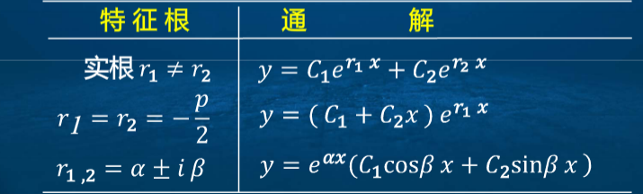
  

## 五、常系数非齐次线性微分方程  
上一节讲的是非齐次的通解结构，其中，齐次的通解容易求得，但是非齐次的特解不好求，本节讲的是如何求非齐次线性微分方程的特解  
这一节讲的也是常系数非齐次线性微分方程的两种特殊情况，想知道咋解查课本去吧：  

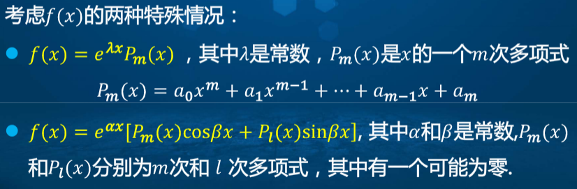
  

欧拉公式：eiθ=cosθ+isinθ  
欧拉方程：  

  

## 六、点与向量的坐标表示  
略  
## 七、向量的数量积、向量积与混合积  
1、数量积a(a1,a2,a3) b(b1,b2,b3)：a.b=a1b1+a2b2+a3b3  
2、数量积定理1：a、b夹角为θ，则a.b=|a||b|cosθ  
3、数量积运算规律满足交换律、结合律、分配律，a.a=|a|2  
4、向量的投影：设a为非0向量，θ为a和b的夹角，称|b|cosθ为向量b在a上的投影，记作(b)a，或Prjab:(b)a=|b|cosθ  
5、(b)a=ea.b  
6、向量积（叉积、外积）：  

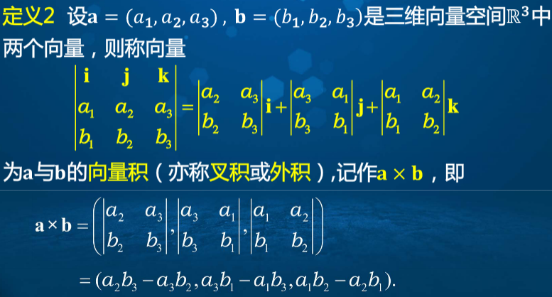
  

7、向量积定律  

- a×b与a、b垂直  
- a、b与a×b符合右手法则  
- |a×b|=|a||b|sinθ  
- 当a、b非0时，a×b长度等于其所确定的平行四边形的面积  

8、向量积运算规律  

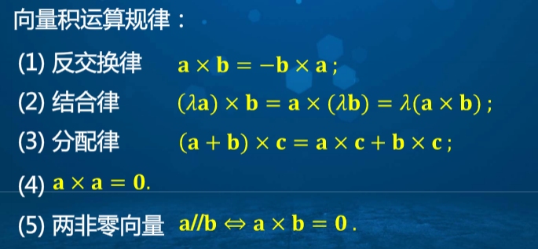
  

9、混合积定义及其几何意义  

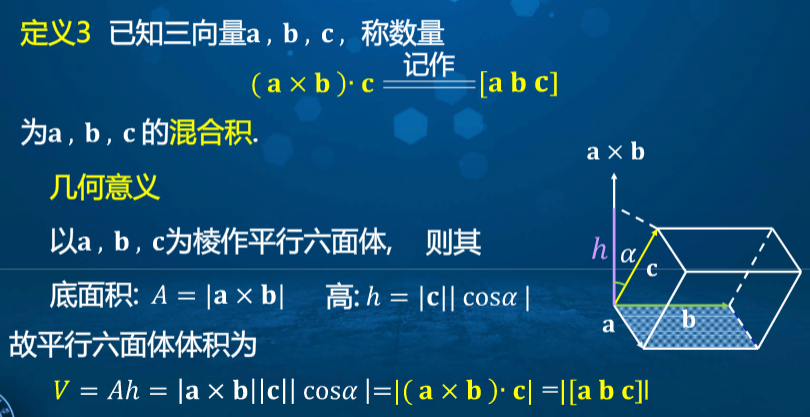
  

10、混合积坐标表示  

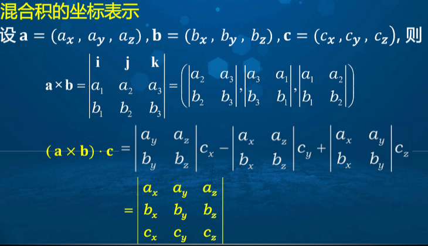
  

11、混合积的性质  

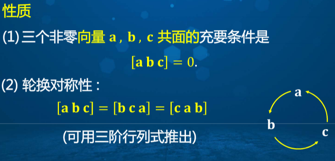
  

## 八、平面及其方程  
点法式方程、三点式方程、截距式方程、一般方程  

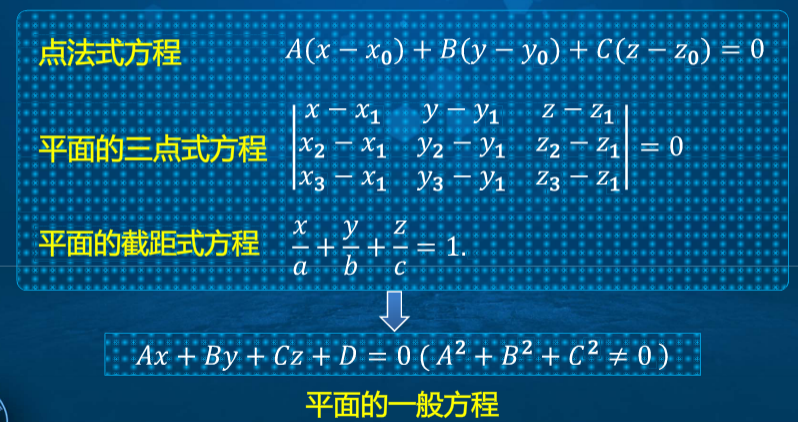
  

点到面的距离公式  

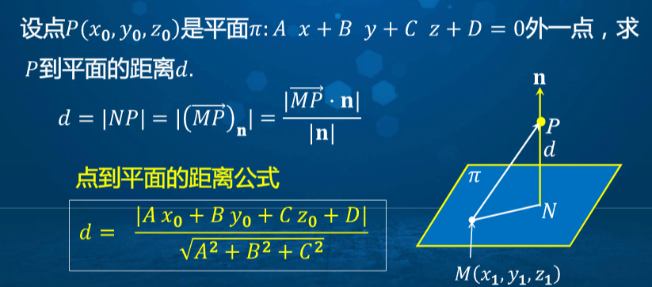
  

## 九、空间直线及其方程  
## 十、十一、十二、十四  
略  
## 十三、向量值函数的导数与积分  
1、向量值函数：  
点和向量一一映射  

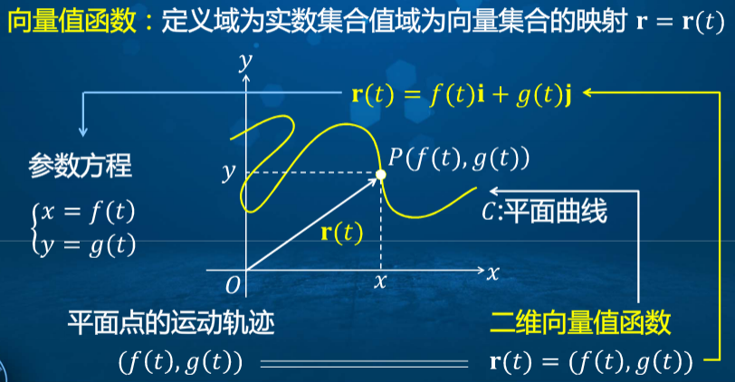
  

2、向量值函数的极限和连续的定义  

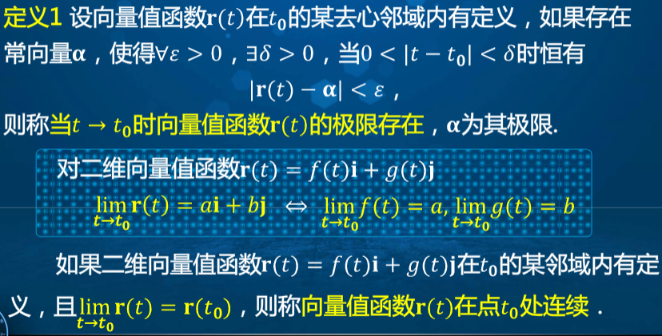
  

3、向量值函数在t0处连续的充分必要条件是其分量函数在t0处连续  
4、向量值函数求导  

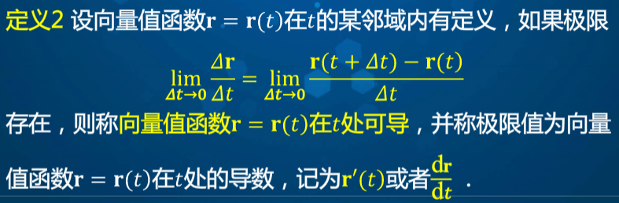
  

5、向量值导数可以转换为其各分量函数求导数  

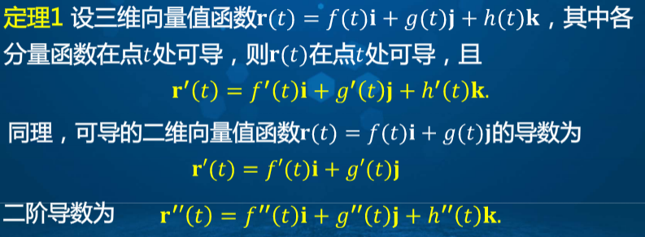
  

6、导数就是曲线在该点的切向量  
7、光滑曲线：若一个向量值函数在区间上满足其导数连续，且在区间内其导数≠0，则称曲线在该区间上是光滑曲线  
8、向量值函数的求导法则及链式法则  

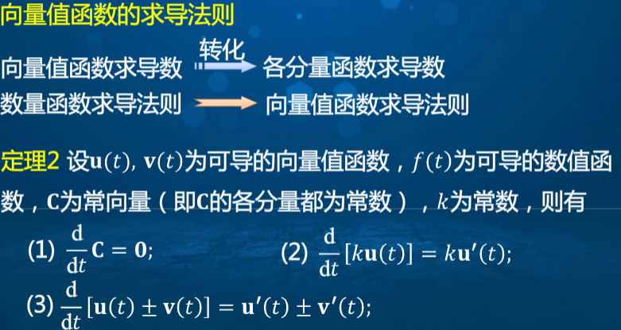
  

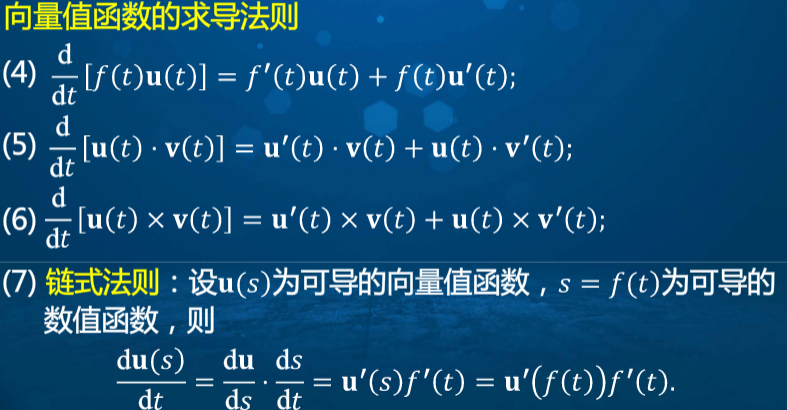
  

9、向量值函数的不定积分  

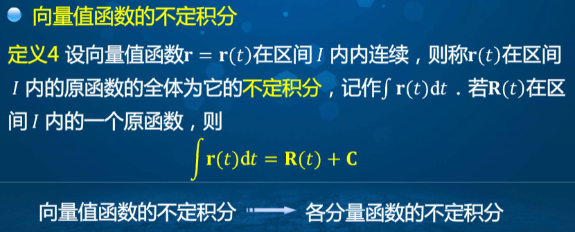
  

10、向量值函数的定积分以及牛顿-莱布尼茨公式  

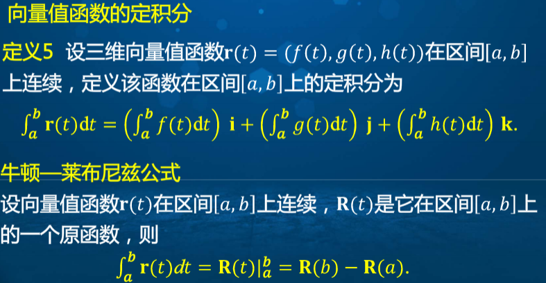
  
