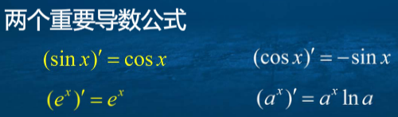

## 一、导数  
导数的定义：  

  

导数的几何意义：切线的斜率  
函数在x0处可导的充要条件是：其在x0的左右导数存在且相等  
连续是可导的必要条件，但不是充分条件。  
导函数的定义：  

  

## 二、导数运算法则  
1、两个重要极限  

  

2、两个重要导数公式  

  

3、四则运算的求导法则  

  
  
  

  

4、反函数的导数互为倒数  
5、复合函数求导，**链式法则：复合函数的导数，等于函数对中间变量的导数乘以中间变量对自变量的导数**  
6、基本的函数求导：  

  

7、三角函数及反三角函数求导：  

  

## 三、高阶导数  
二阶、三阶导数：导数的导数  
n阶导数：  

  

莱布尼茨公式：设函数u(x)和v(x)均存在n阶导数，则有：  

  

隐函数：  

  

**隐函数求导法**：  

  

参数方程求导法：  

  

## 四、局部线性化与微分  
局部线性化就是以直代曲：  

  

微分：  

  

微分和导数的关系：  

  

常见的近似公式：  

  

微分的四则运算：  

  

## 五、导数在实际问题中的应用  
解决相关变化率问题的一般步骤为：  
1、画出示意图，变量命名，并在图中标注  
2、用变量符号写出已知数据，并注意统一量纲  
3、正确建立个变量之间的关系  
4、对所建立的关系式关于时间或其他变量求导数，得含有导数的关系式  
5、根据已知条件，计算出要求的变化率。  
## 六、不定积分的概念  
1、若F(x)是f(x)的一个原函数，则F(x)+C也是f(x)的一个原函数  
2、原函数存在定理：若f(x)在区间上连续，则f(x)在区间上存在原函数。  
**3、不定积分：函数f(x)在区间I上所有原函数的一般表达式，称为f(x)在I上的不定积分，记作：∫f(x)dx。**  
4、不定积分的基本性质  

  

5、基本的积分公式：  

  

6、不定积分的线性运算法则：  

  

## 七、函数的极值及最优化应用  
1、费马引理（极值点的导数为0）：  

  

2、对于可微函数，极值点一定是驻点，但是驻点不一定是极值点。**不可导点也可能是极值点。**  
3、定理二、函数在x0邻域内连续，如果左邻域递增，右邻域递减，则在x0处取极大值；反之，极小值；若左右邻域单调性一致，则不取极值。  
4、单峰函数与单谷函数：想象一哈  
## 八、罗尔定理与拉格朗日中值定理  
罗尔定理：若函数f(x)满足下列条件：在[a,b]内连续，在(a,b)内可导，f(a)=f(b).**那么至少存在一点ξ∈(a,b),使得f'(ξ)=0**  
拉格朗日中值定理（把罗尔定理的图形旋转了一下）：若函数f(x)满足在[a,b]上连续，在(a,b)内可导，**那么至少存在一点ξ∈(a,b),使得f'(ξ)=(f(b)-f(a))/(b-a)**  
拉格朗日中值定理的其他形式：  

  

拉格朗日中值定理又称有限增量定理：  

  

## 九、柯西中值定理与洛必达法则  
柯西中值定理的来源：  

  

柯西中值定理的描述：  

  

求0/0型不定式极限的洛必达法则：  

  

求∞/∞的洛必达法则：  

  

## 十、函数的多项式逼近  
以直代曲精度不够  
二项式定理：  

  

1、泰勒多项式（在x0处用多项式逼近函数，要求1阶导数、2、...n阶导数相等）：  

  

2、麦克劳林多项式（当x0=0时）：  

  

3、ex、sinx、cosx、ln(1+x)、(1+x)a都可以用n阶麦克劳林多项式近似  
4、注意：多项式项数增加，误差减小  
## 十一、泰勒公式  
1、求误差
泰勒余项、绝对误差、皮亚诺余项、带皮亚诺余项的n阶泰勒公式  

  

带皮亚诺余项的n阶麦克劳林公式：  

  

**皮亚诺余项只提供一种定性表示，要想定量，还得拉格朗日余项**  
带拉格朗日余项的n阶泰勒公式（柯西中值定理证明）：  

  

拉格朗日中值公式是泰勒中值公式的一个特例：  

  

## 十二、泰勒公式的应用  
误差估计、极限计算、问题证明  
## 十三、函数的单调性与凸凹性  
函数单调性凭借导函数判定  

  

极值第一充分条件就是通过一阶导数判断，第二充分条件通过二阶导数判断  
凸函数：连接图形上任意两点的弦总位于两点间弧段的上方或下方。  
凸函数同样可以哟弄个二阶导数判定：  

  

拐点：凹弧和凸弧分界点。第一第二充分条件分别用二阶、三阶导数判定。  
## 十四、利用导数研究函数的几何性态  
函数图形与导数关系  

  

函数点类型与导数关系  

  

## 十五、曲率  
略  
## 十六、解非线性方程的牛顿切线法  
线性方程：ax+b=0；非线性方程f(x)=0(fx不具备线性方程的形式)
五次及五次以上的代数方程不存在一般形式的根式解  
简单迭代法：

  

牛顿法：高次方程无法求精确根。将非线性方程线性化  

  

牛顿迭代公式  

  

牛顿迭代法几何意义  

  

牛顿迭代法收敛条件1：  

  

误差估计：  

  

牛顿迭代法优点是收敛速度比较快，缺点是初始值要求高，并且需要计算导数  
## 十七、定积分的概念  
求曲边梯形面积、变速直线运动的路程、做功等都可以用定积分解决
定义1 黎曼可积：  

  

书写形式及其含义：  

  

定积分的线性性、对积分区间的可加性、保号性、保序性、绝对值不等式、
积分估值  

  

  

  

  

## 十八、定积分的性质  
1、积分可积定理1：  
若函数在区间上可积，则函数在区间上有界；**若函数在区间上连续，则函数在区间上必可积**  
2、几种情形下积分可积：函数在区间上有界且有有限个间断点，则函数在区间上可积；若函数在区间上具有单调性，则函数可积。  
3、可积的充要条件是：图中包围曲线的小矩形面积之和可以任意小  

  

4、定积分数列极限的关系：  

  

5、积分中值定理  

  

6、推广的积分第一中值定理  

  

## 十九、微积分基本公式  
微积分基本公式（牛顿莱布尼茨公式）：设函数f(x)在闭区间上可积，F(x)是f(x)的一个原函数，则：  

  

积分上限函数：  

  

积分上线函数的定理：  

  

定理三：如果函数f(x)在区间上连续，则变上限函数就是f(x)在闭区间上的一个原函数。  
## 二十、积分的变量替换法  
不定积分的第一类换元法：  

  

不定积分的第二类换元法：  

  

定积分换元法：  

  

定积分变量替换形式可以看作三个变化：积分区间上下限对应变化；变换积分函数；变换积分元素；  

  

换元公式可以反过来用：  

  

## 二十一、积分的分部变换法：  
不定积分的分部积分公式：  

  

定积分的分部积分公式：  

  

## 二十五、反常积分  
反常积分就是分为无穷区间反常积分和无界函数反常积分（无穷间断点），如果在无穷区间上或者无穷间断点上积分存在，则称积分收敛。  

  

  

  

  

积分收敛发散的比较判别法：  

  

## 二十六、数值计算解决定积分问题  
略  
