# 
第一章 引言
  

深度学习的另一个最大的成就事其在强化学习领域的扩展，在强化学习中，一个自主的智能体必须在没有人类操作者指导的情况下，通过试错来学习执行任务。  
# 
第二章 线性代数
  

## 2.1 基础概念  
C=A+b，其中，Ci,j=Ai,j+bj：向量b和矩阵A的每一行相加  
## 2.2 矩阵相乘  
Hadamard乘积：两个矩阵相对应的元素的乘积，记作A⊙B  
点积：点积代表的是两个相同维数**向量x和y**的矩阵乘积x⊤y，其中，x⊤y=y⊤x  
Ax=b表示为如下：  

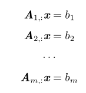
  

## 2.3 单位阵和逆矩阵  
单位阵In：对角线全是1，任意**向量**乘以单位阵都不会改变  
逆矩阵 A−1：A−1A=In.  
求解上式可以用逆矩阵和单位阵进行求解，求解步骤如下：  

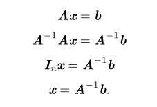
  

逆矩阵A−1主要是作为理论工具使用的，并不会在大多数软件应用程序中实际使用。这是因为逆矩阵A−1在数字计算机上只能表现出有限的精度，有效使用向量b的算法通常可以得到更精确的x。  
## 2.4 线性相关和生成子空间  
如果矩阵的逆存在，那么对于向量b，x要么无解，要么一个解，要么无数个解，因为，解的线性组合也是解。  
一组向量的**线性组合**，是指每个向量乘以对应标量系数之后的和，即：  

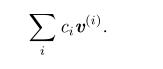
  

一组向量的**生成子空间**是指原始向量线性组合后所能抵达的点的集合。  
**确定Ax=b是否有解，等于确定向量b是否在A列向量的生成子空间中**。此生成子空间称为A的空间或值域。  
如果一组向量中的任意一个向量都不能表示成其他向量的线性组合，那么这组向量称为**线性无关**（linearly independent）  
如果一个矩阵的列空间涵盖整个Rm，那么该矩阵必须包含至少**一组m个线性无关的向量**。  
要想使矩阵可逆，我们还需要保证上式对于每一个b值至多有一个解。为此，我们需要确保该矩阵至多有m个列向量。否则，该方程会有不止一个解。这意味着该矩阵必须是一个**方阵**。  
一个列向量线性相关的方阵被称为**奇异的**（singular），否则就是非奇异的。如果矩阵A不是一个方阵或者是一个奇异的方阵，该方程仍然可能有解。但是我们不能使用矩阵逆去求解。  
**对于方阵而言，左逆矩阵和右逆矩阵相等。**
总结：方阵包括奇异矩阵和非奇异矩阵，其中：如果A为奇异矩阵，则Ax=0有无穷解，Ax=b有无穷解或者无解。**如果A为非奇异矩阵，则Ax=0有且只有唯一零解，Ax=b有唯一解。**  
## 2.5 范数  
使用范数（norm）来衡量**向量**的大小，其中Lp范数定义如下:  

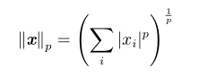
  

p为实数，且p>=1  
更严格的说，范数是满足下列性质的任意函数：  

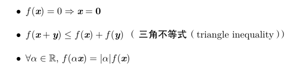
  

当p=2时，L2范数称为欧几里得范数。  
平方L2范数：计算和数学上比L2范数更方便，且其对x的每个元素的导数只取决于对应的元素，而L2范数却与向量整体有关。但是平方L2范数在原点附近增长的十分缓慢。  
L1范数：**对于区分是0的元素与非0的元素很重要**时，选择L1范数，其是在各个位置斜率相同，同时保持简单的数学形式的函数。L1范数作为表示非0元素数目的代替函数。  
L∞范数、最大范数（max norm）：向量中最大元素绝对值。形式如下：  

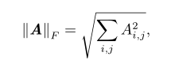
  

矩阵范数：常用Frobenius范数，与L2范数类似，就是矩阵元素平方和的开方。  

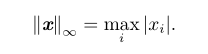
  

两个向量的点积可以用范数来表示，其中θ表示x和y之间的夹角：  

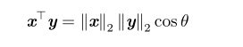
  

## 2.6 特殊类型的矩阵和向量  
对角矩阵diag(v)：由向量v中的元素给定的对角矩阵。只在主对角线上含有非0元素。对角矩阵**计算乘法**非常高效，diag(v)x=v⊙x。 **计算逆矩阵**也非常高效，diag(v)−1=diag([1/v1 ,...,1/vn]⊤)。非方阵的矩阵也可能是对角矩阵，其不具有逆矩阵，但是计算乘法依旧高效。  
对称矩阵：A=A⊤  
单位向量：具有单位范数的向量，即||x||2=1  
正交：x⊤y=0，称x和y相互正交。n维空间中，最多有n个范数非0向量相互正交。  
标准正交：向量正交，且每个向量的**范数为1**  
正交矩阵：行向量和列向量是分别**标准正交**的方阵：A⊤A=AA⊤=I，即逆矩阵为转置矩阵。  
## 2.7 特征分解  
通过特征分解发现矩阵表示成数组元素时不明显的函数性质。  
**方阵A**的特征向量：指与A相乘后相当于对该向量进行缩放的非零向量v，Av=λv。标量λ被称为特征向量v的特征值。通常关注右特征向量（如上所示）。任何缩放后的向量sv都是A的特征向量，且sv与v具有相同的特征值。  
**方阵A**的**特征分解**：A有n个线性无关的特征向量对应着n个特征值，则A的特征分解即为，其中V=[v(1),...,v(n)]，λ=[λ1,...,λn]⊤：  

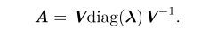
  

实对称矩阵的特征分解：本文只关注一种可以简单分解的矩阵，**实对称矩阵**，A =QΛQ⊤。每个实对称矩阵都可以分解成实特征向量和实特征值，其中Q是A的特征向量组成的**正交矩阵**，Λ是对角矩阵，因为Q是正交矩阵，我们可以将A看作沿方向v(i)延展λi倍的空间：  

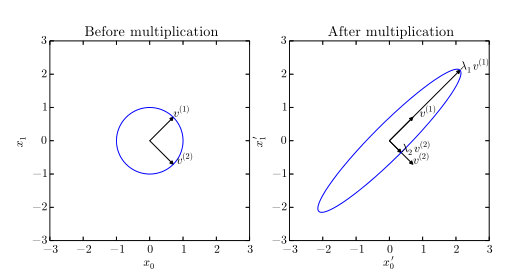
  

实对称矩阵特征分解的性质：

- 当两个或多个特征向量具有相同的特征值时，特征分解不唯一。按降序排列Λ的元素。在该约定下，特征分解唯一当且仅当所有的特征值都是唯一的  
- 当**含有0特征值**时，矩阵是奇异的  
- 实对称矩阵的特征分解也可以用于优化二次方程f(x)=x⊤Ax，其中限制 ∥x∥ 2 = 1。当x等于A的某个特征向量时，f将返回对应的特征值。在限制条件下，函数f的最大值是最大特征值，最小值是最小特征值  
- 所有特征值都是正数的矩阵被称为**正定**（positive definite）；所有特征值都是**非负数**的矩阵被称为半正定  
- 半正定矩阵：∀x,x⊤Ax≥0  
- 正定矩阵：x⊤Ax=0⇒x=0  

## 2.8 奇异值分解（SVD）  
非方阵无特征分解，只能用奇异值分解。将矩阵A分解为三个矩阵的乘积：A = UDV⊤。A：m×n；U：m×m；D：m×n；V：n×n。矩阵U和V都定义为**正交矩阵**，而矩阵D定义为对角矩阵。注意，**矩阵D不一定是方阵** 。  
奇异值：D对角线上的元素，非0奇异值为A⊤A或AA⊤的特征值的平方根  
左奇异向量：U的列向量，即AA⊤的特征向量  
右奇异向量：V的列向量，即A⊤A的特征向量  
SVD最有用的性质：**拓展矩阵求逆到非方矩阵上**  
## 2.9 Moore-Penrose伪逆  
对非方阵求逆，矩阵A的伪逆定义：  

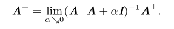
  

计算伪逆的实际算法如下，其中，UDV是上一节中的对A奇异值分解得到的矩阵，D的伪逆是非0元素取倒数之后再转置得到的：  

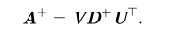
  

当矩阵A的列数多于行数时，使用伪逆求解线性方程是众多可能解法中的一种。特别地，x=A+y 是方程所有可行解中欧几里得范数∥x∥2最小的一个。当矩阵A的行数多于列数时，可能没有解。在这种情况下，**通过伪逆得到的x使得Ax和y的欧几里得距离∥Ax−y∥2最小。**  
## 2.10 迹运算  
迹运算：矩阵对角元素的和  
迹运算描述Frobenius：  

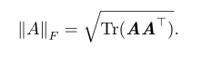
  

迹运算有如下性质：  

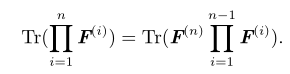
  
## 2.11 行列式  
行列式，记作det(A)，是一个将**方阵**A映射到实数的函数。**行列式等于矩阵特征值的乘积**。行列式的绝对值可以用来衡量矩阵参与矩阵乘法后空间扩大或者缩小了多少。  
## 2.12 实例：用线性代数知识推导主成分分析（PCA）  
