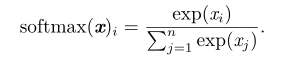
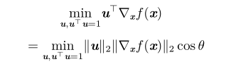
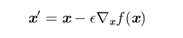
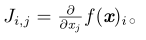
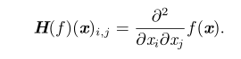
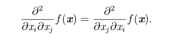
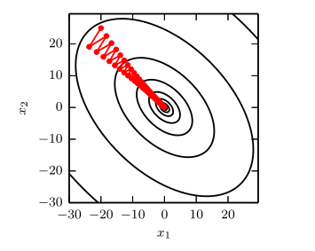
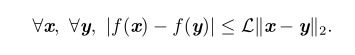
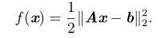

# 
第四章 数值计算
  

数值计算的算法通常是指通过迭代过程更新解的估计值来解决数学问题的算法，而不是通过解析过程推导出公式来提供正确解的方法。  
## 4.1 上溢和下溢  
对上溢和下溢进行数值稳定的一种手段是softmax，上溢和下溢通过softmax(z)解决，其中z=x-maxixi  

  

## 4.2 病态条件  
条件数表征函数相对于输入的微小变化而变化的快慢程度。输入被轻微扰动而迅速改变的函数对于科学计算来说可能是有问题的，因为输入中的舍入误差可能导致输出的巨大变化。  
考虑函数f(x)=A−1x。当A具有特征值分解时，其条件数为max|λi/λj|，当该条件很大时，矩阵求逆对输入的误差特别敏感，这种误差是矩阵本身的固有特性。  
## 4.3 基于梯度的优化方法  
梯度是相对一个向量求导的导数：f的导数是包含所有偏导数的向量，记为∇xf(x)，梯度的第i个元素是f关于xi的偏导数。f作为目标函数，为了最小化f，输出应该是一维的（正如我们平时所见的损失函数、目标函数等）我们希望找到使f下降得最快的方向。计算方向导数，其中u为方向导数，我们就是要找到一个方向u：  

  

这种方法就是梯度下降法，梯度下降建议的新的点是：  

  

### 4.3.1 梯度之上：Jacobian和Hessian矩阵  
假如输入和输出都是向量，需要计算输入和输出都是向量的函数的所有偏导数，此时就需要Jacobian矩阵，有一个函数：f:Rm→Rn，那么f的Jacobian矩阵J∈Rn×m定义为：  

  

二阶导数合并成的矩阵称为Hessian矩阵H(f)(x)，其等价于梯度的Jacobian矩阵：  

  

微分算子在任何二阶偏导连续的点处可交换，也就是它们的顺序可以互换：  

  

这说明Hessian是实对称矩阵。我们可以通过（方向）二阶导数预期一个梯度下降步骤能表现得多好。二阶导数还可以被用于确定一个临界点是否是局部极大点、局部极小点或鞍点。  
当 Hessian 的条件数很差时，梯度下降法也会表现得很差。这是因为一个方向上的导数增加得很快，而在另一个方向上增加得很慢，容易导致如下问题。  

  

我们可以使用 Hessian 矩阵的信息来指导搜索，以解决这个问题。其中最简单的方法是牛顿法（Newton’s method）。  
仅使用梯度信息的优化算法被称为**一阶优化算法** (first-order optimization al-gorithms)，如梯度下降。使用 Hessian 矩阵的优化算法被称为**二阶最优化算法**(second-order optimization algorithms)(Nocedal and Wright, 2006)，如牛顿法。  
在深度学习上，常限制函数满足Lipschitz连续或其导数满足，这允许我们假设梯度下降等算法导致的输入的微小变化将使输出只产生微小变化：  

  

凸优化算法只对凸函数适用，即Hessian处处半正定的函数。因为这些函数没有鞍点而且其所有局部极小点必然是全局最小点，所以表现很好，深度学习背景下凸优化的重要性大大减少。  
## 4.4 约束优化  
就是带约束条件的优化。一种复杂的方法是设计一个不同的、无约束的优化问题，其解可以转化成原始约束优化问题的解。  
KKT方法是Lagrange乘子法（只允许等式约束）的推广。  
## 4.5 最小线性二乘  

  

为了得到上式的最小结果，可以使用梯度下降法逐次迭代得到，可以使用牛顿法。假如加上约束条件x⊤x≤1，我们引入Lagrangian（拉格朗日乘子法）。  
