# 1 多任务学习  
&emsp;&emsp;同时优化多个相关的学习任务  
## 任务（Task）的定义  
&emsp;&emsp;A task is generally referred to the learning of an output target using a single input source. If the input source consists of a single variable (or feature), we will have **a univariate analysis**, if the input source consists of multiple variables (or features), we will have **a multivariate analysis** .  
&emsp;&emsp;任务通常是指使用单个输入源学习输出目标。如果输入源由单个变量(或特征)组成，我们将进行**单变量分析**;如果输入源由多个变量(或特征)组成，我们将进行**多元分析**。  
## 多任务学习的形式  
&emsp;&emsp;“multiple tasks” could mean the learning of multiple output targets using a single input source, or the learning of single output target using multiple input sources, or a mixture of both.  
&emsp;&emsp;“多任务”可能意味着使用一个输入源学习多个输出目标，或者使用多个输入源学习单个输出目标，或者两者兼而有之。  
## 多任务学习的目的  
&emsp;&emsp;MTL is an approach to inductive transfer that improves generalization by using the domain information contained in the training signals of related tasks as an inductive bias. It does this by learning tasks in parallel while using a shared low dimensional representation; what is learned for each task can help other tasks be learned better.  
&emsp;&emsp;MTL是一种归纳转移方法，它使用包含在相关任务训练信号中的域信息作为归纳偏差来提高泛化。同在使用一个共享的低维表示的同时并行地学习任务；在每个任务中所学到的东西可以帮助其他任务学得更好。  
## 1.3 MTL的一些应用  
&emsp;&emsp;特征选择问题：特征选择的时候使用联合选择正则化矩阵方法，效果比多多个源数据单独进行特征选择要好。  
&emsp;&emsp;神经性疾病诊断：单数据源多输出。  
&emsp;&emsp;汽车的目标检测：神经网络预测多类别目标。
## 1.4 相关研究领域  
&emsp;&emsp;归纳迁移学习是MTL的一个特殊例子：归纳迁移学习学习任务有主次之分，而MTL所有任务都是平等的。  
&emsp;&emsp;MTL与learning-to-learn相联系。  
# 2 多任务学习算法表述  
&emsp;&emsp;传统MTL算法的典型表示：  

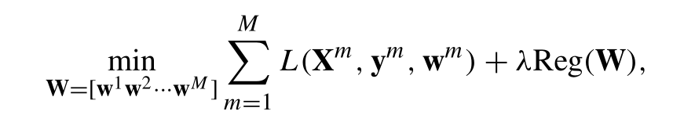
  

&emsp;&emsp;Xm：第m个任务的输入  
&emsp;&emsp;ym:第m个任务的输出  
&emsp;&emsp;wm：第m个任务的参数  
&emsp;&emsp;L：损失函数  
&emsp;&emsp;λ：正则化参数，平衡损失函数和正则化项（太小会过拟合，太高会欠拟合）  
&emsp;&emsp;Reg(W)：正则化项，我们定义的约束项  
&emsp;&emsp;M：任务的个数  
&emsp;&emsp;Nm：第m个任务的样本数量  
&emsp;&emsp;D：每个输入矩阵特征的数量  
&emsp;&emsp;Assumption：所有任务输入的特征维度相同，但样本数量可以不同  
## 2.1 MTL不同的数据保真度项  
&emsp;&emsp;MTL包括三种：SIMO、MISO、MIMO  

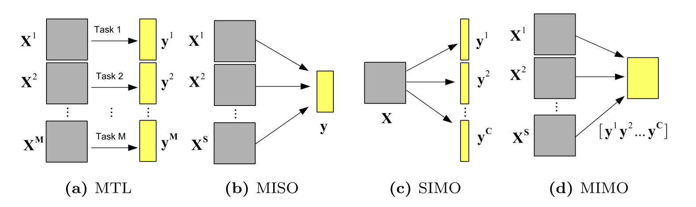
  

### 2.1.1 MISO  
均方损失函数、洛吉斯特损失函数、合页损失函数分别如下：  

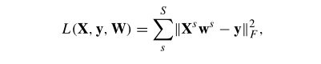
  

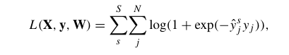
  

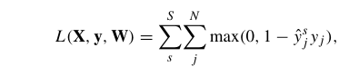
  

### 2.1.2 SIMO  

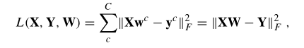
  

&emsp;&emsp;C：表示目标y值的个数  
### 2.1.3 MIMO  

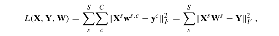
  

## 2.2 MTL权重矩阵不同的正则化项  
### 2.2.1 lasso约束  

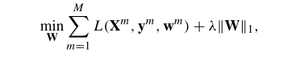
  

&emsp;&emsp;lasso约束也就是l1正则化，正则化参数λ越大，模型权重矩阵越稀疏（过滤掉无用特征）。但是lasso约束并没有充分利用任务间的关联性，通常将其和其他约束一起使用，因此产生很多变种。  
### 2.2.2 组稀疏约束  
#### &emsp;&emsp;*范数的内容在文章后面有讲解*  

##### &emsp;&emsp;l2,1-范数  

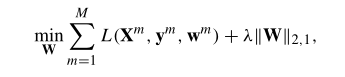
  

&emsp;&emsp;其中，  

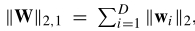
  

##### &emsp;&emsp;lp,q-范数  

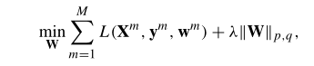
  

&emsp;&emsp;其中，  

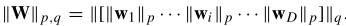
  

##### &emsp;&emsp;Capped lp,1-范数  

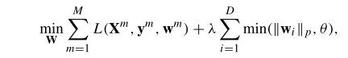
  

##### &emsp;&emsp;Multi-level lasso  

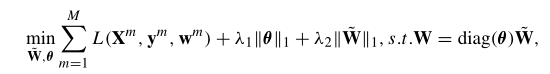
  

##### &emsp;&emsp;Structured group lasso  

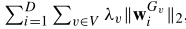
  

##### &emsp;&emsp;Temporal group Lasso  

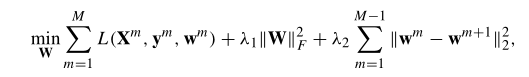
  

### 2.2.3 low-rank 约束  
&emsp;&emsp;使用共享低维子空间代替使用组稀疏约束来提取任务之间的关系。核心就是核范数。  

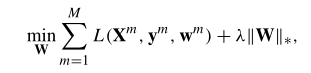
  

### 2.2.4 不相关任务的MTL  
### 2.2.5 图拉普拉斯算子正则化  

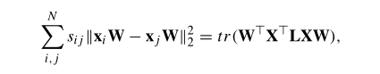
  

## 2.3 不同的MTL已分解的权重矩阵的正则化矩阵方法  
### W=P+Q  
### W=BA  
### W=P+BA  
# 3 不完整数据进行多任务学习  
# 4 使用深度学习的多任务学习  

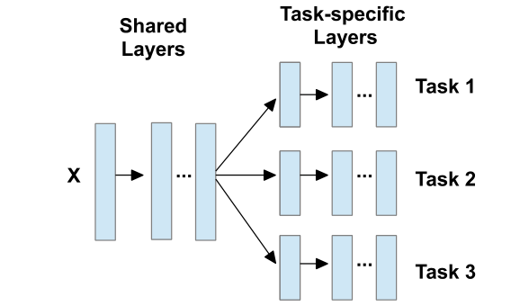
  

## 扩充1：范数  
L1、L2、L0、L2,1、Lp,q、L*  

&emsp;&emsp;[详细讲解看这里](https://blog.csdn.net/zhouxinxin0202/article/details/78620898)  
### 范数扩充-矩阵最大特征值和矩阵奇异值  

## 扩充2：图拉普拉斯算子  
