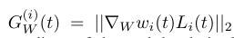
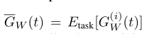
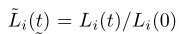
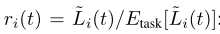
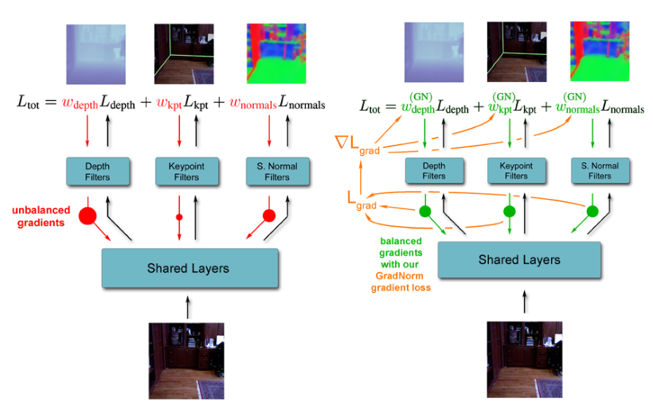
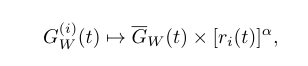
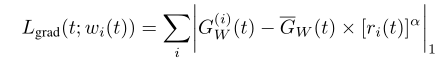
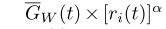
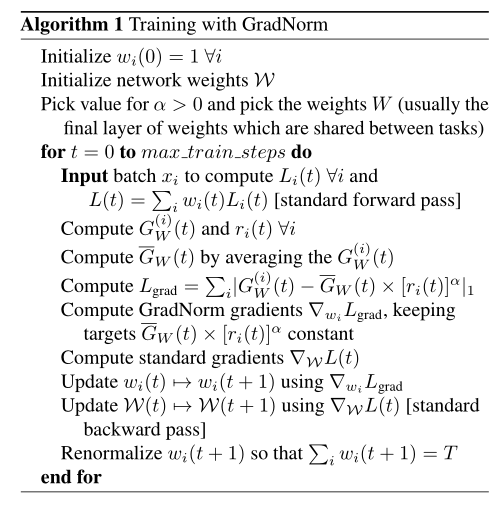
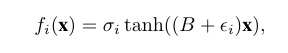

# 摘要  
&emsp;&emsp;深度多任务网络相较于单个任务并行有更好的速度和性能，但是其面临适当训练的挑战。本文提出了一种算法梯度正则化算法GradNorm：该算法通过对梯度大小的动态调整来实现对深度多任务模型训练时的自动平衡。本文的实验显示：GradNorm仅需要调整一个超参数α，就使其在不同的网络结构中，在回归分类任务中，在手工和真实数据集中，相较于单任务网络，静态基线和其他自适应多任务损失平衡技术都有着精度上的提升和过拟合的减小，其同时可以相媲美甚至超过穷尽网格搜索。曾经多任务学习中的参数调整是一个单调乏味的搜索过程，每增加一个任务，它的计算量就会成倍地增加，如今因为GradNorm，使这个过程不受任务数量增长的限制而在少量训练中完成变得可能。也许，GradNorm会释放多任务学习的潜力。  
# 1 引言  
&emsp;&emsp;一个完全场景理解的终极视觉系统必然是同时且有效的执行多个不同角度的任务。理想的多任务将同时具有更高的效率和更高的性能。  
&emsp;&emsp;通常来说，多任务网络很难训练：需要平衡不同的任务才能使模型收敛出鲁棒的共享特征。目前为止的方法主要是调整前向传播或者修改网络体系结构。但是这些方法忽略了重要一点：**任务的不平衡表现为不适当的训练，因为其会引起反向传播梯度的不平衡**。因此，GradNorm的解决办法就是：**通过调整多任务的损失函数直接修改梯度大小来从根本上解决这个问题** 。  
&emsp;&emsp;实际中的多任务的损失函数由单个任务的损失线性的组合而来：L=sum(wi*Li)。GradNorm的提出了一种适应方法，使得在每个时间步对wi都会更新：wi=wi(t)。此种方法的线性组合将会带来梯度平衡，因为wi非常直接且线性地耦合了每个任务的反向传播梯度的大小。因而，本方法需要找到每个时间步最适合的wi来平衡每个任务对最优模型训练的贡献。本文提出了一种简单算法对反向传播梯度过大或过小进行惩罚。正确的平衡是所有任务的训练速度相当。当一个任务训练过快，那么其w需要减小以增大其他任务对模型训练的影响。相较于批量归一化(Ioffe & Szegedy, 2015)，GradNorm有两个不同点：任务归一化而不是数据间的归一化；速率平衡作为归一化的期望目标。  
&emsp;&emsp;本文主要贡献：一种直接调节梯度大小的多任务损失平衡的有效方法；一种仅需调整一个超参数α即可与穷尽网格搜索相媲美甚至更优的方法；说明了直接与梯度进行交互是控制多任务学习的一种强有力的方法。  
# 2 相关工作  
&emsp;&emsp;MTL对多个领域有应用。特别值得注意的是，在寻找明确的方法来利用多任务模型中的任务关系方面，有大量重要的工作要做。(Kendall et al.2017)可能是与当前工作最相关的，它使用联合似然公式，基于每个任务的内在不确定性来推导任务权重。  
# 3 GradNorm算法  
## 3.1 定义及前言  
&emsp;&emsp;对于wi(t)的学习有两个目标：统一梯度准则以发现任务间相对关系；动态调整梯度准则以获得相似的训练速率。  

- &emsp;&emsp;W：实际应用GradNorm的完整网络权重子集，通常选择共享层最后一层的参数以节省计算成本。  

- &emsp;&emsp;t时刻关于W的带权单任务损失梯度的L2范数：  

  

- &emsp;&emsp;t时刻所有任务的梯度范数均值：  

  

- &emsp;&emsp;t时刻单个任务损失比率，**该值越大，表明任务i的训练速率越快**：  

  

- &emsp;&emsp;反向训练速率相关  

  

## 3.2 使用GradNorm平衡梯度  
&emsp;&emsp;图解流程如下：  

  

&emsp;&emsp;期望的梯度范数更新如下，其中均值提供了基线，比率提供了大小，**当比率r越小，表示当前速率越快，梯度范数越大，需要将梯度范数变小，让训练速度降下来**，r越大时相反：  

  

&emsp;&emsp;其中的α设置恢复力的强度，任务复杂度越不相同，训练速度越不匹配时需要设置较大的α来平衡训练速度。当α为0时，会使在W处梯度范数相等。  
&emsp;&emsp;GradNorm做的事就是实际梯度规范和目标梯度规范之间的l1损失函数Lgrad：  

  

&emsp;&emsp;对Lgrad进行微分时，将目标梯度范数（如下图）设置为固定常量且只对wi进行微分，因为wi(t)直接控制任务的梯度大小。  

  

&emsp;&emsp;然后微分后得到梯度▽wiLgrad用于更新wi(相当于直接重新计算了梯度)。**在最后会将wi(t)重新正则化，为了将梯度归一化与全局学习速率解耦。**  
&emsp;&emsp;算法流程如下：  

  

# 4 A Toy Example（一个小例子？）  
&emsp;&emsp;一种通用的情况是：所有任务具有相同的损失函数，但是损失大小不同。如果设置所有的损失权重为1，那么网络训练将会被具有较大损失的任务所支配，这些任务都反向传播较大的梯度，GradNorm可以解决上述问题。  
&emsp;&emsp;T个回归任务用标准平方损失训练，如下：  

  

&emsp;&emsp;其中，tanh(.)是element-wise。输入250维，输出100维。B和ε是常量矩阵，其生成于N(0,10)和N(0,3.5)且独立同分布（IID，independently identically distribution），每个任务共享B，独有ε。δi是问题关键参数，固定尺度用于决定fi输出的比例。δ高的任务将主导训练过程，其难训练，且反向传播梯度大，会导致次优的训练动态。  
&emsp;&emsp;模型训练采用4层Dense(100,ReLU)，最终预测T个值。α设置为0.12。然后呢，模型训练了2个任务及10个任务，将GradNorm与固定wi进行比较，极大提高了时间性能，以及与2017不确定权重方法进行比较，2017方法开始训练很快，但是很快退化，因为其不确定性的权重变化毫无约束，而GradNorm有约束。
# 5 实验部分  
&emsp;&emsp;做了很多实验  
# 6 总结  
&emsp;&emsp;像GradNorm这样的算法可能会有除多任务学习的应用。扩展GradNorm方法来处理类平衡和序列到序列模型仍是研究点，因为在所有存在梯度信号冲突的情况下都会降低模型的性能。梯度调优是在复杂任务上训练大型有效模型的基础。
