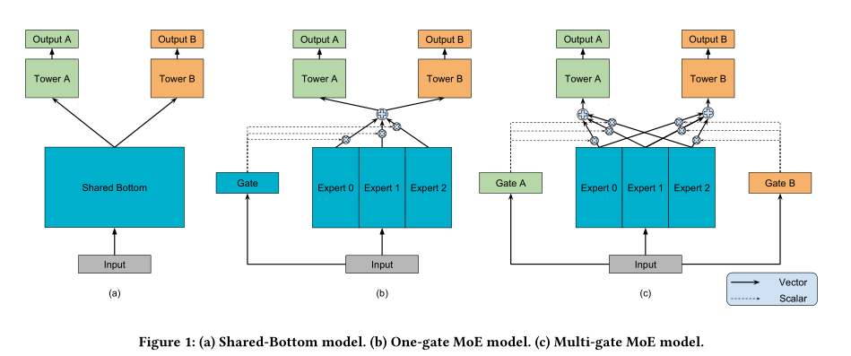
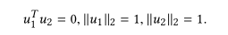
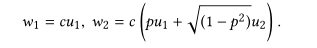
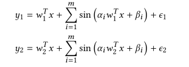
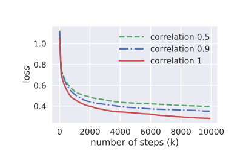
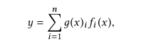
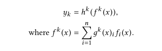
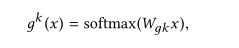

# 摘要  
&emsp;&emsp;本文提出了一种建模任务间关系的方法：多门混合专家模型(Multi-gate Mixture-of-Experts,MMoE)。对其性能的度量是在一个人造数据集（可控任务相关性）进行，然后在实际二分类基准数据集和谷歌大尺寸内容推荐数据集上进行。  
# 1 引言  
&emsp;&emsp;在引言和摘要里都举例：向用户推荐电影时，还需要预测用户对电影的评分，这样才会让他们回来继续购买电影。这篇文章总是在提推荐系统。  
&emsp;&emsp;这一段说了多任务学习经典模型的一个缺点：当所有任务共享相同的参数时，来自任务差异的固有一致性实际上会损害至少部分任务的预测。由此引出MMoE。又说了一下因为数据间复杂的关系模式，导致以前的数据差异性测量并不好用。又说此前的技术都是引入大量的额外的模型参数来保持任务间的差异性，然而对于推荐系统等具有百万或亿级的系统来说，约束力不够，并且在实际的有限资源中，训练如此多的额外参数很难。最后说了MMoE的优点：对任务关系和单任务进行直接建模。它允许自动分配参数来捕获共享的任务信息或任务专用信息，而不需要增加很多新参数。  

  

&emsp;&emsp;专家说白了就是前向反馈网络层。门输入特征，输出softmax门。  
&emsp;&emsp;实验过程是人工数据集（关系可控）（发现在训练次数变多的情况下，MMoE更容易收敛得到更低的loss）、benchmark、UCI、real large-scale content recommendation。  
&emsp;&emsp;最后总结了一下本文的三个贡献：MMoE、人工数据集上的可控实验、大规模数据集上的验证。  
# 2 相关工作  
## 2.1 Deep MTL  
&emsp;&emsp;又讲了共享网络层的缺点，引入了L2约束、十字绣网络、张量分解方法，但是这些方法又具有太多的任务专用参数。  
## 2.2 子网和混合专家的集成  
&emsp;&emsp;就是讲了MoE和PathNet  
## 2.3 多任务学习的应用  
&emsp;&emsp;感觉像是凑字数用的。  
# 3 初步工作  
## 3.1 共享底层多任务模型  
&emsp;&emsp;给了一个公式：  

  

## 3.2 人造数据集的生成  
&emsp;&emsp;可以好好看一下，学习一哈。  
&emsp;&emsp;使用标签间的皮尔逊系数作为任务关联的定量指标。任务间采用正弦函数组合而不是线性组合。  
&emsp;&emsp;(1):给定输入特征维数d，生成两个正交单位向量u1，u2：  

  

&emsp;&emsp;(2):给定尺度常数c和相关分数-1<=p<=1，生成两个权重向量w1和w2：  

  

&emsp;&emsp;(3):从N(0,1)中对输入数据点x∈Rd的每个元素随机采样。  
&emsp;&emsp;(4):生成y1和y2：  

  

&emsp;&emsp;α,β,i = 1,2,…,m参数控制正弦函数的形状和ϵ1,ϵ2先验知识∼N(0,0.01)。  
&emsp;&emsp;(5):重复3、4生成足够的数据。  
&emsp;&emsp;y1和y2的皮尔逊相关就是p。  

  

## 3.3 任务关联性的影响  
&emsp;&emsp;为了验证任务间关联性降低会影响模型质量，就做了如下实验：为共享底部多任务模型进行了不同相关性分数的实验。最终得出结论，传统多任务模型对任务关系是敏感的。  

  

# 4 建模思想  
## 4.1 混合专家  
&emsp;&emsp;MoE模型如下：  

  

&emsp;&emsp;其中g(x)i为g(x)第i个逻辑输出，表示专家fi的概率。g(x)i之和为1，fi为专家。最终输出为专家加权和。  
## 4.2 多门混合专家  
&emsp;&emsp;就是为每个任务设置了一个门。just so so??  

  

  

# 5 MMoE与人造数据  
# 6 实验  
# 7 结论  
&emsp;&emsp;**任务关联性低的时候，MMoE的表现更好；参数少，更高效**。  
# 感受  
&emsp;&emsp;感觉实验不充分啊，都是两个任务，没有比较任务比较多的情况，而且改进太少了，就是为每个任务设置了一个门而已。感觉和Pesudo-task augmentation那篇文章有异曲同工之妙，都是多个任务集成。
