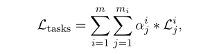
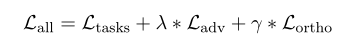
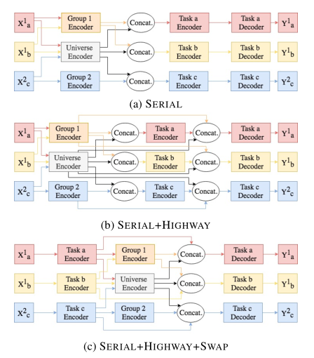
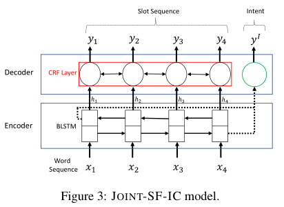
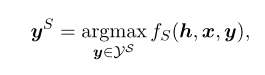
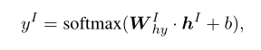
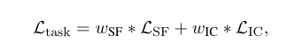

&emsp;&emsp;WDTMD这竟然是篇综述性质的，我是这么认为的。文章提出了几种通用结构。  
# 摘要  
&emsp;&emsp;使用任务的自然分组加入到多任务学习当中，任务组根据已知属性（任务领域或语言）进行分组。并因此实现了两种架构：并行架构及串行架构。  
# 1 引言  
&emsp;&emsp;将任务分组是很自然的事情：联合训练多种语言时，很自然的可以得到语言族信息；同时处理图像和文本信息时，很自然地将其聚为两类。  

- &emsp;&emsp;并行结构：将输入**同时**编码到不同层次的特征空间中。  
- &emsp;&emsp;串行结构：在**任务层次结构的不同层次中**将输入编码到不同的特征空间中。  
  
&emsp;&emsp;作自己说，这篇文章有四个贡献：统一介绍了学习三种特征的结构（任务、任务组、任务域特征）；介绍了两种架构（并行串行）；在真实和手工数据集上测试了性能；实验证明了串行和并行的优越性。  
# 2 体系结构  
&emsp;&emsp;多任务解决了数据不足的问题；后面的都是废话。除了这一句：编码器和解码器可以使用任何组件，不过是理论上。  
## 2.1 并行体系结构  

  

&emsp;&emsp;其任务损失函数如下：  

  

&emsp;&emsp;为抵消三种不同编码器学习特征的冗余，在损失函数中加入了对抗损失和正交约束损失。共享层的对抗训练就是全局和组编码器。正交损失即任务与全局/组之间的编码器的正交约束，为使其学习到不同角度的特征。  

  

## 2.2 串行体系结构  

  

## 2.3 单任务体系的编码器-解码器的例子  
&emsp;&emsp;JOINT-SF-IC结构如下：  

  

&emsp;&emsp;看上图就是一个slot序列的预测和一个整体的目的标签的预测，下面是个BiLSTM，上面是个CRF层。  
&emsp;&emsp;ys和yi的激活函数如下：  

  

  

&emsp;&emsp;联合优化目标函数如下：  

  

# 3 实验设置  
&emsp;&emsp;Alexa数据集、设置了基线等。其中，基线包括几个已存的模型和几个parallel，很明显作者在原文里写到，这几个模型与自己的模型相似，不过是简化版，说明作者不过是对原模型进行了修改，serial模型说白了只是为了体现不一样而改的名。  
# 4 总结  
&emsp;&emsp;这篇文章的主要创新点就是在使用了Group编码器，再一个就是做了比较详细的实验，所以论文实验很重要。  
