# 
Multiple Relational Attention Network for Multi-task Learning
  

&emsp;&emsp;读这篇文章需要先理解什么是注意力机制  
# 摘要  
&emsp;&emsp;此文介绍了一种多任务学习的多关联注意网络MRAN（Multiple Relational Attention Network），这网络由三个注意网络构成，动态地学习任务关系而不是通过预定义地方式，因此避免了关系挖掘不充分以及关系预设不准确的问题。MRAN主要由三部分组成：1)任务-任务关系学习模块，自动地对任务关系进行限定，并自适应地控制正反两方面的知识转移;2)特征-特征交互学习模块，处理特征之间复杂的交互;3)任务-特征依赖学习模块，将相关特征与目标任务分别关联。  
# 1 引言  
&emsp;&emsp;作者认为，多任务学习地核心问题是如何对任务关系进行建模。  
&emsp;&emsp;作者提出了两个困难：如何由MTL模型自身适应性地学习任务间关系（任务关系有三个视角：转移极性、相关强度和关联方式）；如何将不同的任务与相关地特征联系起来。  
&emsp;&emsp;此文三个贡献：发明了一种方法MRAN，自动学习任务间关系并控制任务间正负知识转移；一个任务-特征对齐模块，为不同的任务提取不同地共享特征表示；全面的Deep-MTL框架。  
# 2 预备知识  
&emsp;&emsp;定义、正则化基础地MTL、Deep-MTL  
# 3 研究方法  
## 3.1 框架总览  
&emsp;&emsp;t-f依赖关系学习模块产生注意力权向量α嵌入用于显示基于新功能和任务之间的依赖关系。在测试阶段，特征预测网络直接根据输入X和学习到的注意权值，执行预测任务。在测试阶段放弃了T-F依赖关系学习模块。整个模型体系结构如图所示。  

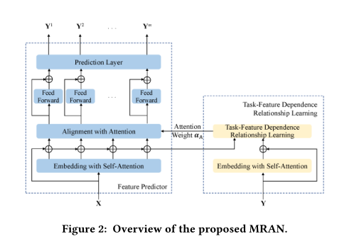
  

## 3.2 使用自注意力机制进行T-T转移关系学习  
&emsp;&emsp;使用四种注意力机制，在得到Y后，首先对每一对输出任务地转移关系进行建模。  

- Dot-product Attention（点积注意力）：基于点积地注意力函数仅从Y计算关联矩阵：  

  

- General Attention：使用一个矩阵WSo来计算关联矩阵：  

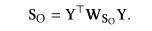
  

- Concatenation Attention（基于连接的注意力）：  

&emsp;&emsp;WSo与两个Y连接进行相乘，使用tanh激活函数，vso是学习的参数，最终So为关联矩阵，其中WSo的尺寸是q*2n，q为隐藏尺度。  

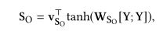
  

&emsp;&emsp;前面的注意力机制在得到关联矩阵So后，为了学习单一的注意表示，使用和池化操作嵌入交互权矩阵，将该值加到特征矩阵的相应维数上。根据下式计算注意权向量，其中softmax为了将输入转换为概率分布：  

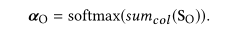
  

&emsp;&emsp;根据下式计算新的任务表示，其中⭕为Hadamard积：  

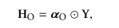
  

- 多头注意力正是下图所利用的注意力机制，与上述三种方式不同，与采用单层前馈神经网络实现的标准加性注意机制相比，该机制具有联合注意不同特征集合中不同表示子空间信息的能力：  

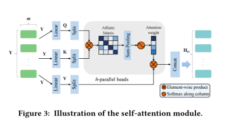
  

&emsp;&emsp;多头注意力机制将Y与Q（query）、K（key）、V（value）相乘，h个并行的头分别注意输出矩阵不同的行，第i行头，使用的Wk，Wq，Wv分别和QKV相关：  

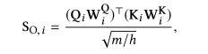
  

&emsp;&emsp;还是softmax：  

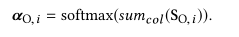
  

&emsp;&emsp;第i行新的任务表示如下：  

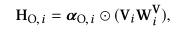
  

&emsp;&emsp;最终将所有的头进行拼接：  

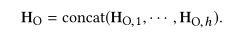
  

&emsp;&emsp;使用上述步骤之后，在MRAN中加入残差和批归一化层：  

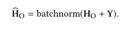
  

## 3.3 自注意力机制下F-F交互关系学习  
&emsp;&emsp;计算过程和上一节完全一样，不过是把y换成了x。  
## 3.4 校准注意力（Alignment Attention）学习任务-特征依存关系  
&emsp;&emsp;过程如图所示：  

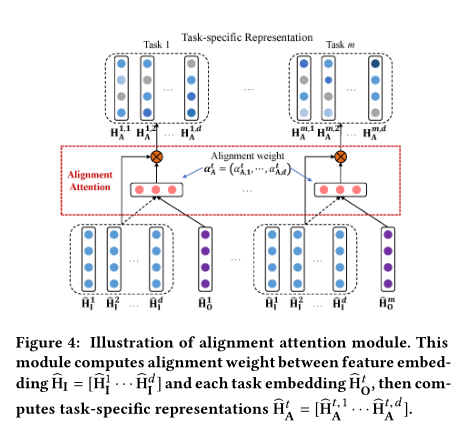
  

&emsp;&emsp;**训练阶段：** 关联矩阵的计算与3.2节一样，不过是为Ho每一列计算，即为每一个任务计算。校准权重计算如下：  

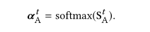
  

&emsp;&emsp;最终每个任务的新的特征表示与上述方法相同，先Hadamard，然后加入残差和批归一化。  
&emsp;&emsp;**测试阶段：** 得到校准权重后，直接根据残差和批归一化那一步计算任务专有特征表示。  
## 3.5 预测层  
&emsp;&emsp;这里就很简单了，就是在每个任务表征最后加了一个前馈子网络预测输出，包含两层ReLU。  

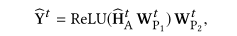
  

## 3.6 目标函数  
&emsp;&emsp;目标函数如下，其中第一项为任务损失的线性结合，第二项为训练参数的惩罚项，第三项为关联矩阵的惩罚项：  

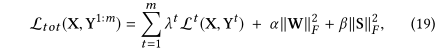
  

&emsp;&emsp;损失函数可以使用最小二乘损失函数：  

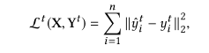
  

## 3.7 理论分析  
&emsp;&emsp;十字绣网络需要预设关联矩阵，十字绣网络为MRAN
的一个特例；MMoE的门控其实就相当于多头注意力机制，而且其不考虑特征交互。  
# 4 实验  
&emsp;&emsp;主要就是和上述两种方法比较。数据集、评价指标、结果、对只包含单一组件的MRAN进行实验。  
# 5 相关工作  
&emsp;&emsp;废话，但是作者说这是第一次尝试通过自注意机制对任务关系和特征-特征交互进行建模，学习特征和任务的内在表示  
# 6 总结  
&emsp;&emsp;**需要将注意力机制的论文看下，多头注意力机制不是很懂啊**  
