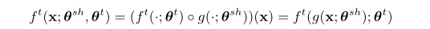

# 
Multi-Task Learning as Multi-Objective Optimization
  

# 摘要  
&emsp;&emsp;此文将多任务学习看作为本质上的多目标优化，因为确实，任务中可能存在竞争性的任务，为了减少损失，通常的做法是使多任务的损失线性加权和降到最小，但是本文将多任务学习视为多目标优化问题进行解决，目标是找到一个pareto最优解。此文提出了多目标损失的上界，并证明优化这个上界可以得到一个pareto最优解。  
# 1 引言  
&emsp;&emsp;统计学中的斯坦悖论是多任务学习的早期动机之一。斯坦悖论如下：使用所有样本估计三个或三个以上高斯随机变量的均值比单独估计要好，即使高斯是独立的。  
&emsp;&emsp;任务竞争情况超出了线性加权损失的可控范围，为多任务寻找的一个不受任何其它因素所支配的解决方案就是pareto最优解。  
&emsp;&emsp;2012年提出的多梯度下降算法MGDA（multiple-gradient descent algorithm）有效解决了这个问题，**该算法使用基于梯度的优化，并可证明收敛于Pareto集合上的一个点。MGDA非常适合于具有深度网络的多任务学习。它可以使用每个任务的梯度并解决一个优化问题来决定对共享参数的更新。**  
&emsp;&emsp;但是MGDA在大尺寸大规模应用方面有两个问题：大规模梯度不行；向后传播的计算次数会线性缩放，乘以任务数。  
&emsp;&emsp;本文提出了一个基于Frank-Wolfe的优化器，其可以应用到大规模的问题上；本为还提出了一个MGDA的优化上界，而且还证明通过单次的反向传播就可以得到而不是特定任务的梯度。利用上界可以得到一个pareto最优解且成本忽略不计。  
# 2 相关工作  
&emsp;&emsp;本文工作就是将剃度为基础的多目标优化应用到多任务学习当中。  
# 3 多任务作为多目标优化  
&emsp;&emsp;加权求和方法需要网格搜索，代价昂贵；且两个任务参数优化相反时，若没有任务重要性，就无法解决。  
&emsp;&emsp;使用向量值损失L来指定多目标优化公式，多目标优化的目标是达到pareto最优：  

  

&emsp;&emsp;多任务的pareto最优性定义如下：  

  

# 3.1 MGDA介绍  
&emsp;&emsp;MGDA以KKT（ Karush-Kuhn-Tucker）为必要条件。为任务特定参数以及共享参数的KKT条件声明如下：  

  

&emsp;&emsp;可以看到，每个任务的关于任务专有参数的梯度为0，且存在一系列权重和为1，且关于共享参数的权重加权和为0。  
&emsp;&emsp;任何满足这些条件的解都称为帕累托平稳点。每一个帕累托最优点都是帕累托平稳的，反之则不然。优化问题如下：  

  

&emsp;&emsp;MGDA的作者表明，这个问题的解要么为0，且得到的点为pareto最优点，要么就为每个任务提供了一个梯度下降的方向来改进所有的任务。由此得到的算法是对任务专有参数的更新以及对共享参数的更新（通过权重加权和）。  
# 3.2 解决上述优化问题  
&emsp;&emsp;上述优化问题等价于在输入点集合的凸包中找到一个极小范数点。两个例子的优化问题如下：  

  

&emsp;&emsp;解决方案如下：  

  

&emsp;&emsp;更具体地图例如下：  

  

&emsp;&emsp;由两个任务地例子推广到多个任务地例子，即扩展Frank-Wolfe方法，使用上述解决方案作为子程序。  

  

  

# 3.3 高效优化的编码器-解码器架构  
&emsp;&emsp;这一节讲述了如何解决后向传播需要乘以T的问题，因为线性放大的后向传播将会使计算开销增大，对于大规模的问题不现实。  
&emsp;&emsp;将任务专有及共享参数结合起来，将假设类约束为：  

  

&emsp;&emsp;g是所有任务共享的表示函数，ft是任务特有函数，z如下：  

  

&emsp;&emsp;我们可以将下列上界表述为链式法则的直接结果:  

  

&emp;&emsp;最终的优化目标如下，将其称为MGDA-UB：  

  

&emsp;&emsp;上述优化问题会产生一个pareto最优解，其定理如下：  

  
# 4 实验  
# 5 总结  
&emsp;&emsp;说白了是对别人方法的改进。  

