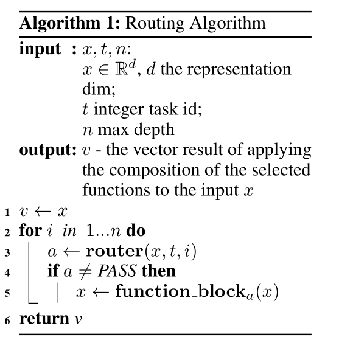
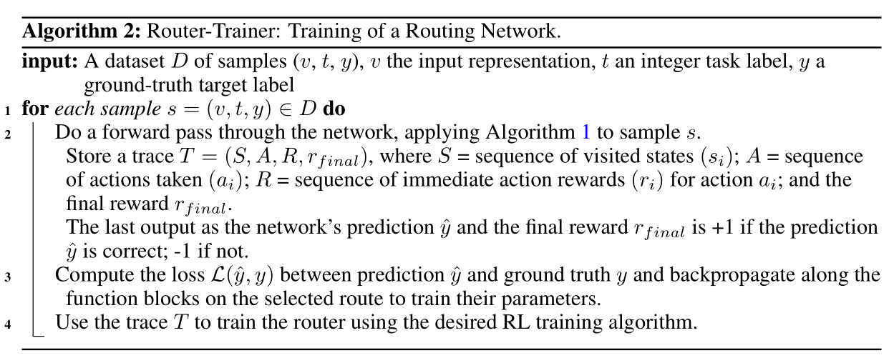
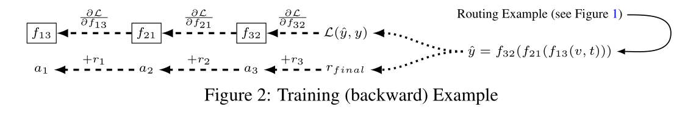
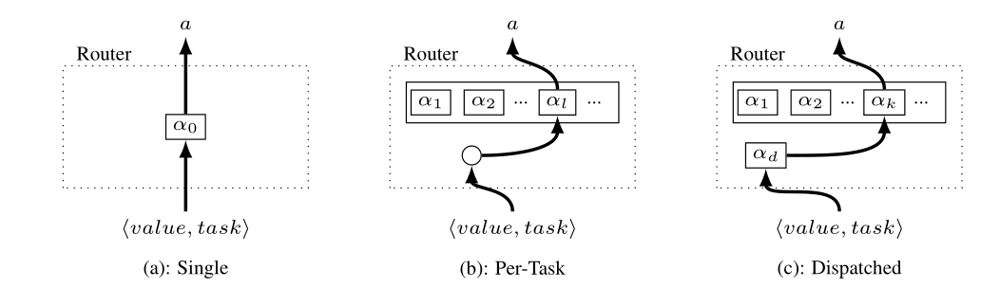
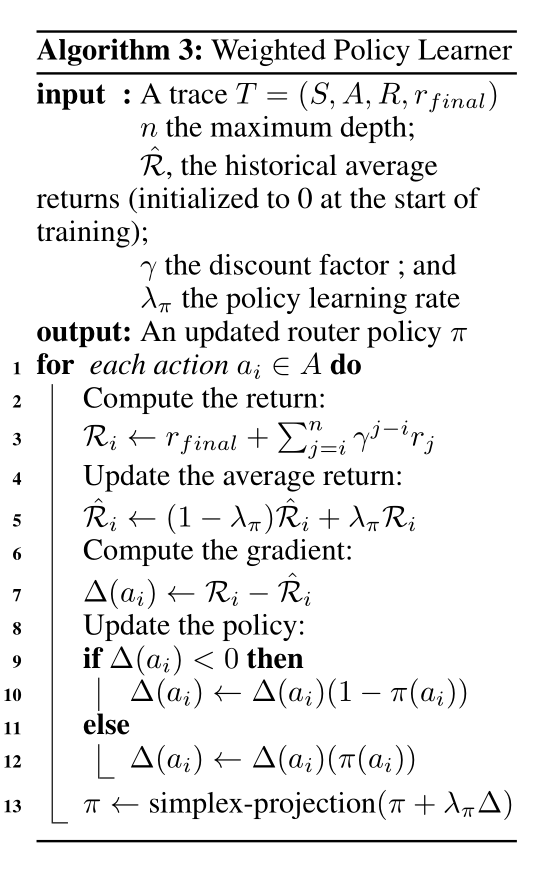
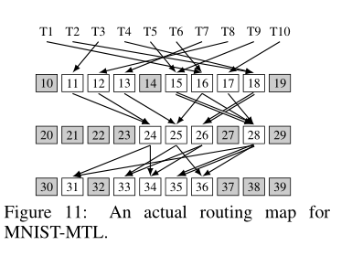

# 
路由网：多任务学习中非线性函数的自适应选择
  

## 摘要  
多任务学习经受任务干扰，提出了一种路由网络：由路由器和一些功能块组成。使用多代理强化学习（multi-agent reinforcement learning,MARL）来联合训练路由和功能块。实验结果表明精度有提升，且训练时间大大缩短，相较十字绣网络提升85%。  
## 1 引言  
路由网可以防止负迁移。路由器的决定可以由多种因素改变。由于路由器会做出一系列不可微的困难决策，因此采用强化学习来训练他们。功能块可以用任何一种网络层。  
## 2 相关工作  
在路由网络中学习的是一个完全动态的组合模型，它可以根据不同的任务调整其结构。与注意力机制和选门机制的MTL有着相同的目标，但是能用于多达20个任务的MTL。本文与混合专家模型也有相似之处，但是其并未扩展到大规模任务应用中去。此项工作扩展进了自动架构搜索这一新兴领域。最近持续学习引起了广泛关注。但是周期太长。任务特定路由作为一种认知功能的高层次思想是建立在人类大脑的生物学研究和理论基础上的。？？？这么牛逼有点吹了。  
## 3 路由网络  
路由是迭代地应用路由器来选择要组成的功能块并应用于输入向量的过程，处理过程如下：  

  

如果功能块具有不同的维度，则路由器必须选择维度匹配的功能块。具体的路由算法如下，其中，PASS表示跳过当前迭代，直接进入下一次迭代，因此，最终选择的功能块的个数可能小于路由深度。  

  

### 3.1 使用强化训练（RL）训练路由器  
RL算法的使用是在反向传播过程中使用的，为了训练路由器策略。通过训练过程记录的轨迹，会保留一系列的状态s和行文a。对行为a会同时记录实时奖励和最终奖励r。奖励是为代理训练设计的。RL算法以及反向传播图示如下：  

  

  

#### 3.1.1 奖励设计  
实时行动奖励是给每一个行动a的回应，最终奖励rfinal是给路由选择最终阶段的。其中，最终奖励衡量网络表现，如果实例分类正确，则奖励为1，否则为-1，回归任务可以用损失来代表奖励。  
实时奖励是为了鼓励路由器尽可能少的使用功能块。奖励就是乘以一个超参数ρ∈[0,1]：块被选中次数的平均值或者块被选中的历史可能性的平均值。实验发现ρ越小越好。  
#### 3.1.2 强化学习算法  
其中，强化学习算法的三种变种图例如下，其中<value,task>指的是输入x和任务标记task，αi表示路由选择代理，αd表示调度代理：  

  

(a)只有一个路由代理来做路由决策。(b)使用固定的规则和固定个数的代理（等同于任务的个数）来进行决策，而(c)使用调度代理来代替规则进行选择路由代理。  
对于多代理场景，使用一种称为加权策略学习器(Weighted Policy Learner, WPL)的MARL算法进行了实验。  
尝试以表格和近似形式存储策略。表格表示以调用深度作为行维，以函数块作为列维，其中的条目包含在给定深度上选择给定函数块的概率。近似值表示可以由一个传入深度的MLP组成(以1-hot表示)，或d个MLPs向量，每个决策/深度对应一个。上述存储策略可以用q-learning和策略梯度算法进行学习。  
下面这段话是复制的：  
*Implementing the router decision policy using multiple agents turns the routing problem into a stochastic game, which is a multi-agent extension of an MDP. In stochastic games multiple agents interact in the environment and the expected return for any given policy may change without any action on that agent s part. In this view incompatible agents need to compete for blocks to train, since negative transfer will make collaboration unattractive, while compatible agents can gain by sharing function blocks. The agents (locally) optimal policies will correspond to the game s Nash equilibrium.*  
*使用多个代理实现路由器决策策略将路由问题转化为一个随机博弈，这是一个MDP的多代理扩展。在随机博弈中，多个agent在环境中相互作用，任意给定策略的期望收益可能在不采取任何行动的情况下发生变化。在这种观点下，不兼容的代理需要争夺块来训练，因为负迁移将使协作失去吸引力，而兼容的代理可以通过共享功能块获得。agent(局部)最优策略对应于博弈的**纳什均衡**。*  
单代理性能很差。WPL是一种**PG算法**，它的设计目的是抑制振荡，**使各代理更快地收敛**。WPL用于表格存储策略。路由器和功能块的训练是在计算损耗后独立进行的，将其联系起来没有提升，其中WPL算法的流程如下：  

  

所以，代理训练的WPL算法是其他的论文。  
## 4 定量结果  
训练速度更快：在给定大小的数据集上，添加功能块对训练路由网络所涉及的计算没有明显的影响。十字绣网络有一个软路由策略，它的计算量与功能块的数量成线性关系。由于软策略在所有功能块中反向传播，而硬路由策略仅在选择的块中反向传播，所以硬策略可以更容易地扩展到需要许多不同类型的功能原语的许多任务学习场景。  
## 5 定性结果  
胡扯，但是反而我觉得，这个多代理过程，更像是在寻找一个组合，感觉不会是最优效果啊，就是有种穷举的感觉。就像下面这个图，第二层代理先为任务选择了四个功能块，第三层反而选择五个，就感觉很奇妙：  

  

## 7 附录  
奖励ρ的选择和对十字绣网络比较的实验，不同的代理结构，决策表示，决策输入，WPL算法扩展。  
感觉本文里贡献最大的好像是WPL吧。  