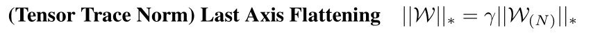
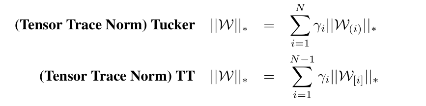
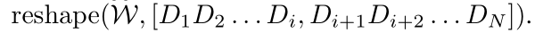
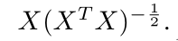
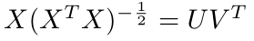
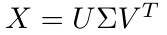
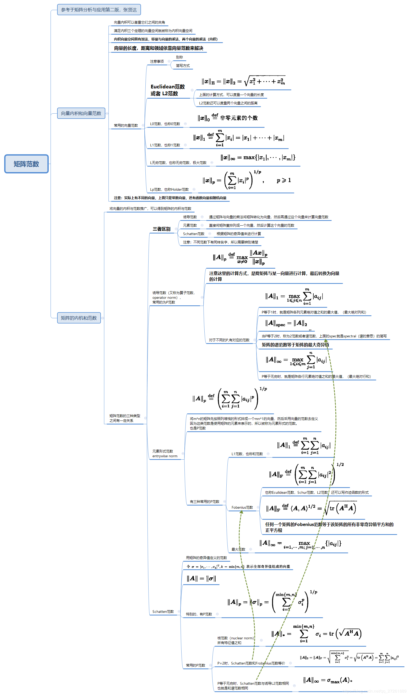

这篇文章只有四页，应该是和张量分解那篇一起看的，感觉比较水。  
## 摘要  
所有模型的参数都由张量迹范数进行正则化，从而鼓励每个神经网络尽可能重用其他参数，这种方法没有通过指定哪些层具有绑定的参数来预先定义参数共享策略，而是考虑所有可共享层的共享，并且共享策略是以数据驱动的方式学习的。  
## 1 引言和相关工作  
Matrix-based MTL：就普通的多任务学习  
Tensor-based MTL：张量为基础的多任务学习，其应用场景没看懂，原文如下：  
  
*In the classic MTL setting, each task is indexed by a single factor. But in many real-world problems, tasks are indexed by multiple factors. For example, to build a restaurant recommendation system, we want a regression model that predicts the scores for different aspects (food quality, environment) by different customers. Then the task is indexed by aspects × customers. The collection of linear models for all tasks is then a 3-way tensor W of size D×T1×T2 , where T 1 and T 2 is the number of aspects and customers respectively. Consequently Ω(W) has to be a tensor regulariser (Tomioka et al., 2010). For example, sum of the trace norms on all matriciations 1 (Romera-paredes et al., 2013), and scaled latent trace norm (Wimalawarne et al., 2014). An alternative solution is to concatenate the one-hot encodings of the two task factors and feed it as input into a two-branch neural network model (Yang & Hospedales, 2015).*  
  
Deep MTL：正常  
## 2 研究方法  
矩阵的迹范数=矩阵奇异值的和，其是矩阵的秩的最紧密的凸关系。如何定义张量的秩取决于我们如何对张量进行因式分解。对一个N路张量，其张量迹范数如下定义：  

  

使用张量最后一维来索引任务，这是最简单直接的方式应用矩阵基的技术。Tucker和TT rank分别如下：  

  

W[i]是展开张量的另一种方式，其形式如下：  

  

## 3 迹范数的优化  
使用梯度下降法不是最好的选择，但是为了和DL保持一致，因此采用次梯度下降：  

  

更稳定的计算数值的方法来代替计算平方根：  

  

  

## 4 实验  
该技术为深度多任务学习中的分支结构设计问题提供了一种数据驱动的解决方案。  
## 延申  
各种范数的定义如下：  

  
