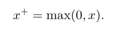

# 
第三章 概率与信息论
  
概率论原先只是用来预测概率的，现在被机器学习大量的使用。因为机器学习通常必须处理不确定量，有时也可能需要处理随机(非确定性的)量。  
概率分为两种：频率派概率，直接与事件发生的频率相联系（丢硬币）；贝叶斯概率，涉及到确定性水平（医生诊断病人得病概率）  
## 3.2 随机变量  
一个随机变量只是对可能的状态的描述；它必须伴随着一个概率分布来指定每个状态的可能性。  
## 3.3 概率分布  
用来描述随机变量或一簇随机变量在每一个可能取到的状态的可能性大小。  
### 3.3.1 离散型随机变量和概率质量函数  
PMF：概率质量函数，表示离散型随机变量的概率分布。x∼P(x)。当概率质量函数同时作用于多个随机变量时，其概率分布称为联合概率分布。  
函数P是随机变量x的PMF，其必须满足以下条件：P定义域是x所有状态的集合；任意状态x，其概率0<=P(x)<=1；所有状态的概率和为1，这称为归一化条件。  
### 3.3.2 连续型变量和概率密度函数（PDF）  
概率密度函数p(x)并没有直接对特定的状态给出概率，相对的，它给出了落在面积为δx的无限小的区域内的概率为p(x)δx。  
## 3.4 边缘概率  
通过联合概率分布来了解其对于子集上的概率分布就是边缘概率分布，有x和y的P(x,y)，计算P(x)的离散与连续求和法则如下：  

  

  

## 3.5 条件概率  
条件概率分布的计算公式如下，分母必须大于0：  

  

## 3.6 条件概率的链式法则  
链式法则如下，其中一个例子如下：  

  

  

## 3.7 独立性和条件独立性  
两个随机变量是相互独立的，如下：  

  

两个随机变量是条件独立的，如下：  

  

## 3.8 协方差  
公式如下：  

  

两个变量相互独立，则其协方差为0，反之不一定。  
## 3.9 常用概率分布  
### 3.9.1 Bernoulli分布  
Bernoulli分布是单个二值随机变量的分布。它由单个参数ϕ∈[0,1]控制，ϕ给出了随机变量等于1的概率。  

  

### 3.9.2 Multinoulli分布  
是指在具有k个不同状态的单个离散型随机变量上的分布，其中k是一个有限值。Multinoulli分布由向量p∈[0,1]k−1参数化，其中每一个分量pi表示第i个状态的概率。最后的第k个状态的概率可以通过1−1⊤p给出。注意我们必须**限制1⊤p≤1**。Multinoulli分布经常用来表示对象分类的分布，所以我们很少假设状态1具有数值1之类的。因此，我们通常不需要去计算Multinoulli分布的随机变量的期望和方差。  
### 3.9.3 高斯分布  

  

µ∈R和σ∈(0,∞)，µ给出了中心峰值的坐标，也是分布的均值；σ给出了标准差，方差用σ2表示。标准正态分布，µ=0，σ=1。  

  

当我们需要经常对不同参数下的概率密度函数求值时，用方差的倒数β控制分布的精度：  

  

为什么采用正态分布，当我们由于缺乏关于某个实数上分布的先验知识而不知道该选择怎样的形式时，正态分布是默认的比较好的选择：很多真实情况比较接近，中心极限定理也给出了相同的答案；在具有相同方差的所有可能的概率分布中，正态分布在实数上具有最大的不确定性。因此，我们可以认为**正态分布是对模型加入的先验知识量最少的分布。**  
多维正态分布如下，它的参数是一个正定对称矩阵Σ（分布的协方差矩阵）：  

  

同样的代替如下，把协方差矩阵固定成一个对角阵，更简单的是各向同性高斯分布：  

  

### 3.9.4 指数分布和Laplace分布  
如果需要在x=0处取得边界点的分布，则会使用指数分布，其使用指示函数1x≥0来使得当x取负值时的概率为零：  

  

Laplace分布允许我们在任一点μ处设置概率质量的峰值:  

  

### 3.9.5 Dirac分布和经验分布  
有时,我们希望概率质量函数的所有质量都集中在一个点上,使用Dirac delta函数:p(x)=δ(x−µ),其被定义为**除了0以外的所有点的值都是0,但是积分为1.**这是一个抽象的概念,其被称为**广义函数,**把其想象成一系列函数的极限点，这一系列函数把**除0以外**的所有点的概率密度越变越小。通过μ可以得到一个在x=µ处具有无限窄也无限高的峰值的概率质量。  
Dirac分布作为**经验分布**的一部分如下:  

  

经验分布将概率密度1/m赋给m个点x(1),...,x(m)中的每一个，这些点是给定的数据集或者采样的集合。其是训练数据的似然最大的那个概率密度函数.  
### 3.9.6 分布的混合  
在混合模型中,样本是由哪个组件分布产生的取决于从一个 Multinoulli分布中采样的结果：  

  

潜变量是我们不能直接观测到的随机变量。混合模型的组件标识变量c就是其中一个例子。  
高斯混合模型,它的组件p(x|c=i)是高斯分布。高斯混合模型是概率密度的万能近似器.在这种意义下，任何平滑的概率密度都可以用具有足够多组件的高斯混合模型以任意精度来逼近。  
## 3.10 常用函数的有用性质  
logistic sigmoid,通常用来产生 Bernoulli 分布中的参数ϕ:  

  

其函数图示如下:  

  

softplus函数,用来产生正态分布的β和σ参数,它的范围是(0,∞):  

  

其是如下函数的平滑版本:  

  

softplus函数图示如下:  

  

如下有一些非常重要的性质:  

  

## 3.11 贝叶斯规则  

  

P(y)可以用下面的公式计算出来，因此不需要事先知道P(y)

  

## 3.12 连续型变量的技术细节  
深入理解需要用到**测度论**  
概率论中的一些重要结果对于离散值成立但对于连续值只能是“几乎处处”成立。  
假设有y=g(x)，那么py(y)=px(g−1(y))是不对的，证明如下：  
保持如下性质：  

  

求解得到：  

  

等价于：  

  

高维空间中，微分运算扩展为Jacobian矩阵的行列式，矩阵的每个元素变为Ji,j=∂xi/∂yj  

  

## 3.13 信息论  
主要使用信息论的一些关键思想来描述概率分布或者量化概率分布之间的相似性。  
信息论量化信息的三个性质：  

  

一个事件X=x的自信息：I(x)=-logP(x)自信息只能处理单个的输出，当需要对概率分布中的不确定性总量进行量化，使用香农熵，代表的是分布的事件所产生的期望信息总量。  

  

那些接近确定性的分布(输出几乎可以确定)具有较低的熵；那些接近均匀分布的概率分布具有较高的熵。  
使用KL散度来衡量两个分布之间的差异（假设Px和Qx都是关于随机变量x的概率分布）：  

  

KL散度是非对称的，且非负的。当KL为0时，表明两个离散分布相同或连续分布几乎处处相同。非对称的意思是：  

  

这种非对称性意味着选择DKL(P||Q)还是DKL(Q||P)影响很大。  
交叉熵：H(P,Q)=H(P)+DKL(P||Q)，当碰到0log0时，使用极限(x趋近于0)得到0log0=0：  

  

## 3.14 结构化概率模型  
当我们用图来表示这种概率分布的分解，我们把它称为结构化概率模型（structured probabilistic model）或者图模型（graphical model）。  
有向图：  

  

  

  

无向图：  

  

  

  

图模型概率分布的一种特殊描述（description）所具有的特性，而任何概率分布都可以用这两种方式进行描述。  
