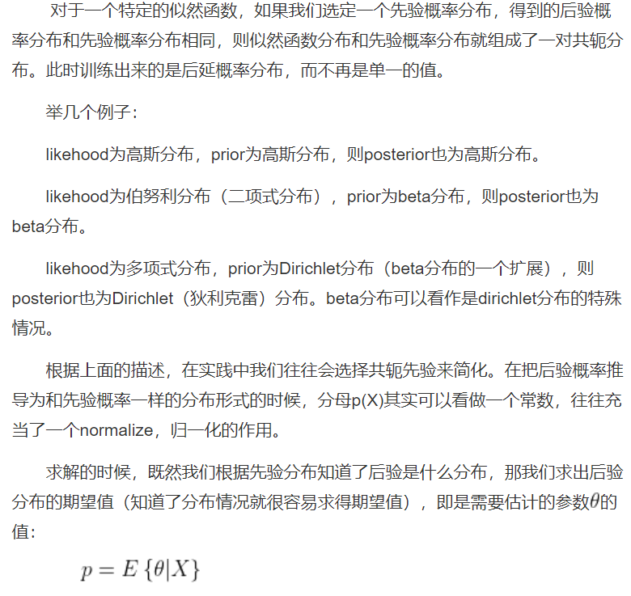
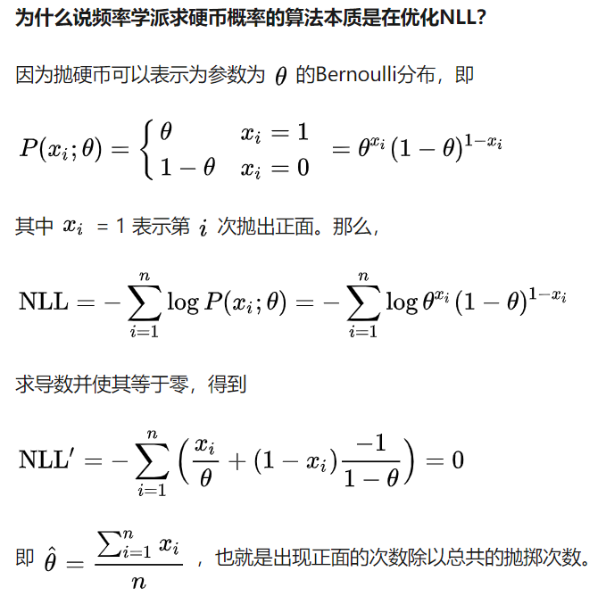

### MAP、MLE、Bayes  
- MAP和MLE的推导及关系  
- 极大似然估计到对数似然损失函数  
- 对数似然损失函数在多分类中的具体计算  
- 期望风险、经验风险以及结构风险与MAP和MLE的关系  

  
  
- 最大后验估计允许我们把先验知识加入到估计模型中，这在样本很少的时候是很有用的（因此朴素贝叶斯在较少的样本下就能有很好的表现），因为样本很少的时候我们的观测结果很可能出现偏差，此时先验知识会把估计的结果“拉”向先验，实际的预估结果将会在先验结果的两侧形成一个顶峰。通过调节先验分布的参数，比如beta分布的α，β，我们还可以调节把估计的结果“拉”向先验的幅度，α，β越大，这个顶峰越尖锐。这样的参数，我们叫做预估模型的“超参数”。
- 贝叶斯估计是MAP基础之上的，MAP省略了bayes公式中的分母P(X)，而贝叶斯估计不可以省略，即要考虑θ的所有情况（P(X)可以展开为全概率公式），且Bayes估计要估计整个参数概率分布，比如NB  

### 共轭分布  

  
### 抛硬币就是极大似然估计  

  

### 贝叶斯统计  
通过已知的概率模型来精确的计算各种结果的可能性就是概率论；根据观测的结果来推断模型的不确定性就是统计学  
贝叶斯统计学派被古典统计学派诟病的核心问题是对于未知变量的先验分布是非常主观的  
古典统计学认为，未知的模型或者参数是确定的，只不过我们不知道它确切的形式或者取值   
贝叶斯统计学认为，未知的模型或者参数变量是不确定的，但是这种不确定性可以由一个概率分布来描述   
对很多生活中的实际问题，使用一个合理的猜测（educated guess）作为先验是很有好处的  
新证据或者数据来更新认知的过程就是贝叶斯推断  
贝叶斯推断框架的强大之处在于我们可以迭代的看问题，即在每次有新观测数据后我们可以得到一个新的后验分布，然后把它作为下个新数据出现前的（新的）先验分布。换句话说，在这个过程中我们通过反复迭代使用贝叶斯定理，持续更新对未知量的分布的认知。
