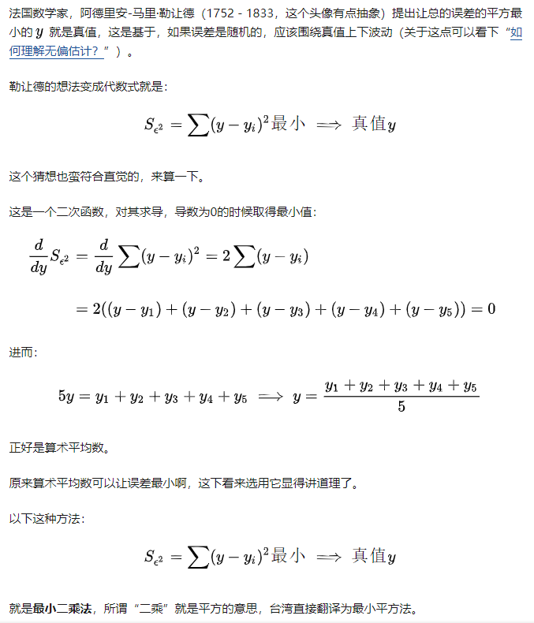
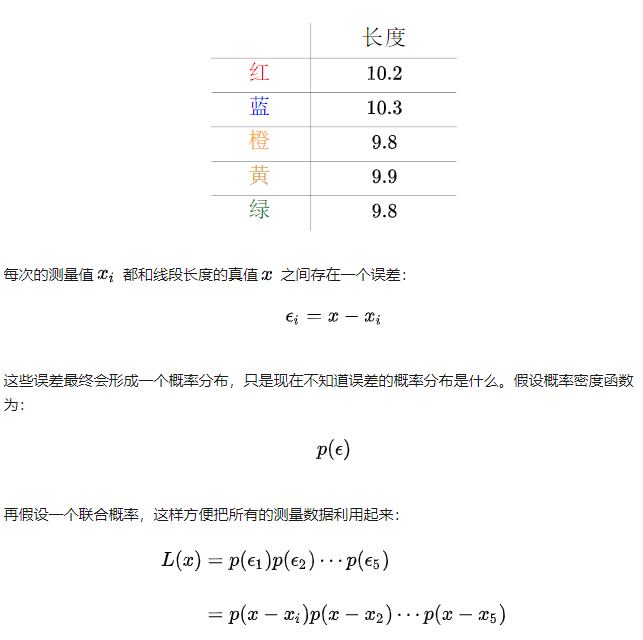
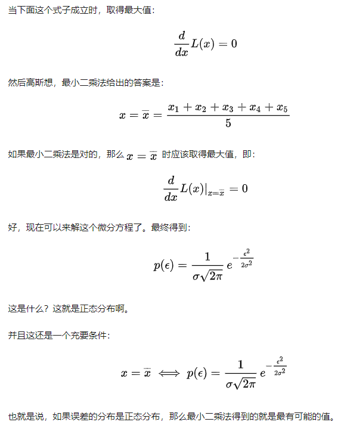
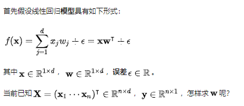
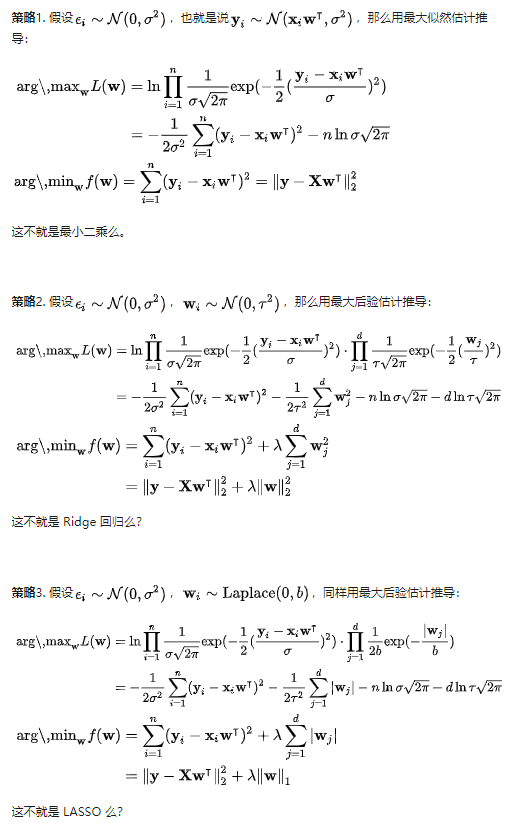

### 最小二乘法的定义  

  

### ls与正态分布  

  

  

### ls ridge lasso推导  
从概率论的角度：  
Least Square 的解析解可以用 Gaussian 分布以及最大似然估计求得  
Ridge 回归可以用 Gaussian 分布和最大后验估计解释  
LASSO 回归可以用 Laplace 分布和最大后验估计解释  

  
  

  
