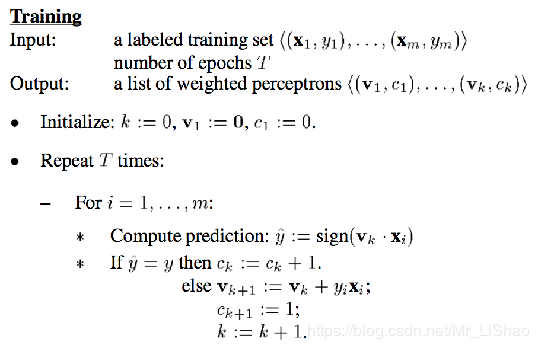
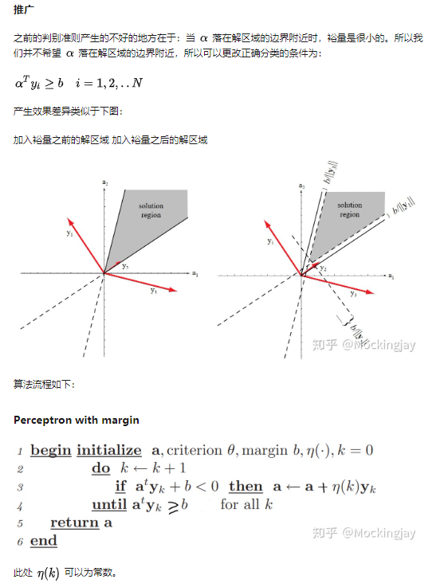

### 口袋算法  
&emsp;&emsp;如果数据线性不可分，感知机显然解决不了这样的问题，解决办法是找到一个犯错最少的超平面。具体的做法就是在寻找的过程中把最好的超平面记住（放在口袋里）  
  
Pocket Algorithm简单总结如下：  
- 初始化w，把w作为最好的解放入口袋  
- 随机找出一个分类错误点  
- 修正错误，假设迭代次数为t次（t=1,2,...），那么修正公式为：  
- 如果$w_{t+1}$比w犯的错误少，那么用$w_{t+1}$替代w，放入口袋  
- 经过t次迭代后停止，返回口袋里最终的结果    
  
&emsp;&emsp;相对于PLA算法，Pocket算法花费的时间更多，PLA只需要证明一个点犯错就表示线不合适，但是Pocket算法还要 把所有犯错的点都找出来，并相加对比  
### 表决感知机  
&emsp;&emsp;预设k个带有权重初始化为0的感知机，单独训练每个样本，按照下面的算法训练感知机的权重以及参数，最终结果由k个感知机投票决定  

  
  
### 带边缘感知机  
&emsp;&emsp;普通感知机判断误分类点是$-y_i(wx_i+b)>0$或者说$y_i(wx_i+b)<0$，现在误分类点为$y_i(wx_i+b)<d_{margin}$，即分离超平面不仅需要分类正确，还需要与点的距离足够远  

  
  