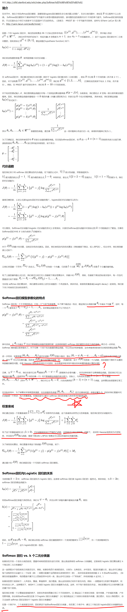

主要矛盾是，在统计学习方法中，使用LR进行多分类的模型如下：  
$$P(y=k|x)=\frac{e^{w_kx}}{1+\sum\limits_{k=1}^{K-1}e^{w_kx}}$$  
$$P(y=K|x)=\frac{1}{1+\sum\limits_{k=1}^{K-1}e^{w_kx}}$$  
而softmax的函数如下：  
$$P(y=k|x)=\frac{e^{w_kx}}{\sum\limits_{l=1}^{K}e^{w_lx}}$$  
感觉二者好像没有什么区别啊，区别就在于第K项分类的计算公式，但是计算的最终结果又不一样，比如，$e^{w_kx}=2,3,4,k\in\{1,2,3\}$，则用LR多分类计算出来的三类的概率分别是1/3，1/2，1/6；用softmax计算出来的概率分别是2/9，1/3，4/9  

  
