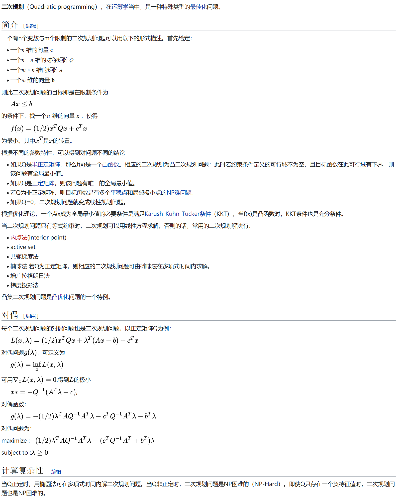
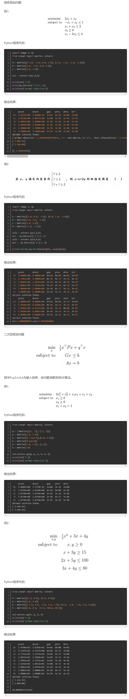

  
Python中支持Convex Optimization（凸规划）的模块为CVXOPT,其安装方式为：

卸载原Pyhon中的Numpy
安装CVXOPT的whl文件，链接为：https://www.lfd.uci.edu/~gohlke/pythonlibs/
安装Numpy+mkl的whl文件，链接为：https://www.lfd.uci.edu/~gohlke/pythonlibs/
之所以选择这种安装方式，是因为Python的whl和pip直接install的不兼容性。

  CVXOPT的官方说明文档网址为：http://cvxopt.org/index.html， 现最新版本为1.1.9,由Martin Andersen, Joachim Dahl 和Lieven Vandenberghe共同开发完成，能够解决线性规划和二次型规划问题，其应用场景如SVM中的Hard Margin SVM.

  CVXOPT使用举例如下：

  