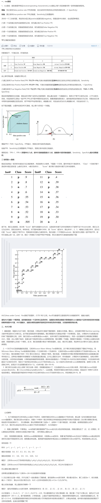

### AUC简介
- AUC是Area Under Curve的首字母缩写，这里的Curve指的就是ROC曲线，AUC就是ROC曲线下面的面积（下面会介绍） 
- AUC是模型评价指标，只能评价二分类模型，其他的二分类模型指标有logloss，precision，accuracy等  
  
### 为什么要用AUC
- 因为ROC曲线有个很好的特性：当测试集中的正负样本的分布变化的时候，ROC曲线能够保持不变。  
- 在实际的数据集中经常会出现类不平衡（class imbalance）现象，即负样本比正样本多很多（或者相反），此时如果用precision/recall等指标的话，数据分布的波动就会出现预测的较大波动  
- AUC考虑了分类器对于正例和负例的分类能力，在样本不平衡的情况下，依然能够对分类器作出合理的评价  
- 下图是ROC曲线和Precision-Recall曲线的对比，(a)和(c)为ROC曲线，(b)和(d)为Precision-Recall曲线。(a)和(b)展示的是分类其在原始测试集（正负样本分布平衡）的结果，(c)和(d)是将测试集中负样本的数量增加到原来的10倍后，分类器的结果。 

  
