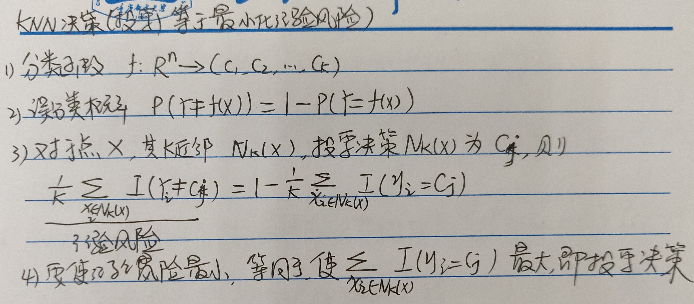
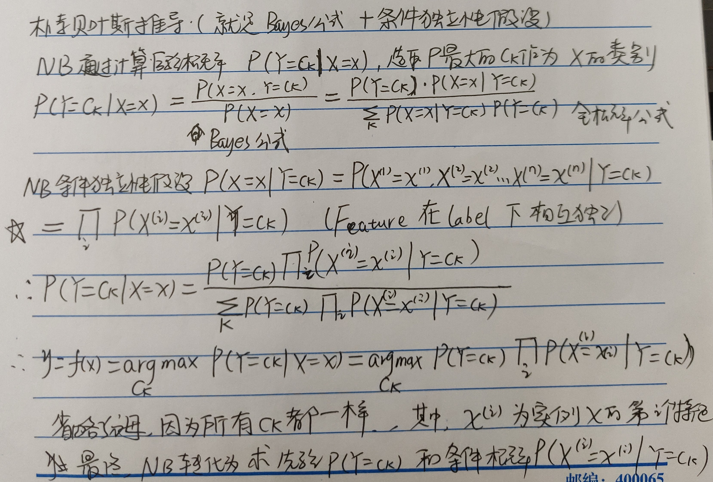
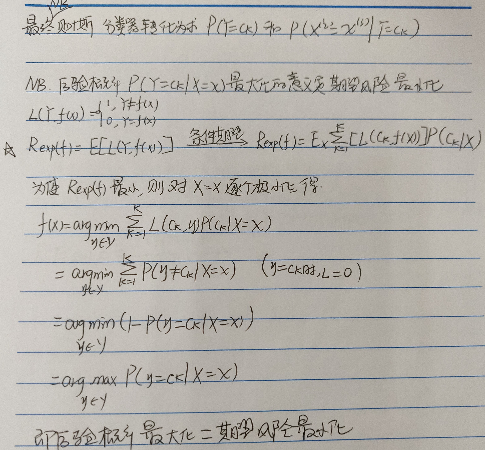
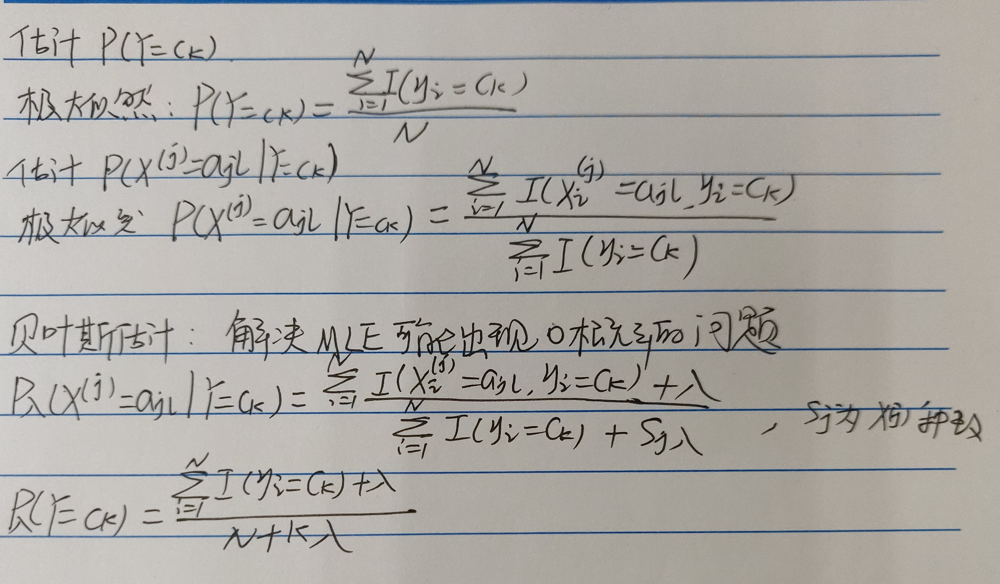

1、感知机推导  

  

2、KNN投票决策就是经验风险最小化，为什么？  

  

3、Naive Bayes推导（Bayes公式和条件独立性假设）  

  

4、为什么NB的后验概率最大化就是期望风险最小化？  

  

5、NB的先验概率和条件概率的极大似然估计和贝叶斯估计  

  

其证明为：  
https://www.zhihu.com/question/33959624