## 绪论  
学好概率论的两条检验标准：是否对“随机”有足够的认识；是否对“数据”感兴趣  
## 第一次 基本概念  
#### 1、随机试验、样本空间、随机事件的关系  
随机试验（对随机现象的观察、记录、实验）→样本空间（随机试验所有可能的结果构成的集合）→随机事件（样本空间S中的子集）→必然事件（样本空间S看作事件）+基本事件（事件A只含一个样本点e）+不可能事件（空集）  
#### 2、事件的相互关系：A-B=AB'=A∪B-B=A-AB；A∩B=空集时，A和B互不相容或排斥→A∪B=S时，称二者互逆、对立  
#### 3、频率的性质  

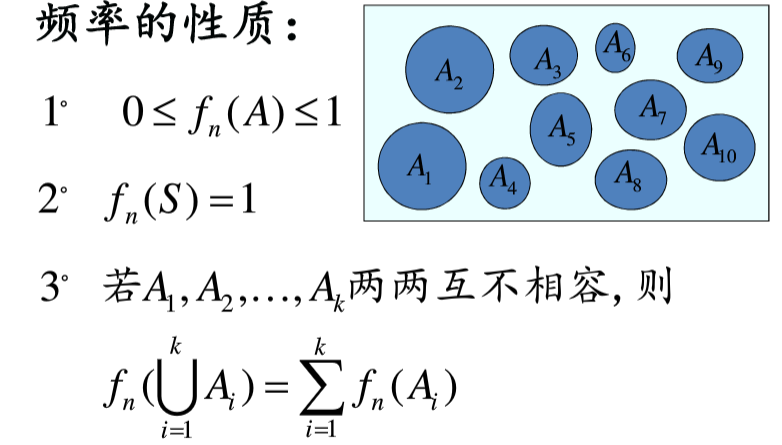
  

#### 4、概率的加法公式  

- 有限可加性：N个事件互斥，则N个事件的概率和等于N个事件求并后再求概率  
- 若A包含于B，则P(B-A)=P(B)-P(A)（P(B)=P(A)+P(B-A)）  
- 一般的，P(A∪B)=P(A)+P(B)-P(AB)（A∪B=A∪(B-A)→P(A∪B)=P(A)+P(B-A)=P(A)+P(B)-P(AB)）  

## 第二次 概率  
#### 1、条件概率  

- P(B)≠P(B|A)，因为A的发生压缩了B的样本空间  
- 对于条件概率的理解：P(B|A)=P(AB)/P(A)可以理解为**B在A中所占的比例**；条件概率是概率；条件概率同样具有可列可加性；**条件概率具有概率的所有性质**  
- 条件概率的乘法公式：P(A1A2...An)=P(A1)P(A2|A1)P(A3|A1A2)...P(An|A1A2...An-1)  

#### 2、全概率公式及贝叶斯公式  

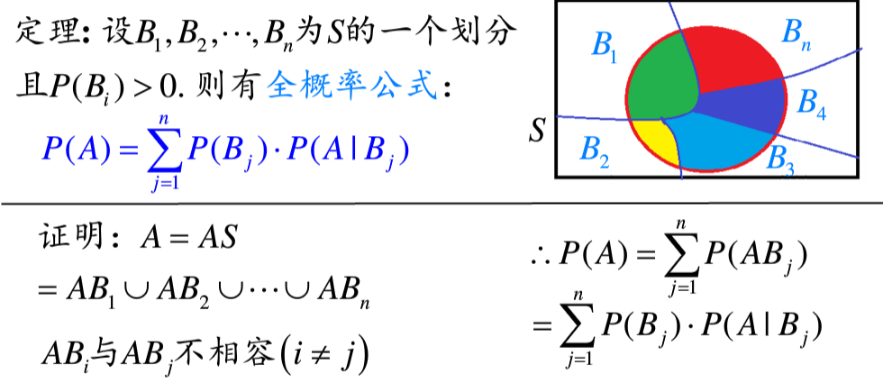
  

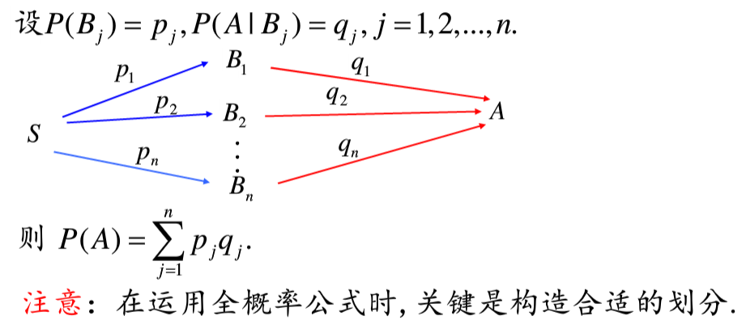
  

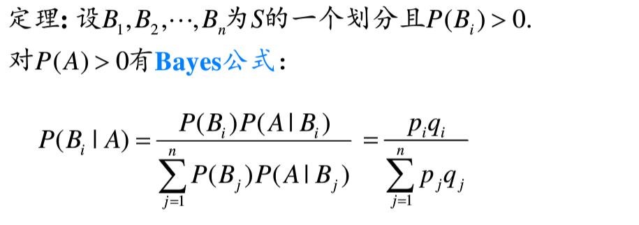
  

全概率公式给出了计算概率的另一种方法（找一个划分）；贝叶斯公式？
#### 3、事件独立性  
注意两两独立并不是相互独立的充分条件，事件是独立的就可以转换为概率的乘积。条件概率就可以省去条件（P(A|B)=P(A)）；小概率发生事件在大量重复实验中至少有一次发生几乎是必然的  

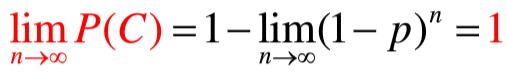
  

## 第三次 离散型随机变量  
#### 1、泊松分布与二项分布的关系  

- 泊松分布：P(X=k)=λke-λ/k!  
- eλ的泰勒展开（麦克劳林公式）为：  

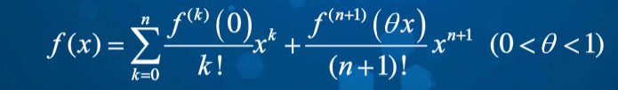
  

  

- 可以看到，泊松分布之和为1  
- 泊松分布的用途：如果某事件以固定强度λ，随机且独立的出现，该事件在单位时间内出现的次数（个数）可以看作是服从泊松分布（某人一天收到的微信的数量、来到公共汽车站的乘客、某放射性物质发射出的粒子、显微镜下某区域中的白血球）  
- **二项分布与泊松分布具有近似关系**：当n>10,p<0.1时，二者具有近似关系，λ=np  
- 几何分布P(X=k)=p(1-p)k-1：在重复多次的伯努利试验中，实验进行到某种结果出现第一次为止服从几何分布（首次击中目标时射击的次数）  

#### 2、分布函数  

- 理解了分布函数的定义就好理解了：随机变量X，对任意实数x，称函数F(x)=P(***X<=x***)为X的概率分布函数，简称分布函数。要注意区间的开闭情况，比如P(**a<X<=b**)=P(X<=b)-P(X<=a)=F(b)-F(a)、P(a<X<b)=P(a<X<=b-0)=F(b-0)-F(a)  
- F(x)是单调不减的，且为右连续函数，即F(x+0)=F(x)  

## 第四次 连续型随机变量  
#### 1、连续型随机变量的分布函数与概率密度的性质   

- 首先要注意连续型随机变量的定义：对于随机变量X的分布函数F(x)，若存在**非负**的函数f(x)，使对于任意实数x有：  

  

称X为连续型随机变量，f(x)为概率密度函数。可以看到**连续型随机变量的定义是通过分布函数存在概率密度函数给出的**  

- 重点研究的是概率密度函数，而不是分布函数：f(x)>=0；无穷区间上的积分为1；开闭区间无所谓（单个点的概率为0）；当Δ趋近于0时，P(x<X<=x+Δx)≈f(x)·Δ(x)；**f(x)的值是可以大于1的**  

#### 2、均匀分布与指数分布  

- 对于任意的a<k<k+l<b，均有p(k<X<k+l)=l/(b-a)，与k无关，仅与l有关  
- 指数分布的定义：概率密度函数以及分布函数为：  

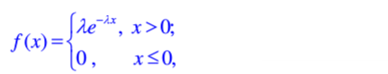
  

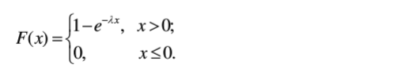
  

注意，λ是大于0的  

- 指数分布的无记忆性  

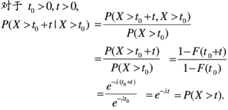
  

- 指数分布的用途：指数分布可以用来表示独立随机事件发生的时间间隔（旅客进机场的时间间隔，排队论中一个顾客接受服务的时间长短，以及无记忆性的现象（连续时））  

#### 3、正态分布  

- 正态分布的定义  

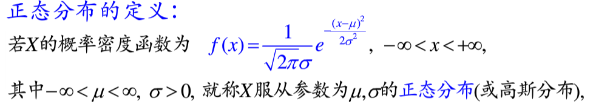
  

- μ称为位置参数（决定对称轴的位置），σ称为尺度参数（决定曲线的分散程度）  
- 正态分布的用处：自然界和人类社会很多现象可以看作正态分布；多个随机变量的和可以用正态分布来近似；  
- 正态分布的概率计算：**分布函数是积分积不出来的**，需要使用数值积分或者转化成标准正态分布，通过查表计算  
- 标准正态分布：Z～N(0,1)，由于其对称性，所以其分布函数Ф(-z0)=1-Ф(z0)  
- 问题来了，如何将一般的正态分布转换成标准正态分布  

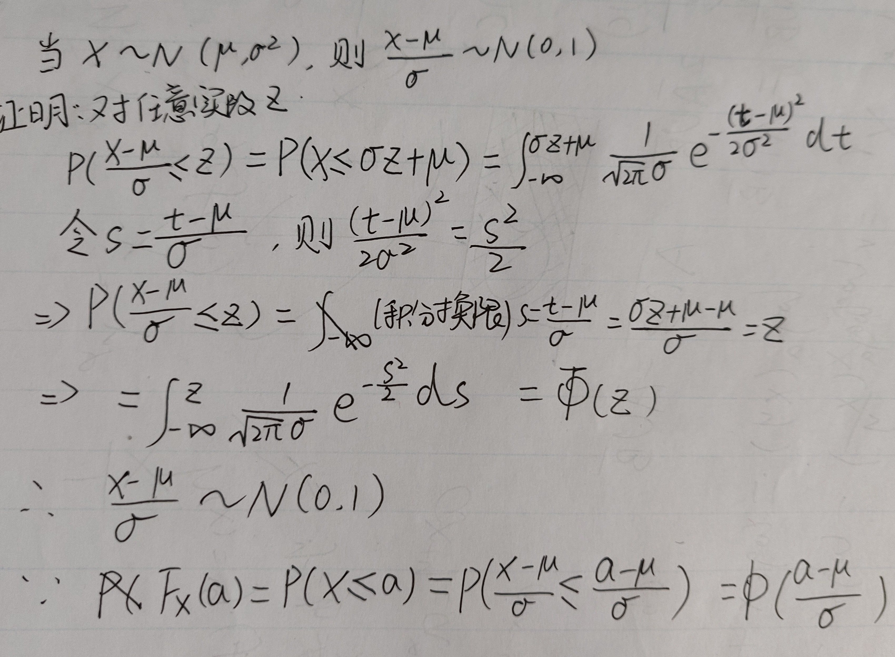
  

#### 4、随机变量函数的分布  
求解随机变量函数的概率分布，有如下定理：  

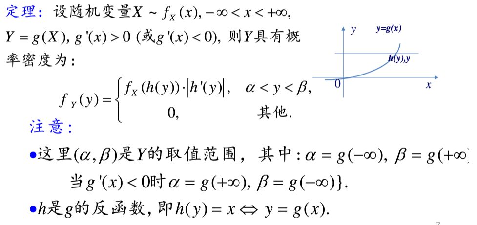
  

随机变量符合正态分布时，随机变量的函数的概率分布计算如下：  

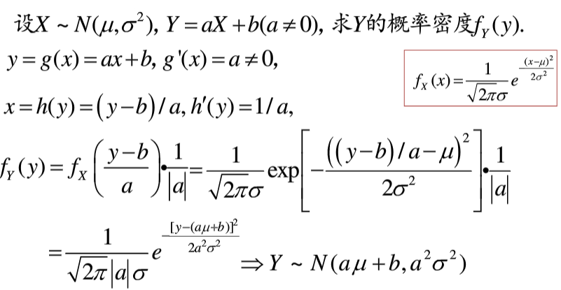
  

## 第五、六、七次、二元随机变量  
#### 1、二元随机变量的条件分布函数  
通过极限方式定义  

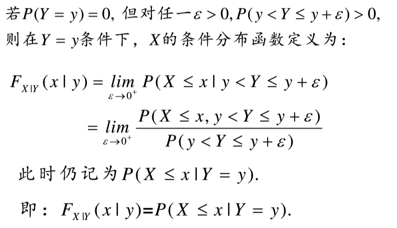
  

#### 2、二元离散型与连续型随机变量比较  

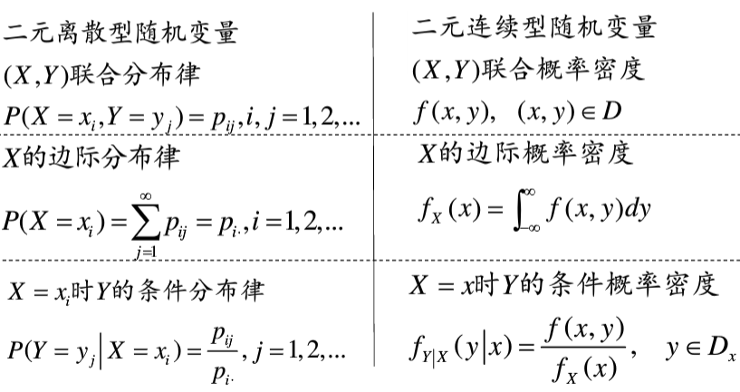
  

#### 3、二元正态分布的概率密度函数、边际概率密度及条件概率密度  

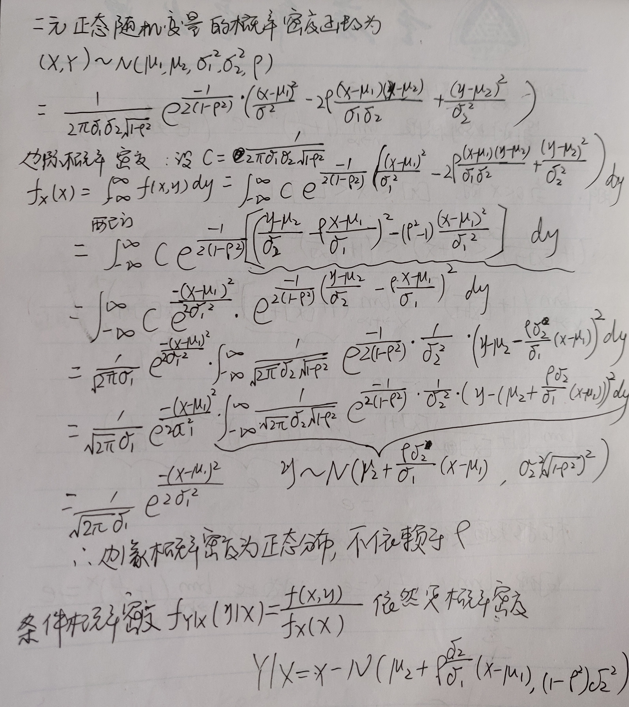
  

#### 4、二元随机变量的独立性  

- 首先看独立性的定义（通过分布函数定义）  

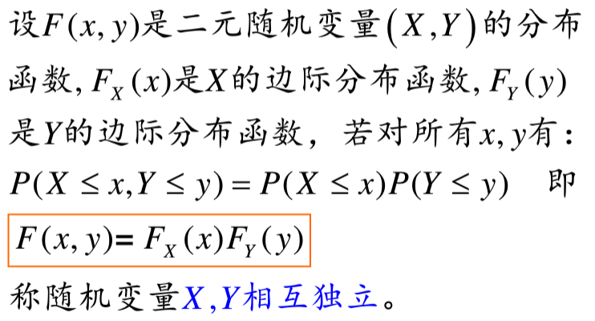
  

- 当随机变量为连续型时，独立性的等价判断可以用概率密度函数判断。在平面的点(x,y)上几乎处处成立f(x,y)=fX(x)fy(y)（平面上除去面积为0的集合以外，处处成立）  
- 上述判断标准表明，两个独立的连续型随机变量，其概率密度函数必可以分解为f(x,y)=g(x)h(y)  
- 二元正态随机变量的独立性的充要条件是ρ=0  

#### 5、n元随机变量的独立性  

- n元随机变量的相互独立  

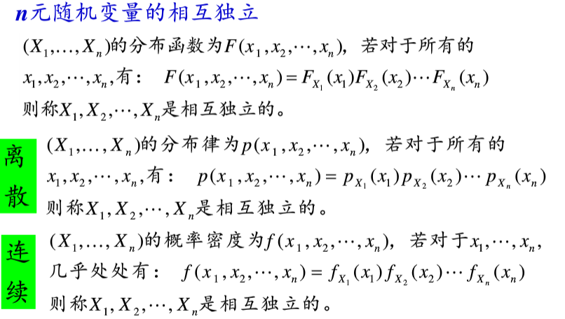
  

- 两个n元随机变量的相互独立  

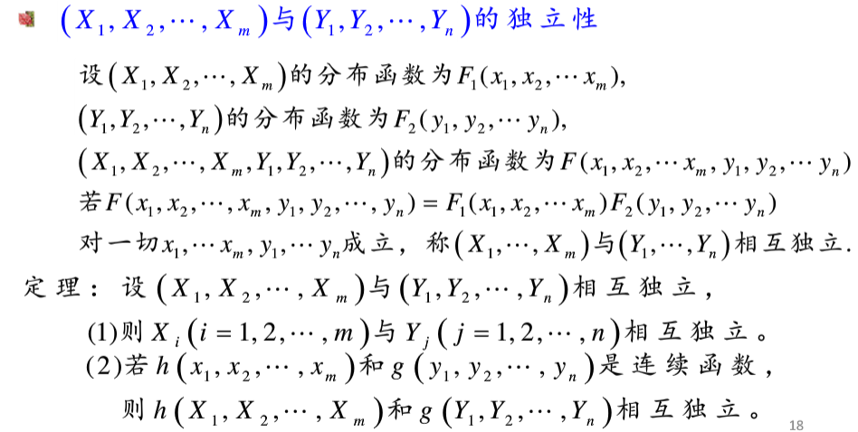
  

#### 6、随机变量函数的X+Y分布  

- 一般性地，设二元连续型随机变量(X,Y)具有概率密度f(x,y)，Z是X,Y的函数，Z=g(X，Y)，则先求Z的概率分布，再求Z的密度函数  

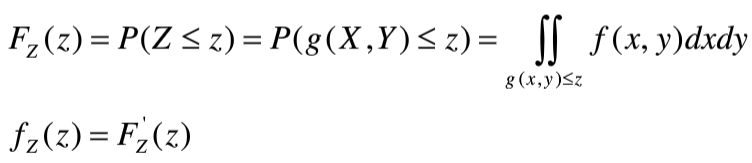
  

- 特殊地，若Z=X+Y，则可以求Z的分布，先求概率密度如下：  

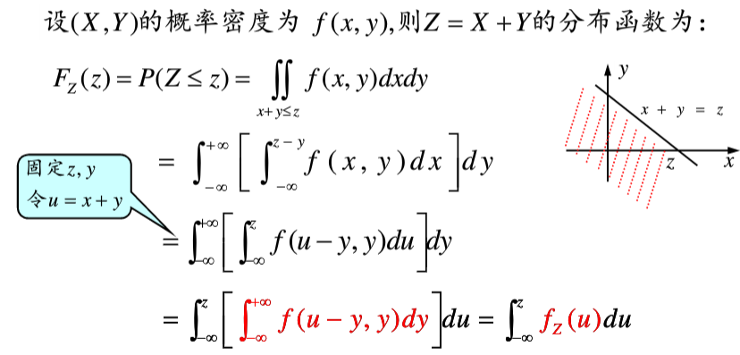
  

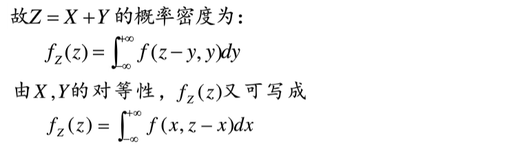
  

- 卷积公式：Z=X+Y，**若X和Y独立**，则卷积公式如下：  

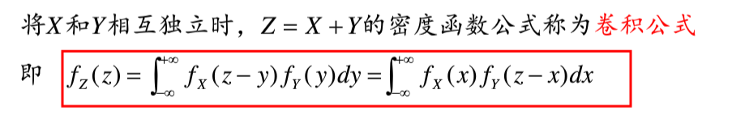
  

- 卷积公式的应用：n个独立的正态变量的线性组合仍为正态分布：  

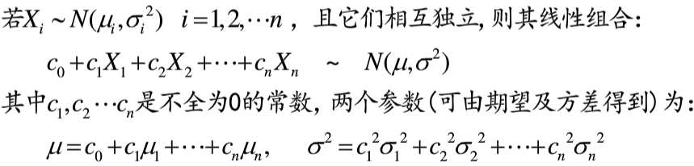
  

- 离散型随机变量伯努利分布和泊松分布的X+Y：  

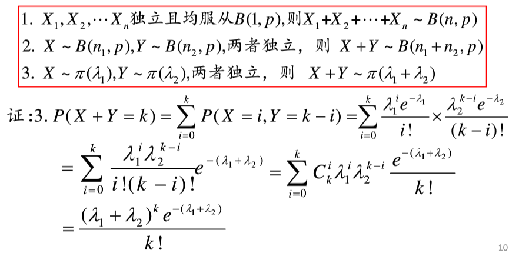
  

#### 7、随机变量函数的max和min分布  
前提就是X和Y是相互独立的，那么  

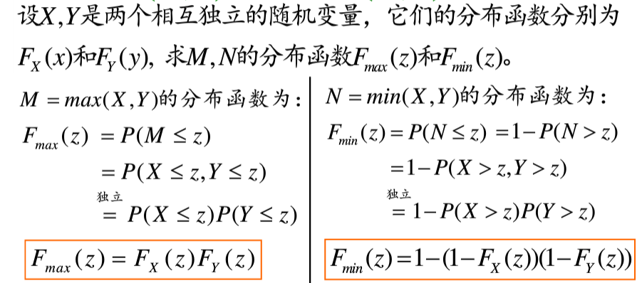
  

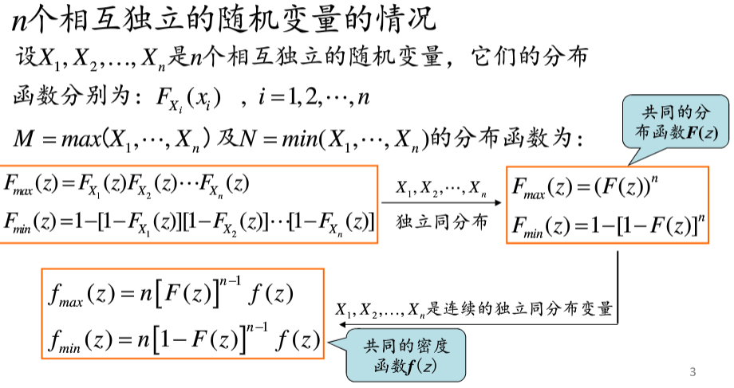
  

## 第八、九次 期望、方差、协方差、相关系数  
#### 1、数学期望  

- 首先要理解数学期望的定义：设离散型随机变量X的分布律为P(X=xk)=pk,k=1,2...，若级数x1p1+x2p2+...xkpk**绝对收敛**（绝对收敛保证了交换次序不会改变极限值），则称级数的值为随机变量X的数学期望，为E(X)，即：  

  

连续型的数学期望定义类似：  

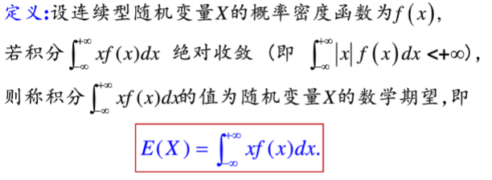
  

- 一些常用的分布的数学期望：0-1为p，泊松为λ，标准正态分布为μ，指数分布为1/λ，二项分布为np，均匀分布为(a+b)/2  
- 求随机变量函数的数学期望很简单，不需要求出随机变量函数的分布可以直接利用定理来求出  

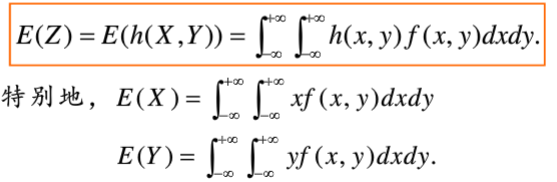
  

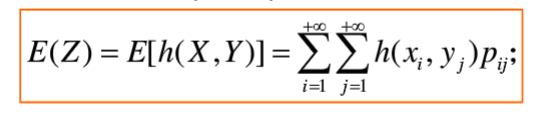
  

- 数学期望的运算性质很重要，手动证明一下：  

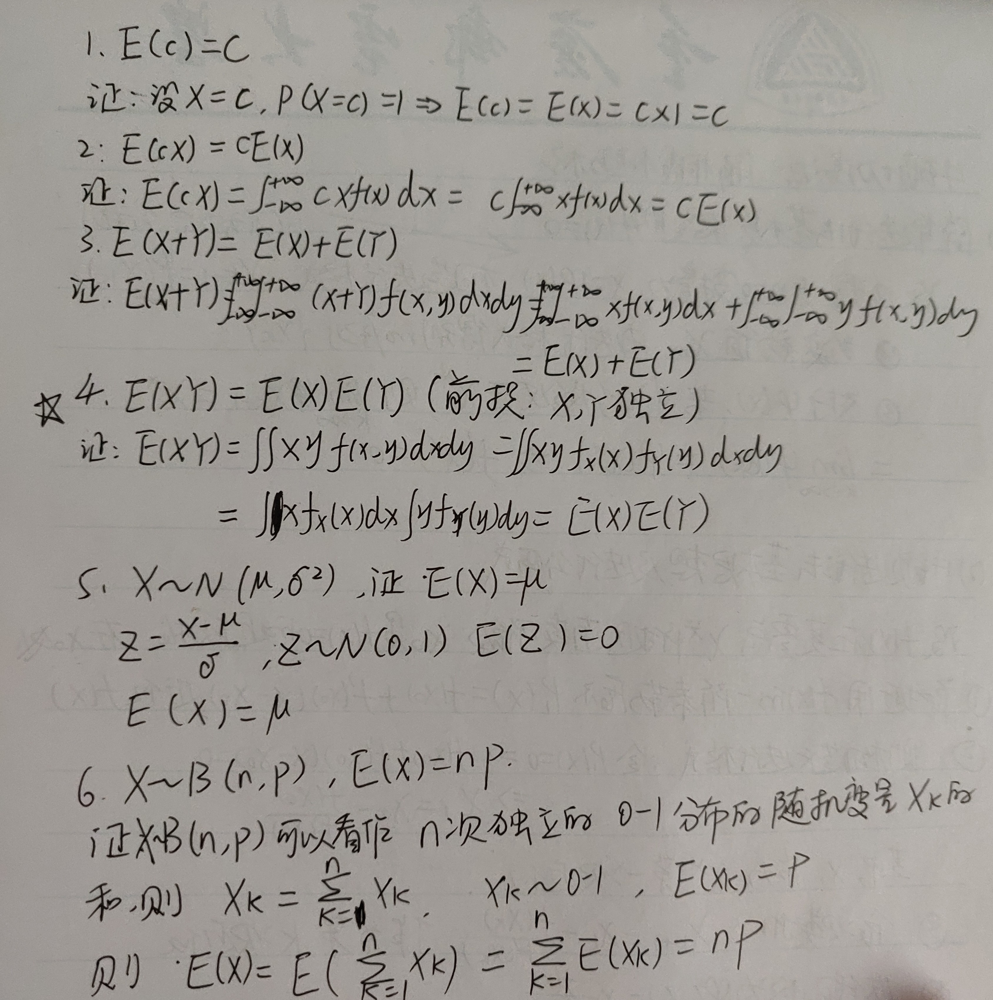
  

#### 2、方差  

- 方差计算公式推导  

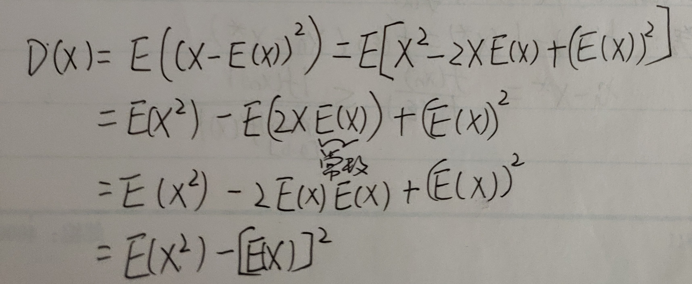
  

- 方差的性质推导  

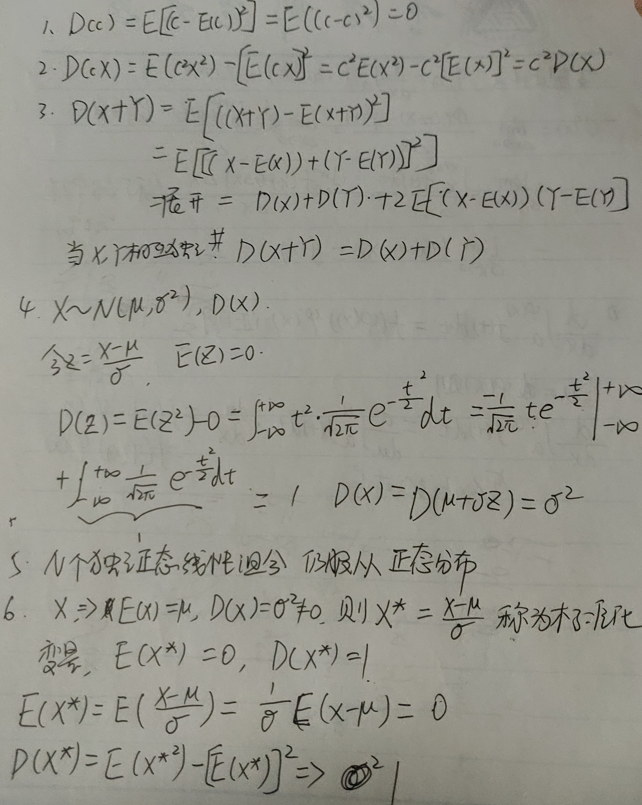
  

#### 3、协方差、相关系数以及独立与不相关的性质与证明  

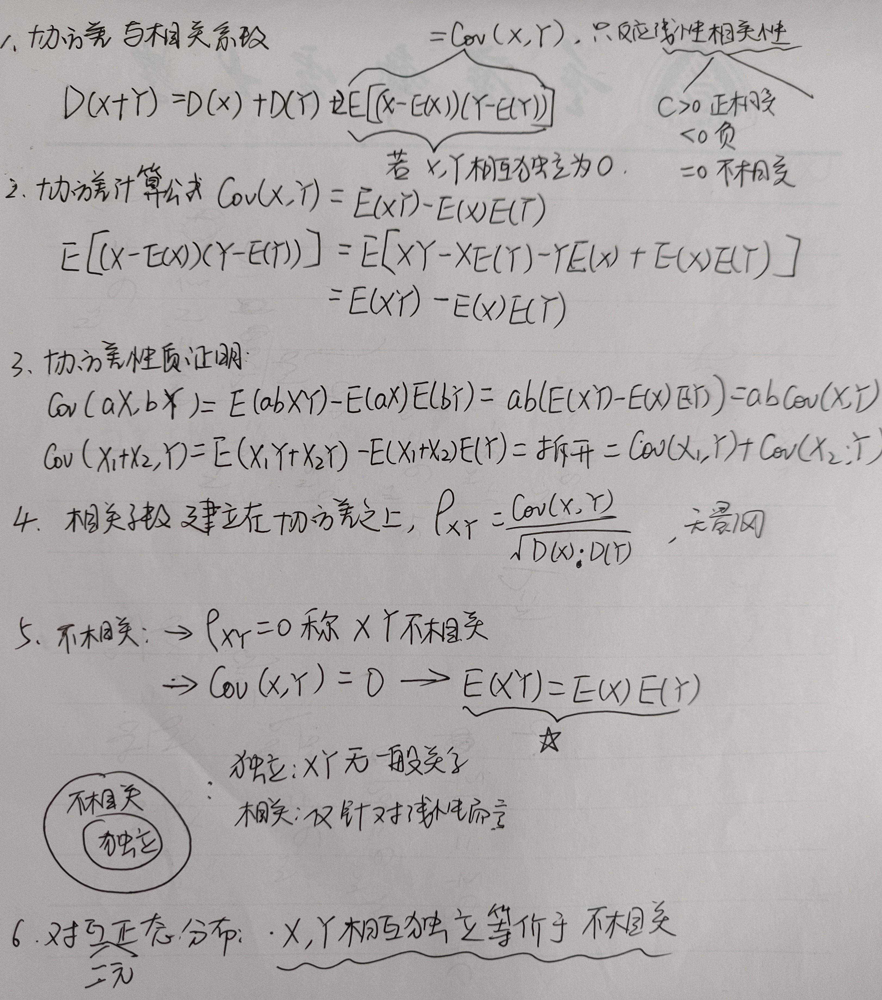
  

#### 4、协方差矩阵  
协方差矩阵是非负定矩阵，证明日后复习了线性代数再来证明  
#### 5、n元正态随机变量  

- 首先看定义  

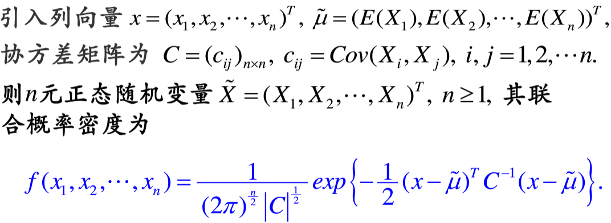
  

- 然后n元正态随机变量具有四条重要的性质，证明就不需要了但是需要记住：X的任意子向量、任意子向量的线性组合，凡是与线性组合或线性函数相关的改动，新的向量（不管是一维还是多维）都服从正态分布；X若服从n元正态分布，则X1,X2,...相互独立，两两互不相关，协方差矩阵为对角矩阵  

## 第十次、终篇  
#### 1、依概率收敛的理解  

- 对于频率稳定于概率，需要从可能性即概率的角度来解释：当n充分大时，对于任意的ε>0，|na/n-p|>=ε发生的可能性很小，随着n的增大，越来越小，这就是依概率收敛  
- 对于随机变量序列Y1,Y2,...Yn，若n→∞，任意ε＞0，|na/n-c|>=ε的概率→0，则称数列依概率收敛到c  

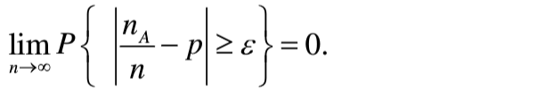
  

#### 2、切比雪夫不等式  
当随机变量存在期望和方差时，切比雪夫不等式给出了一个随机变量落在期望附近的区域内或外的可能性的有界估计，但是估计结果较为粗糙，也就是误差很大  

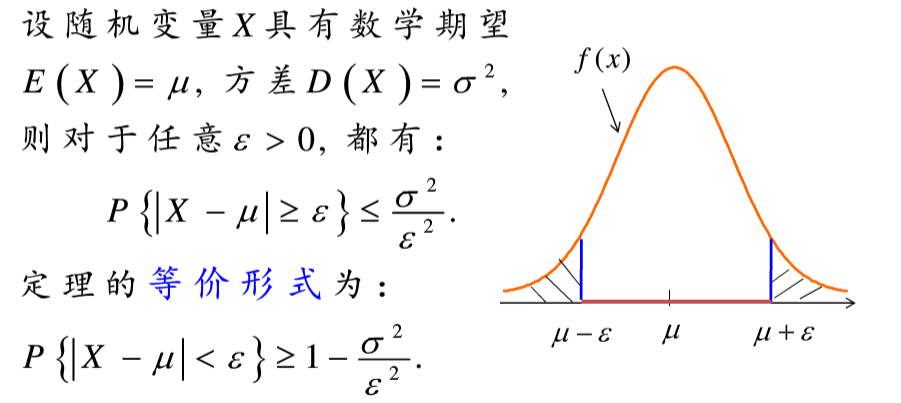
  

#### 3、大数定律  
大数定律共有三个：

- 伯努利大数定律：伯努利试验中n足够大时，频率依概率收敛于常数c（概率）  
- 切比雪夫大数定律：n个独立的随机变量，具有相同的μ和方差σ2，若n足够大，随机变量之和的均值依概率收敛于μ  
- 辛钦大数定律：比切比雪夫大数定律要求更低，其**不需要方差存在**，只需要n个独立但是**同分布**的随机变量期望存在为μ，则n足够大，随机变量之和的均值依概率收敛于μ  
- 伯努利大数定律提供了大量重复实验频率依概率收敛的证据；切比雪夫，尤其是辛钦提供了估计随机变量平均值的方法：即若估计X的期望，只需要从X分布中取足够多的点，其平均值依概率收敛于μ  

#### 4、中心极限定理  
终于，到了概率论最后一讲  

- 首先是独立同分布的中心极限定理（CLT）：设随机变量X1,X2,...,Xn,...相互独立且同分布，E(Xi)=μ，D(Xi)=σ2，则对于充分大的n，有这n个随机变量的和近似于正态分布，即：  

  

- 德莫弗-拉普拉斯中心极限定理就是讲了对于n充分大的二项分布B(n,p)，可以用正态分布来近似N(np,np(1-p))  
