## 一-九讲  
略  
## 十、函数项级数收敛与一致收敛  
1、函数序列和极限函数  

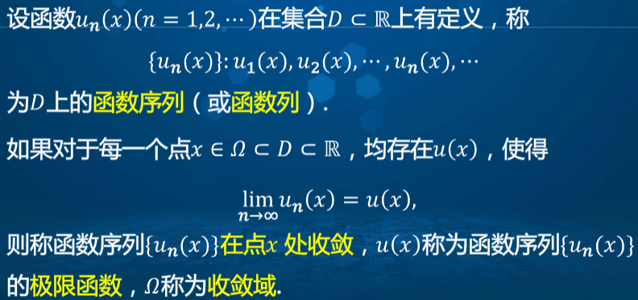
  

2、函数项级数及其收敛发散特性  

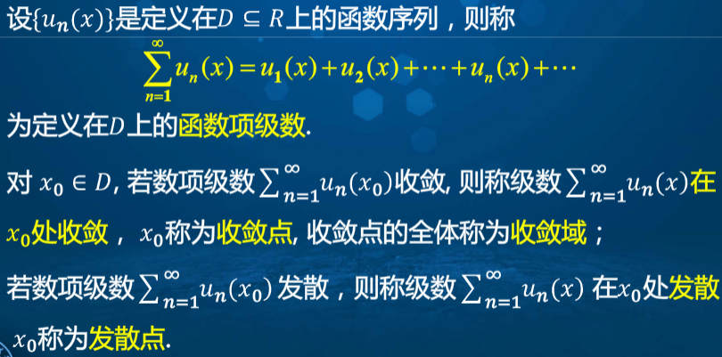
  

3、和函数  

  

4、函数项序列的一致收敛  

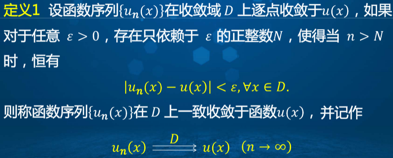
  

一致收敛的几何解释  

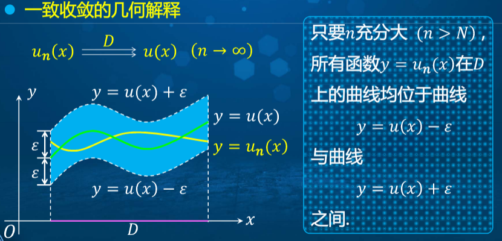
  

5、函数项级数的一致收敛  

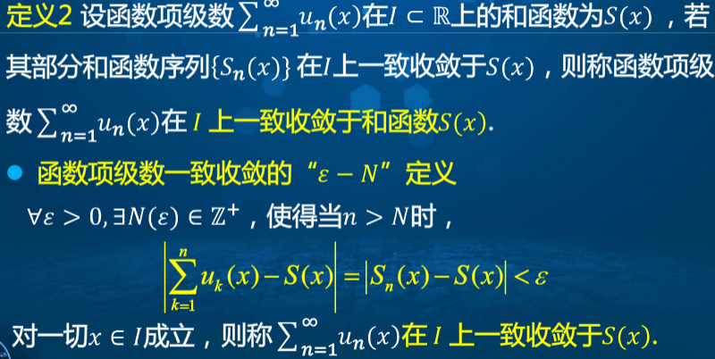
  

6、判断函数项级数的收敛性-魏尔特斯拉斯判别法（又称M-判别法）  
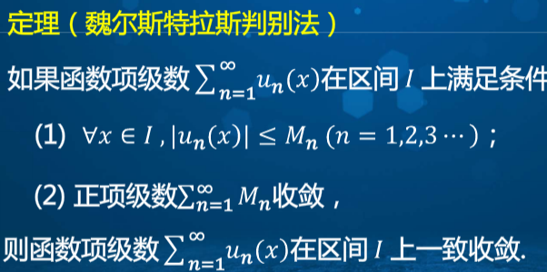
  

8、黎曼函数  
处处连续但是处处不可导  

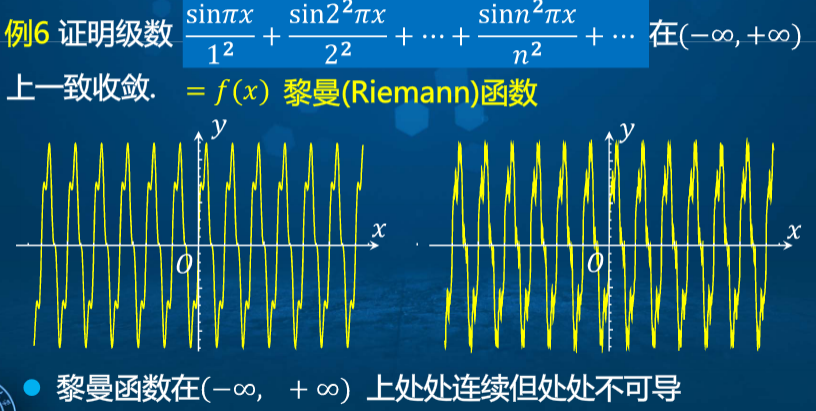
  

## 十一、函数项级数的解析性质  
引入：有限个函数和的极限运算、求导运算、积分运算  

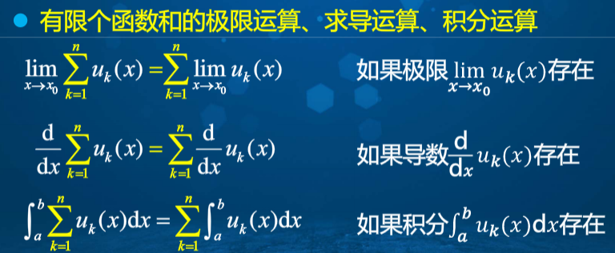
  

1、和函数的连续性  

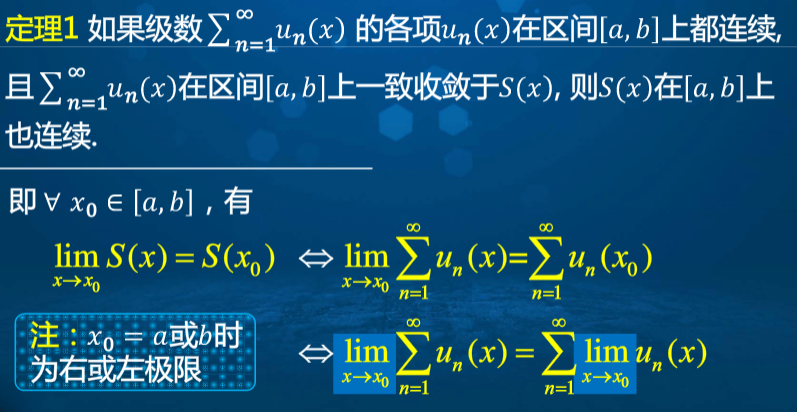
  

2、函数项级数的逐项可积性  

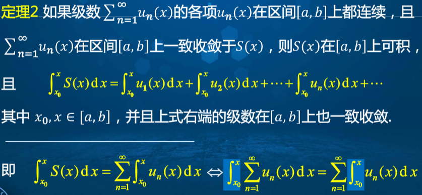
  

3、函数项级数的逐项可导性  

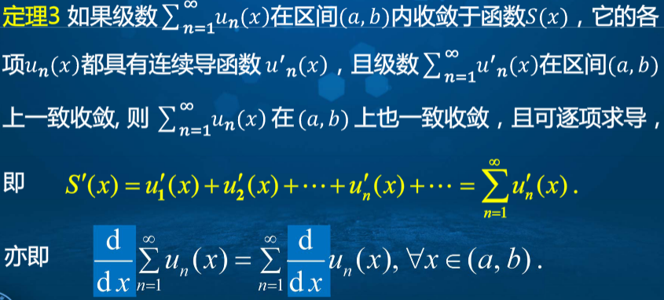
  

## 十二、幂级数的收敛域和函数  
1、幂级数的概念  

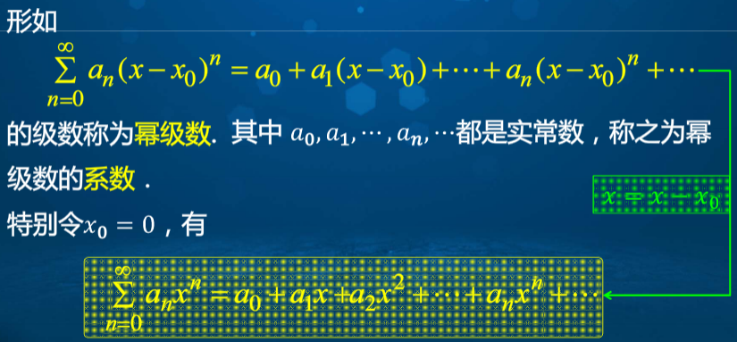
  

2、埃贝尔定理  

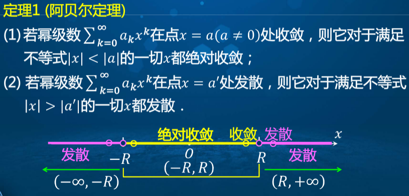
  

3、收敛半径及收敛域  

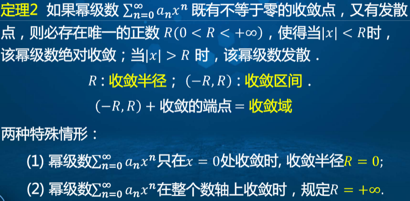
  

4、收敛半径的计算  

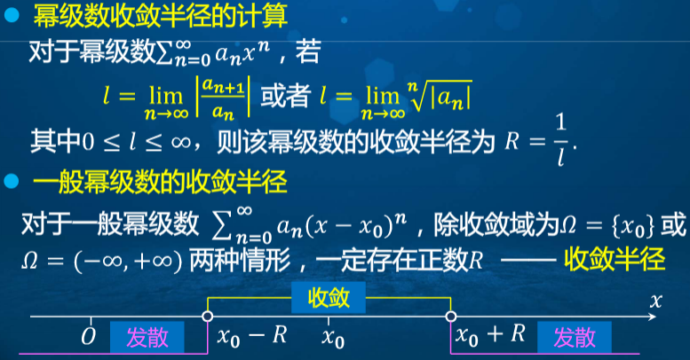
  

5、幂级数的四则运算  

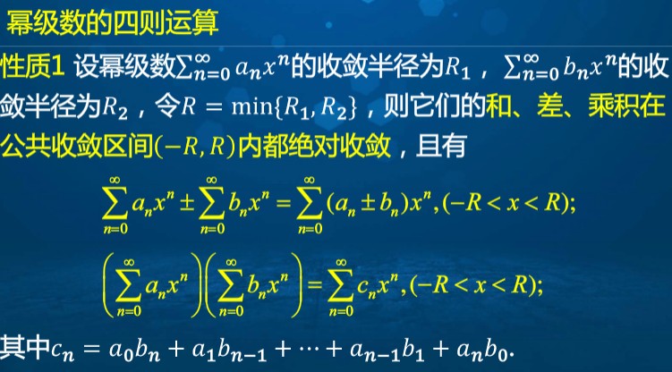
  

6、幂级数的解析性质  

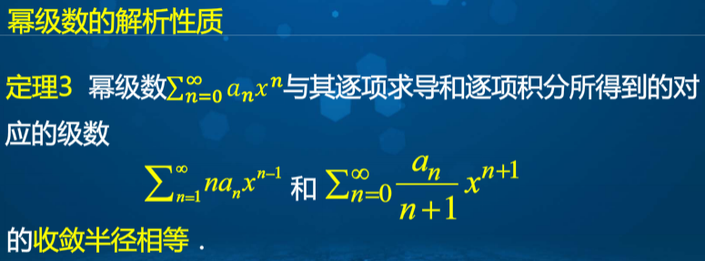
  

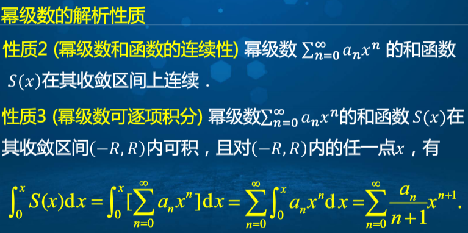
  

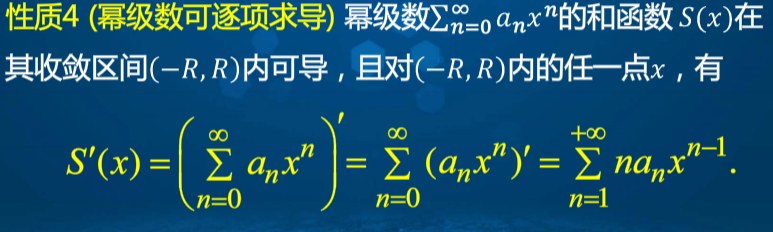
  

## 十三、函数的幂级数展开（泰勒级数）  
泰勒公式就是幂级数  

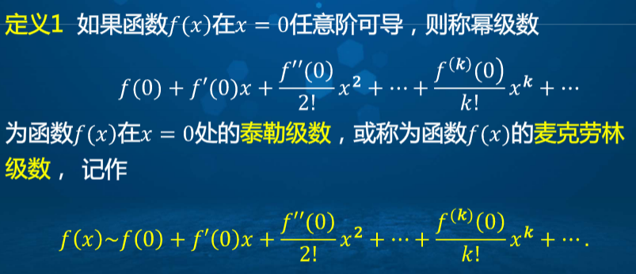
  

1、泰勒级数展开的充要条件  

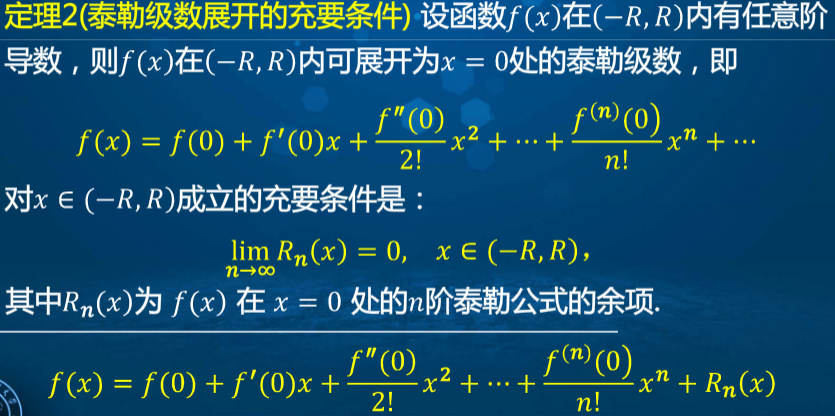
  

2、泰勒级数展开的充分条件  

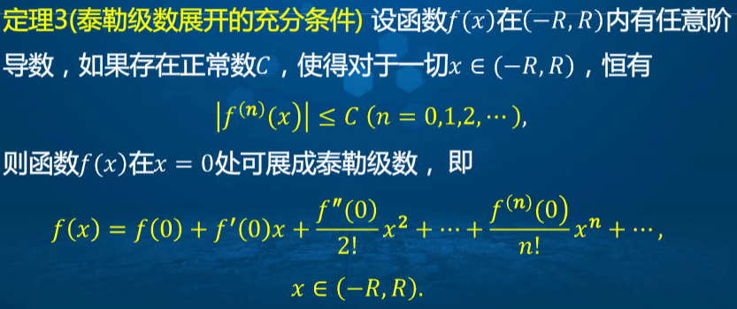
  

3、公式法展开  

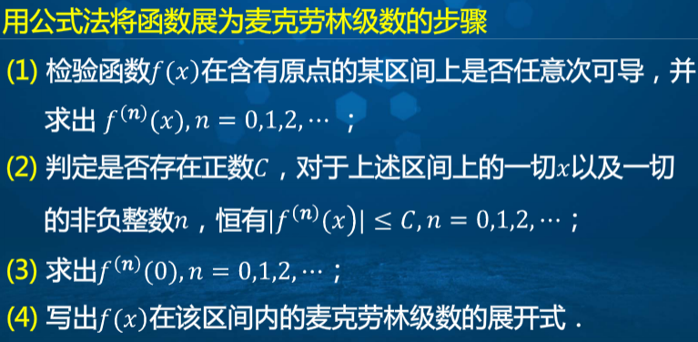
  

4、间接法展开  
逐项求导数积分或者待定系数法、幂级数运算  
5、泰勒级数的用处  

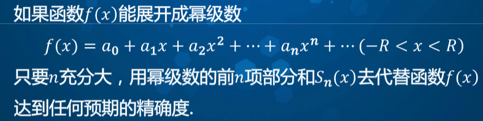
  

## 十四、十五、十六、傅里叶级数展开（三角级数）  
周期性  
分段函数拼接成整体  

## 十七、一阶线性微分方程组  
1、两个典型的模型  
兰彻斯特作战模型和军备竞赛模型  

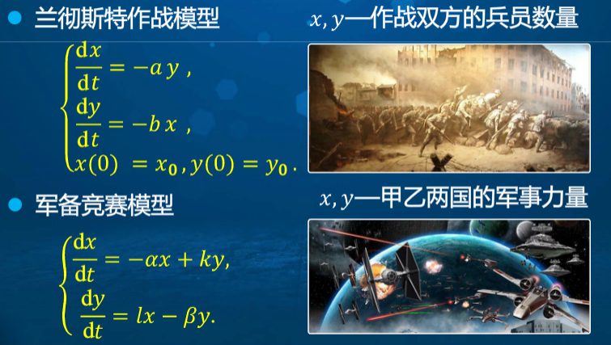
  

2、微分方程组  

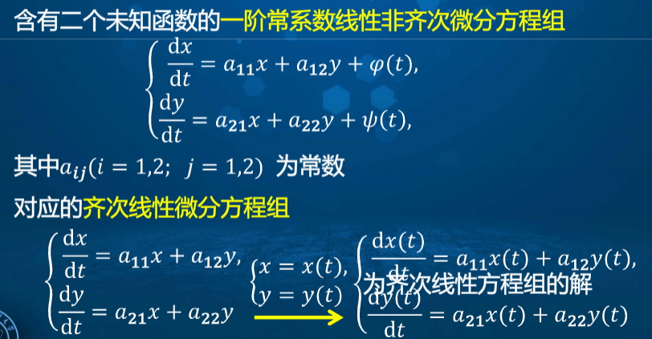
  

3、微分方程组转换成矩阵形式，方便向高维方程组扩展  

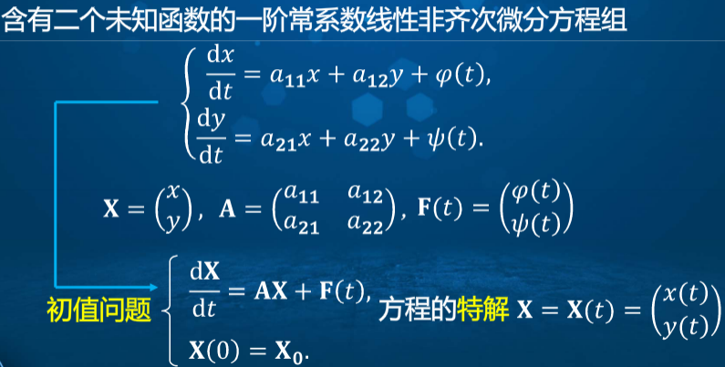
  

4、齐次线性微分方程组解的结构  

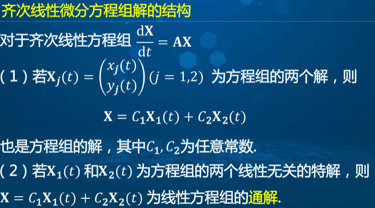
  

5、非齐次  

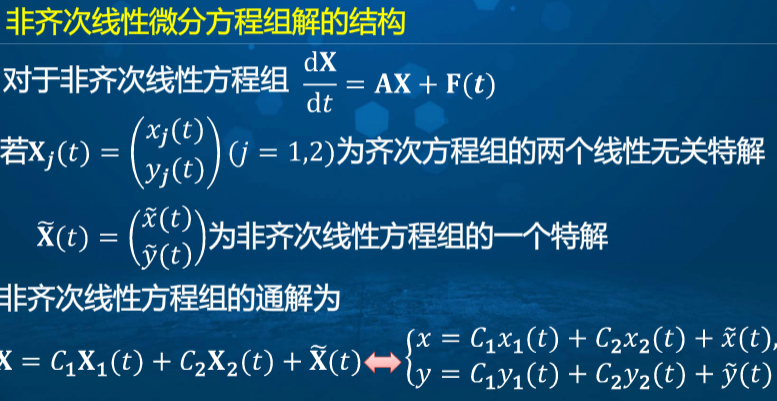
  

6、消元法解方程组  

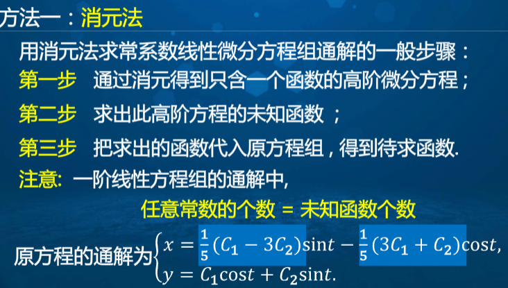
  

7、特征值法  

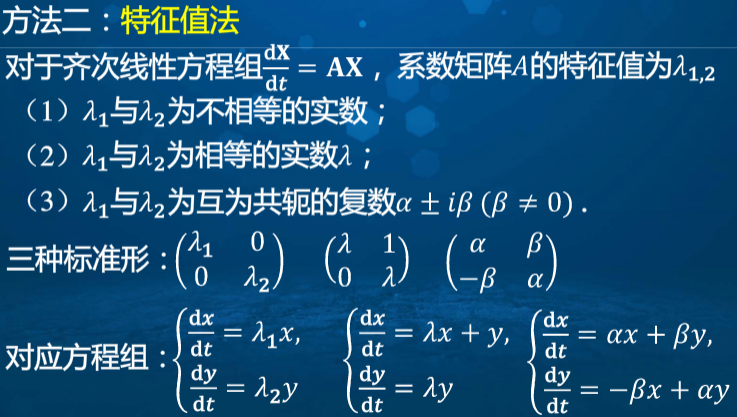
  

8、自治系统及平衡点  

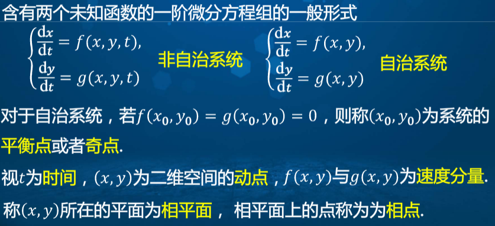
  

## 十八、微分方程稳定性初步  
1、稳定性的概念  

  

2、方程组稳定性的概念  

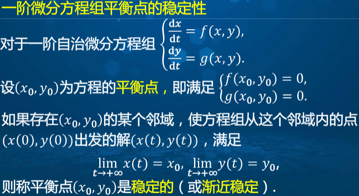
  

3、可探讨一阶常系数齐次线性自治系统的稳定性  

  

通过分析根的状态可以得出  

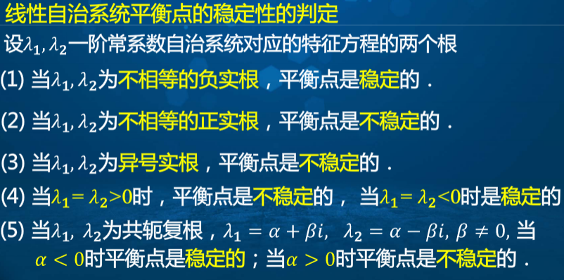
  

