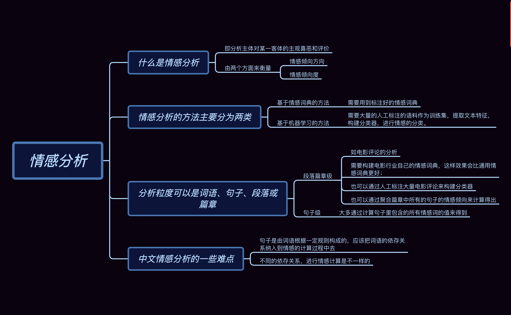

## 遗留问题  
花书  
那些python/pytorch/nlp库函数的使用  
比赛详细  
nlp相关知识  
## 算法数据结构  
[五分钟学算法](https://www.cxyxiaowu.com/suanfa-2/suanfa)
[前k个高频元素](https://blog.csdn.net/qq_17550379/article/details/80957793)  

## 加强训练  
### 优秀博客  
[机器学习/深度学习](http://freewill.top/tech-stack/)  
[microstrong](https://www.zhihu.com/people/MicrostrongAI/posts?page=2)  
[apache中文文档](http://docs.apachecn.org/)
### matplotlib  
[核心原理](https://baijiahao.baidu.com/s?id=1659039367066798557&wfr=spider&for=pc)  
[numpy-matplotlib](https://www.runoob.com/numpy/numpy-matplotlib.html)  
[入门详解](https://www.jianshu.com/p/da385a35f68d)
### shap  
[shap1](https://zhuanlan.zhihu.com/p/83412330)  
[shap2](https://github.com/slundberg/shap)  
[shap3](https://zhuanlan.zhihu.com/p/101352812?utm_source=qq)  
### seaborn  
[seaborn](https://zhuanlan.zhihu.com/p/24464836)
### scipy  
[scipy教程1](https://ptorch.com/news/49.html)  
[scipy教程2](https://www.yiibai.com/scipy/scipy_introduction.html)  
[scipy教程3](https://wizardforcel.gitbooks.io/scipy-lecture-notes/content/0.html)  
### python详解  
[python1](https://morvanzhou.github.io/tutorials/python-basic/basic/)  
[python2](https://www.liaoxuefeng.com/wiki/1016959663602400)   
[python标准库](https://docs.python.org/zh-cn/3.7/library/index.html)  
[python常用库](https://www.jianshu.com/p/04f398b32da1)  
[python常用库](https://zhuanlan.zhihu.com/p/21563130)  
### sklearn详解  
[基本使用](https://zhuanlan.zhihu.com/p/35731775)
[中文文档](http://www.scikitlearn.com.cn/)  
[英文文档](https://scikit-learn.org/stable/)  
[中文文档2](https://sklearn.apachecn.org/)
### pytorch详解  
[教程](https://pytorch.org/tutorials/)  
[中文文档](https://pytorch-cn.readthedocs.io/zh/latest/)  
### numpy详解  
[numpy教程](https://www.runoob.com/numpy/numpy-tutorial.html)    
## NLP  
[nlp发展](https://zhuanlan.zhihu.com/p/80217404)  
[nlp发展](https://zhuanlan.zhihu.com/p/71938746)  
[nlp-pytorch第三方库](https://ldzhangyx.github.io/2018/11/22/pytorch-nlp/)
### 情感分析  

  

### 实体识别  
[实体识别](https://zhuanlan.zhihu.com/p/88544122)  
[lstm+crf详解](https://www.jianshu.com/p/566c6faace64)  
[lstm+crf代码](https://github.com/scofield7419/sequence-labeling-BiLSTM-CRF)  
[lstm+crf代码](https://pytorch.org/tutorials/beginner/nlp/advanced_tutorial.html#bi-lstm-conditional-random-field-discussion)  
[IDCNN-crf](https://blog.csdn.net/weixin_37947156/article/details/94356102)
[bert-crd](https://zhuanlan.zhihu.com/p/88545507)  
### 数据预处理(清洗/分词/特征提取)  
[jieba/清洗/去停用词/tfidf/countvec](https://zhuanlan.zhihu.com/p/53277723)  

### 词向量  
[词向量](https://zhuanlan.zhihu.com/p/56382372)
### textcnn  
[textcnn](https://zhuanlan.zhihu.com/p/77634533?from_voters_page=true)
### python多进程  
[python多进程](https://www.cnblogs.com/jiangfan95/p/11439207.html)  
### 文本相似度特征  
[文本相似度](https://blog.csdn.net/qq_28031525/article/details/79596376)
### 语义相似度特征  
[语义相似度](https://www.cnblogs.com/shona/p/11971310.html)
### 孪生RNN和孪生TextCNN  
[孪生网络](https://zhuanlan.zhihu.com/p/35040994)
[孪生lstm](https://lujunru.github.io/2018/05/03/Siamese-LSTM-%E5%AD%AA%E7%94%9F%E7%BD%91%E7%BB%9C/)
### qAUC  
$qAUC=\frac{sum(AUC_i)}{query\_num}$  
$AUC_i$是每一个$query\_id$下的AUC  

### bilstm  
[bilstm](https://zhuanlan.zhihu.com/p/47802053)  
#### transformer  
[1. 图解transformer](https://blog.csdn.net/longxinchen_ml/article/details/86533005)  
[2. 图解transformer2](https://www.jianshu.com/p/e7d8caa13b21)  
理解transformer比较直观的图  

  

#### attention  
[attention+transformer](https://zhuanlan.zhihu.com/p/53682800)
#### crf/hmm  
[crf通俗理解](https://www.zhihu.com/question/35866596)
#### 预训练模型/bert/elmo/gpt/xlnet/微调    
[全面总结](https://zhuanlan.zhihu.com/p/76912493)  
[全面总结2](https://zhuanlan.zhihu.com/p/115014536)
[bert原理](https://mp.weixin.qq.com/s?__biz=MzA3NDIyMjM1NA==&mid=2649035055&idx=1&sn=c49f6919ec8d0fef269f751680819edf&chksm=8712af52b06526443ed01d2ec3bb9d8621ec4ef714b132dfa88020bbda268fdc22ab2e598f78&scene=21#wechat_redirect)  
[bert微调](https://zhuanlan.zhihu.com/p/149904753)
[bert+transformer知识点](BERT/Transformer知识点)
[快速使用bert](https://zhuanlan.zhihu.com/p/112235454)
[elmo](https://zhuanlan.zhihu.com/p/72839501)

