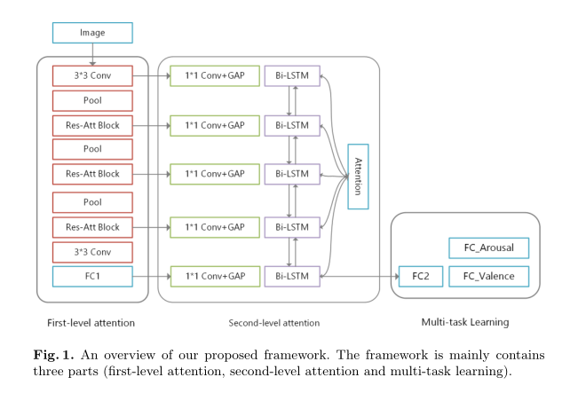
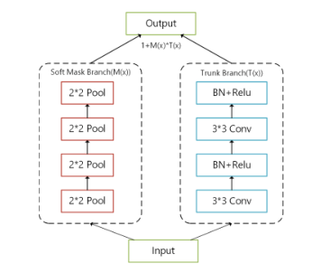

# 论文1 Two-level attention with two-stage multi-task learning for facial emotion recognition  
## 摘要  
价值唤起模型能够反映复杂的人类情绪，包括情绪的轻微变化。以往的面部情绪估计大多只考虑实验室数据，使用视频、语音或其他多模态特征。这些方法应用于真实世界的静态图像的效果是未知的。本文提出了一种基于多任务学习的二级注意估计框架，用于静态图像的面部情绪估计。通过一级注意机制自动提取并增强相应区域的特征。然后我们设计了一个实用的结构来处理第一级注意提取的特征。在接下来的研究中，我们利用双向递归神经网络(Bi-RNN)和自我注意(第二级注意)来自适应地充分利用这些特征之间的关系。它可以总结为全球和当地信息的结合。此外，我们利用MTL来同时估计效价和唤起的价值，利用了这两种任务的相关性。在情感网数据集上的定量结果表明了该框架的优越性。此外，还进行了大量的实验来分析不同成分的有效性。  
## 1 引言  
情感计算近年来发展迅速，逐渐成为一个有吸引力的领域。它在人机交互领域起着重要的作用。随着网络的飞速发展，社交媒体上每一秒都有无数的表情图片被贴出来，HCI的应用场景主要是在现实中。因此，面部情绪识别(FER)在野外更接近于应用。与实验室环境下的FER不同，野外FER会受到多种非情绪因素的严重影响，包括遮挡、面部姿态、光照和受试者的多样性。与离散模型相比，连续模型更准确地表达了情感，反映了不同情感之间的关系。而细微变化的面部表情也可以通过连续的数值有效的体现出来。  
以往的工作主要集中在FER(离散模型)方面，将提取的特征应用于合适的分类器或集成方法来实现结果[1-3]。一些连续的模型工作是基于视频、语音或生理信号[4,5]来估计情绪。一般采用长短时记忆网络(LSTM)或支持向量回归(SVR)方法，利用时间信息对标签进行预测。然而，上述各种模式的数据采集难度较大，而图像构建较大数据集的能力相对较强。我们使用静态图像来估计价值唤起模型上的面部情绪。效价和觉醒的强度分别代表积极或消极、平静或兴奋的程度。两者的预测本质上是一个回归问题。根据我们的研究发现，Mollahosseini[7]将最后一个完全连接(FC)层分别替换为线性回归和训练唤醒和效价任务。然而，它忽略了这两个任务的相关性。多任务学习(Multi-task learning, MTL)充分利用任务之间的关系，通过不同任务的共享特征来提高模型的泛化能力。此外，培训时间可以在一定程度上缩短。因此在接下来的研究中采用了MTL。  
此外，减少非情感因素的影响也至关重要。之前的许多研究使用卷积神经网络(CNN)通过度量学习来学习与情绪相关的特征。Liu[8]提出(N+M)-tuplet loss，计算正、负样本之间的距离，减少不同主体带来的负担。Li[9]提出了深度局域保留损失(Deep Locality preserve loss, DLP-loss)函数，该函数能够保持类内样本的紧致性，提高特征的判别能力，相对减弱非情绪因素带来的影响。然而，这些通过提高类内识别能力的方法并不适用于连续模型。Sun[10]在CNN的最后一个FC层之前使用了注意机制来进行feature mapping。该方法能够自动提取感兴趣区域的特征。但是Sun仅仅考虑了最后一层的特征，忽略了之前卷积层之间的注意信息。  
在这项工作中，我们提出了一个两级注意与MTL框架面部情绪估计。首先，采用Wang[11]提出的残差注意机制提取不同层次的特征作为一级注意;针对不同接受域的特征，我们使用1*1滤波的卷积层和全局平均池(GAP)将其转换为二级注意输入。在接下来的研究中，我们提出了利用双向递归神经网络(Bi-RNN)的自我注意来利用不同接收域的不同层的信息。即二级注意自动提取全局特征与局部特征之间的关系信息。此外，考虑到唤醒和效价的相关性，我们使用MTL来预测两者的价值。为了验证所提出的框架，我们在一个开放数据集(affect tnet[7])上进行了大量的实验，取得了显著的效果。  
本文的其余部分组织如下。在下一节中，我们将介绍本文的相关工作。我们将在第3节中详细描述我们设计的框架。第四部分给出了实验结果及相关分析。最后，对全文进行总结。  
## 2 相关工作  
### 2.1 面部情绪评估  
面部情绪估计和识别的一般步骤是从图像或视频序列中提取特征。传统的方法通常将面部信息作为特征，如几何形状、外观、纹理等。在现实世界中，面部表情通常在面部姿态、光照、背景和主体上有巨大的变化。因此，上述特征提取方法不能很好地处理这些非情感因素。环境下的泛化能力相对较弱。最近，随着计算能力的增长，许多领域发展了深度学习(DL)，以达到最先进的结果。通过DL可以在一定程度上解决现实世界中非情感因素带来的挑战。基于连续模型的面部情绪估计一直是DL技术研究的难点。  
面部情绪估计的研究多基于视频序列。早期的研究是在高度可控的数据集上进行的。在AVEC2017的比赛中，获胜者[4]结合了文本、声音和视频的特征，利用LSTM提取时间信息进行最终预测。Chang[12]提出了一种集成的网络来提取人脸属性动作单元(AU)信息，同时估计价值激发值，并在affo-wild中获得了成功。其中面部属性特征为浅特征，AU信息为中间特征。Dimitrios[13]将最后的卷积层、池化层、全连接层放入门控递归单元中，融合最后的结果。  
在静态图像方面，除了我们在第一节中提到的Mollahosseini提出的方法之外。Zhou[14]也对fer2013数据集进行了实验。原始数据集被标记为七个类别，作者通过众包的方式对这些图像进行了标记(由于作者没有公开披露这些标记，所以本文没有对这个数据集进行实验)。Zhou将VGG16和ResNet的最后一层替换为GAP层，采用双线性池预测V-A的值。在本文中，我们还使用静态图像来预测V-A的值，这是一个严格的问题。  
### 2.2 注意力机制  
人类感知的过程证明了注意机制[15]的重要性。从广义上讲，注意力可以看作是将可用的处理资源分配给信号最丰富的组件[16]的一种机制。目前，注意力机制广泛应用于各个领域，如机器翻译[17]、视觉问答[18]、图像字幕[19]等。在以往的研究中，大多数注意机制是在序列处理中实现的，利用注意机制进行图像分类的研究较少。Hu[16]设计了挤压-激励网络，根据损失来学习特征图的权值，使得特征的质量可以得到提高，无用的特征可以被稀释。它可以被看作是通道维度上的特征图的吸引注意力机制。Wang[11]提出了一种图像分类注意模型，该模型采用沙漏模型构造主干和掩模分支，掩模分支为自底向上自顶向下的结构。遮罩分支能够产生软的注意力重量。在本文中，我们利用Wang提出的残差注意块来提取特征作为第一级注意。  
### 2.3 多任务学习  
多任务学习在计算机视觉和自然语言处理中有着广泛的应用[20,21]。上述所有的论文都表明，MTL可以训练一个统一的系统同时执行多个任务(前提是任务之间存在一定的相关性)。在[5]中，作者提出了一种适应深度信念网络(Deep Belief Network, DBN)的多任务模型，其中以情绪分类为主要任务，以V-A预测为次要任务。结果表明，MTL利用了不同任务之间的附加信息，提高了情绪估计的结果。在[12]中，构建了一个端到端网络，同步训练人脸属性识别、人脸动作单元识别和V-A估计。在本文中，我们利用我们提出的MTL框架来提取任务之间的共享特征表示，考虑到这两个任务之间的相关性。  
## 3 一个价值激发预测框架  
在本节中，我们将介绍我们提出的框架。主要包括整体框架、两层注意机制、效价与唤起预测的回归方法和多任务学习方法。  
### 3.1 整体框架  
图1为本文面部情绪估计的总体框架。提出的框架主要包括三个部分。首先，作为第一级注意，利用剩余注意块提取具有注意的不同接受域的特征。然后以自我注意为二级注意，利用双rnn提取不同接受域特征之间的关系信息。最后，利用MTL方法同时预测配价和唤醒值。  

  

### 3.2 一级注意力  
通过剩余注意块提取本文的第一级注意特征(注意感知特征)。该块采用自底向上的自顶向下结构，将前馈和反馈注意过程扩展为单个前馈过程，可嵌入任何端到端框架。如图2所示，块有两个分支:主干分支和掩码分支。主干分支与普通CNN结构相同，通过卷积层提取特征。块的关键部件是掩模分支，它能产生软量注意。掩码分支利用多个最大池化层来扩展接受域并获取块的全局信息。接下来，通过对相同数量的上采样层进行操作，通过对称自顶向下的结构将feature map放大到相同大小的输入(上采样层采用双线性插值)。最后利用sigmoid函数将输出值调节到0 ~ 1，作为主干分支特征的控制门。此时掩模支路的输出规模与主干支路的输出规模相同，可以直接计算。
常用的注意模型是用点积法计算的，但在深度学习网络中，由于软注意权值小于1，特征将难以置信地衰减。此外，软注意权重的潜在错误可能会破坏主干分支已经学习到的良好特性。因此，块构造一个近似相同的映射结构来解决上述问题。整个block的输出如下:  

  

好了，可以确定此篇论文和我的想法没有冲突了。  
# 论文2 Two-Level Attention Network With Multi-Grain Ranking Loss for Vehicle Re-Identification  
看了一下，也是使用残差网络  
