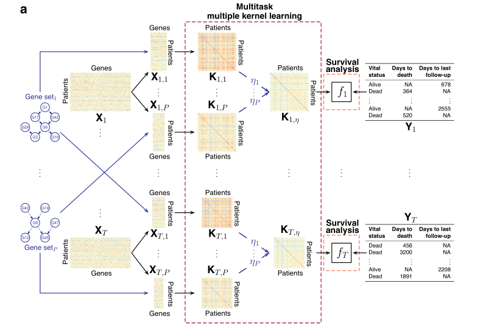

# 
论文1 A Multitask Multiple Kernel Learning Algorithm for Survival Analysis with Application to Cancer Biology
  

# 
多任务多核学习算法在癌症生物学中的应用
  

多核多任务学习，并不是深度学习，但是思想可以借鉴一下：  

  

# 
论文2 Learning to Detect Sepsis with a Multitask Gaussian Process RNN Classifier
  

# 
学习使用多任务高斯过程RNN分类器检测脓毒症
  

太难了看不懂  
# 
Nonparametric variable importance using an augmented neural network with multi-task learning
  

# 
使用具有多任务学习的增广神经网络的非参数变量重要性
  

在预测建模应用中，在解释结果的可变性时，确定特征子集的相对贡献通常是有意义的。将这个变量的重要性考虑为未知的底层数据生成机制的函数，而不是用于拟合数据的特定预测算法，这是很有用的。本文将这些非参数变量重要性的思想与机器学习联系起来，提出了一种利用神经网络建立预测模型时有效估计变量重要性的方法。展示了一个具有多任务学习的单扩张神经网络如何同时估计许多特征子集的重要性，改进了以前的估计重要性的方法。  
首先，这是第一个应用于神经网络的非参数变量重要性度量。其次，具有多任务学习的增广神经网络可以同时满足多个特征子集的变重要性要求。  
太难了看不懂  
# 
A Unified Architecture for Natural Language Processing:Deep Neural Networks with Multitask Learning
  

# 
自然语言处理的统一架构:具有多任务学习的深度神经网络
  

08年的论文  
灵感：利用无监督的数据来训练多任务？  
# 
Algorithms and Applications for Multitask Learning
  

# 
多任务学习的算法和应用
  

