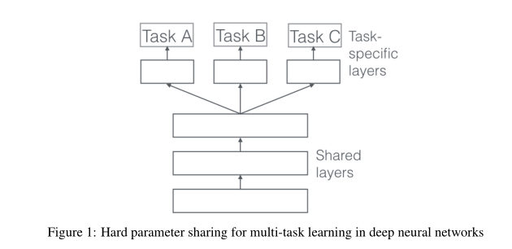
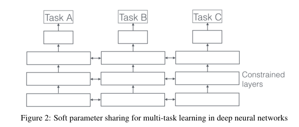
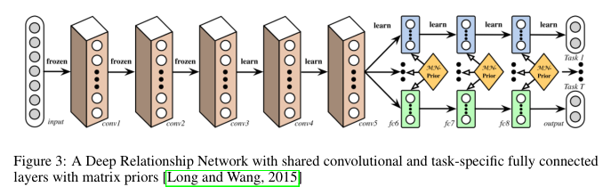
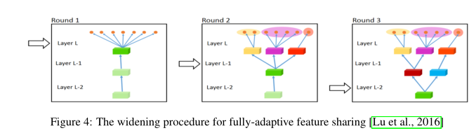
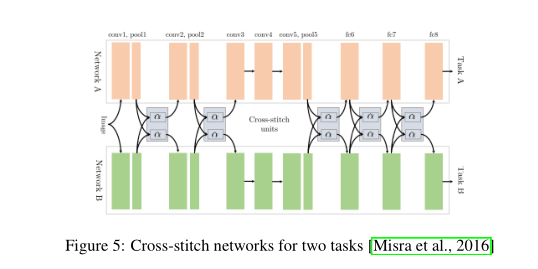
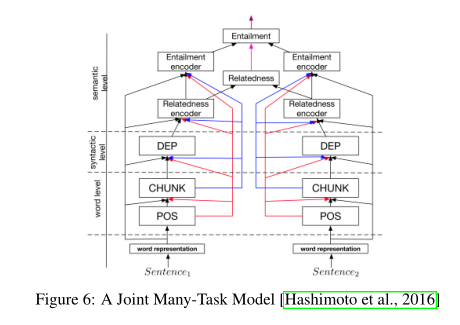
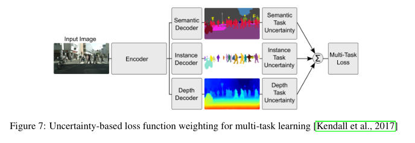
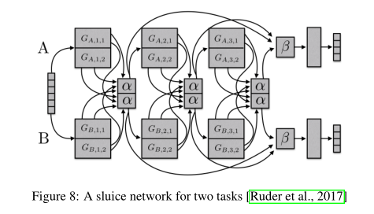

## 1 引言  
&emsp;&emsp;只要发现自己在优化多个损失函数，那么自己就是在做多任务学习  
&emsp;&emsp;多任务学习的目标：MTL improves generalization by leveraging the domain-specific information contained in the training signals of related tasks（MTL通过利用相关任务的训练信号中包含的特定于领域的信息来改进泛化）.  
## 2 动机  
&emsp;&emsp;我们可以从机器学习的角度来激励多任务学习:我们可以把多任务学习看作是一种归纳转移的形式。归纳转移可以通过引入归纳偏差来帮助改进模型，归纳偏差导致模型偏爱某些假设。例如，归纳偏差的一种常见形式是“l1正则化”，它导致对稀疏解的偏好。在MTL的情况下，归纳偏差由辅助任务提供，这使得模型更倾向于解释多个任务的假设。  
## 3 深度学习的两种多任务学习的方式  
### 硬参数共享  

  

### 软参数共享  

  

## 4 为什么MTL有效？  
### 4.1 隐式数据增加  
&emsp;&emsp;由于不同的任务具有不同的噪声模式，同时学习两个任务的模型能够学习更一般的表示。学习任务A有过度拟合A的风险，而共同学习A和B使模型通过平均得到更好的F表示  
### 4.2 感知聚焦  
&emsp;&emsp;如果任务非常嘈杂或者数据有限且高维，模型就很难区分相关和不相关的特征。MTL可以帮助模型将注意力集中在那些真正重要的特征上，因为其他任务将为这些特征的相关性或不相关性提供额外的证据。  
### 4.3 窃听机制  
&emsp;&emsp;有些特性G对于某些任务B很容易学习，而对于另一个任务A则很难学习。这可能是因为A以更复杂的方式与特征交互，或者是因为其他特性阻碍了模型学习G的能力。通过MTL，我们可以允许模型窃听，即通过任务B学习G。  
### 4.4 表示偏差  
&emsp;&emsp;MTL使模型偏向于其他任务也喜欢的表示形式。这也将有助于该模型推广到未来的新任务中，作为一个假设空间，如果训练任务的数量足够多，并且训练任务的学习能力也足够强，只要它们来自相同的环境。  
## 5 非深度学习中的MTL  
## 6 深度学习中的MTL  
### 6.1 深层关系网络（Deep Relationship Networks）  

  

&emsp;&emsp;它们将矩阵先验放在完全连接的层上，这使得模型能够学习任务之间的关系，类似于我们之前看到的一些贝叶斯模型。然而，这种方法仍然依赖于预先定义的共享结构，这种结构对于经过充分研究的计算机视觉问题可能是足够的，但是对于新任务却很容易出错。  
### 6.2 完全适应的特征共享（Fully-Adaptive Feature Sharing）  

  

&emsp;&emsp;从另一个极端开始，[Lu et al.， 2016]提出了一种自底向上的方法，该方法从一个瘦网络开始，在训练期间使用一个促进相似任务分组的标准动态地扩展它。图中可以看到动态创建分支的扩展过程。然而，贪心方法可能无法发现全局最优的模型，同时将每个分支分配给一个任务并不允许模型学习任务之间更复杂的交互。  
### 6.3 十字绣网络（Cross-stitch Networks）  

  

### 6.4 低监督性（Low supervision）  
&emsp;&emsp;相比之下，在自然语言处理(NLP)中，最近的工作主要是为多任务学习寻找更好的任务层次结构。

### 6.5 联合多任务模型（A Joint Many-Task Model）  

  

### 6.6 不确定性加权损失（Weighting losses with uncertainty）  

  

&emsp;&emsp;与其学习分享结构，[Kendall et al.， 2017]采用正交方法，考虑每个任务的不确定性。然后，在任务相关不确定性最大的高斯似然的基础上，通过推导一个多任务损失函数，调整每个任务在成本函数中的相对权重。它们用于逐像素深度回归、语义和实例分割的体系结构如图所示。  
### 6.7 MTL张量因子分解（Tensor factorisation for MTL）  
&emsp;&emsp;[Yang and Hospedales, 2017a]推广了之前讨论的一些矩阵分解方法，使用张量分解将模型参数分解为每个层的共享和特定于任务的参数。  
### 6.8 闸式网络（Sluice Networks）  

  

&emsp;&emsp;最后，我们提出了水闸网络[Ruder et al.， 2017]，该模型概括了基于深度学习的MTL方法，如硬参数共享和十字缝网络、块稀疏正则化方法，以及最近创建任务层次结构的NLP方法。如图所示，该模型允许了解应该共享哪些层和子空间，以及网络在哪些层了解了输入序列的最佳表示形式。  
### 6.9 模型共享  
&emsp;&emsp;与其限制模型将所有任务的知识压缩到相同的参数空间中，不如借鉴我们讨论过的MTL中的长处，使模型能够了解任务之间应该如何交互。  
## 7 寻找合适的辅助任务  
&emsp;&emsp;Related task、Adversarial、**Hints**、Focusing attention、Quantization smoothing、Predicting inputs、Using the future to predict the present、Representation learning。  
&emsp;&emsp;Hints:如前所述，MTL可用于学习仅使用原始任务可能不容易学习的特征。实现这一点的有效方法是使用提示，即将预测特征作为辅助任务。这种策略在自然语言处理上下文中的最新例子是[Yu and Jiang, 2016]预测一个输入句子中是否包含一个积极或消极的情绪词作为情绪分析的辅助任务，[Cheng et al.， 2015]预测句子中是否存在一个名字作为名字错误检测的辅助任务。  
&emsp;&emsp;最近的工作[Alonso and Plank, 2017]发现，对于NLP中的序列标注问题，使用紧凑统一的标签分布的辅助任务更为可取，我们在实验中也证实了这一点[Ruder et al.， 2017]。此外，研究发现，在主要任务与非平稳辅助任务快速稳定的情况下，更有可能取得进展。然而，迄今为止，这些实验的范围有限，最近的发现只是为深入理解神经网络中的多任务学习提供了第一个线索。  
## 8 结论  
&emsp;&emsp;虽然MTL的使用越来越频繁，但已有20年历史的硬参数共享模式仍然普遍适用于基于神经网络的MTL。然而，最近在学习分享什么的方面取得的进展是有希望的。同时，我们对任务的理解——它们的相似性、关系、层次结构和MTL的好处——仍然是有限的，我们需要更深入地研究它们，以便更好地理解MTL的泛化能力。
