# 摘要  
&emsp;&emsp;本文提出了一种非对称多任务特征学习**Deep-AMTFL**(Deep Asymmetric Multitask Feature Learning)。此方法可以**学习跨多个任务共享的深层表示**，同时有效防止了**在特征共享过程中的负迁移** 。本文还专门引入一个**非对称自编码术语**，该术语允许简单任务的可靠预测器对特征学习有很高的贡献，同时抑制了较困难任务的不可靠预测器的影响。这允许了学习低噪声的表示，并且使不可靠预测其经由共享潜在特征从可靠预测器中开发知识。这样的共享特征间的非对称的知识转移比任务间的非对称转移更具有伸缩性和效率。
# 1 引言  
&emsp;&emsp;首先说了解决**负迁移**问题是多任务学习中的一个重要挑战。负迁移指的是简单任务的准确预测器会被困难任务的不准确预测器消极地影响。  
&emsp;&emsp;然后说了本文准备diss的2016年的方法非对称多任务学习方法AMTL（Asymmetric Multi-task Learning），AMTL**通过任务间参数正则化，允许任务间的知识传递不对称**，来解决负迁移问题。AMTL将每个任务的任务参数强制表示为其他任务的参数的稀疏组合，从而生成一个决定任务间知识传输量的有向图。  
&emsp;&emsp;然后说了AMTL的三个缺点：  
&emsp;&emsp;&emsp;1.首先，在大多数情况下，任务表现出一定程度的关联性，但是 **任务的模型参数可能不能作为其他任务的参数的组合来重构，因为任务只是部分相关的** 。举了个斑马、老鼠、鬣狗的例子。  
&emsp;&emsp;&emsp;2.**任务很多时，不具有伸缩性，容易过拟合**。由于任务间知识转移图呈二次增长，AMTL不能很好地适应任务数量的增加，当任务数量较大时，如大规模分类时，AMTL会变得效率低下，容易过度拟合。虽然稀疏性可以帮助减少参数的数量，但它并不能减少问题的内在复杂性。  
&emsp;&emsp;&emsp;3.最后，任务间转移模型仅以学习到的模型参数及其关系图的形式存储知识。然而，有时，以显式表示的形式存储所学的知识可能是有益的，这种表示形式可用于以后的其他任务，如转移学习  
&emsp;&emsp;最重要的是AMTFL可以扩展到深度学习上去，这一点非常好。  
&emsp;&emsp;最后作者总结了下本文的三个贡献：  

- &emsp;&emsp;&emsp;提出了AMTFL，在任务间不存在因果关系而是具有相关性时表示更自然。  
- &emsp;&emsp;&emsp;将方法扩展到了深度学习中去。  
- &emsp;&emsp;&emsp;在转移学习场景中，我们利用学习的深度特征进行知识转移，这表明我们的模型学习的深度特征比基础深度网络更有用。  
# 2 相关工作  
&emsp;&emsp;把多任务学习、非对称多任务学习、自编码器历史讲了一遍，又提出了相关的问题。其中自编码器部分：本文提出了一种用于特征学习的稀疏非线性自编码器，其作用是使用稀疏非线性反馈链接从模型参数中重建潜在特征，来达到降噪的目的。本文的自编码器相似于07年的稀疏自编码器，因为其转换的潜在特征空间是稀疏的。  
&emsp;&emsp;本文的正则化矩阵与降噪自编码器相似，因为其目的与自编码器相似：通过自动编码形式对特征进行细化，使重构的潜在特征反映出更可靠预测器的丢失，从而获得更清晰的表示。  
# 3 AMTFL  
&emsp;&emsp;首先讲了多任务学习一般化的优化目标，如下：  

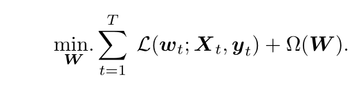
  

&emsp;&emsp;其中，t属于{1,2,...,T}个任务，数据集格式为：  

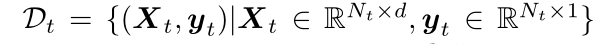
  

&emsp;&emsp;wt为R(d*1，d行1列)，W=[w1,w2,...,wT]，Ω强制执行关于跨任务共享属性的特定先验假设W。  
&emsp;&emsp;其次，讲了两种流行的假设，一种是假设任务间有相同的潜在基，W能够被分解为：W=LS，L(d*k，d行k列)为k个潜在基集合，S(k*T)是潜在基线性结合的稀疏矩阵。公式被改写成如下的形式：  

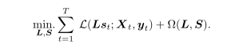
  

&emsp;&emsp;基于上一种假设，Go-MTL的目标函数为：  

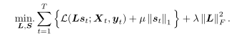
  

&emsp;&emsp;另一种假设就是本文diss的AMTL：不基于显式假设共享潜在基的探索任务关联性的方法。每个任务的参数被重构为其他参数的稀疏线性组合。  

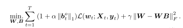
  

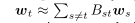
  

Btt=0，bt是Bt的第一行，bt(1*T，一行T列)控制从任务t到其他任务的输出量，α与L相乘使从困难任务发出的传输比那些简单任务更加稀疏。  
## 3.1 从任务到基的非对称转换  
&emsp;&emsp;首先diss了AMTL的两个缺点：1、有着严重的负迁移存在，因为每个任务（可靠预测或者不可靠预测）对潜在基的构造都有着相同的贡献度；2、其大量任务时的伸缩性不好，而且其未学到明确的特征。  
&emsp;&emsp;其次，分析了Go-MTL的目标函数中的负迁移是如何发生的。  

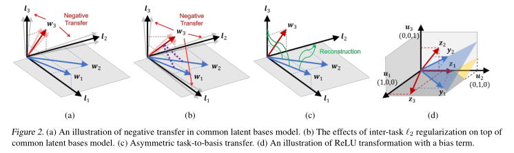
  

&emsp;&emsp;如图具有三个任务，任务参数由潜在基{l1,l2,l3}生成。w1由{l1,l3}生成，w2由{l1,l2}生成，w3由{l2,l3}生成。假设任务1、2是可靠的，而任务3是不可靠且有噪声，那么w3会将噪声转移给{l2,l3}，最终消极的影响w1和w2。  
&emsp;&emsp;然后该论文提出了一个假设解决的方案，简单的将go-mtl和amtl相结合，其目标函数如下：  

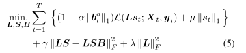
  

&emsp;&emsp;之后论证了该方法不可行：w3由w1和w2通过B进行线性组合而来，**进而可以影响l1**（？？？？没搞懂），l1最终会被污染，进而影响可靠模型。  
&emsp;&emsp;然后作者说他们提出了一种可以防止从任务预测器到潜在特征的负迁移的新的正则化方法，称之为非对称任务到基的转换。上图c，潜在特征仅由可靠预测其的参数重构。同时因为预测器的参数是从潜在特征重构而来，因此将这种正则化方法称为自编码器。  
## 3.2 非线性特征重构  
&emsp;&emsp;首先，作者说有两个问题需要解决：1、重构需要用非线性的方式，给出的理由是*in Figure 2(c).In this case, the linear span of {w1 ,w2 } does not cover any of {l1,l2,l3}.* **没看懂**  ；2、重建需要在特征空间完成，而不是参数的基，因为需要将方法直接运用到深度神经网络当中。  
&emsp;&emsp;L和S分别为第一层第二层的参数，隐藏层的非线性用ReLU表示，Z=ReLU(XL)，AMTFL公式如下：  

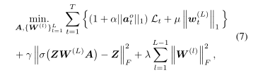
  

&emsp;&emsp;deep_AMTFL公式如下：  

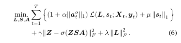
  

&emsp;&emsp;其中z（表示L-1层的隐藏表示）和loss如下：  

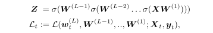
  

&emsp;&emsp;最后讲了讲损失函数，选择常用的即可。  

# 4 实验  
&emsp;&emsp;实验部分对浅层和深层AMTFL分别做了实验。浅层实验：一个人造数据集，去除AMTFL表层的ReLu，因为特征是线性的。比较了几个算法的bases、tasks、然后使用了真实数据集进行比较，深层实验类似。最后对实验结果进行了定量分析（Quantitative evaluation）和定性分析（Quanlitative analysis）。  
# 5 总结  
&emsp;&emsp;巴拉巴拉  
# 6 理解  
**无T_T**