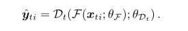
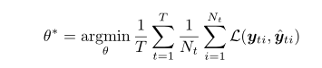
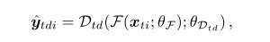
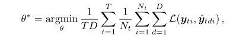
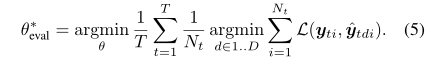
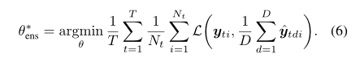
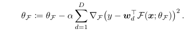
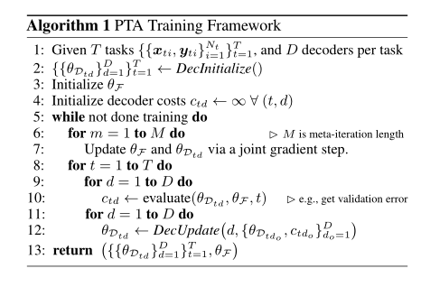

# 伪任务增强  
## 用多个任务模拟单一任务  
### PTA的代价很明显就是时间代价，而且不稳定 

&emsp;&emsp;这篇论文主要工作是从理论上证明了多伪任务训练动力学是如何严格地分解单训练的，并在实践中引入了一类控制伪任务的算法。但是感觉不靠谱啊  
#### 暂时放过  
&emsp;&emsp;10/10/2019 2:34:39 PM  
# 摘要  
&emsp;&emsp;伪任务增强模拟了在同一领域相关的多个任务的效果。伪任务对单任务性能提升有帮助，与多任务学习有互补效果。  
# 1 引言  
&emsp;&emsp;多任务学习在CV、NLP、speech等方面都有广泛应用。此论文将deep MLTL的思想运用到STL上面去，称为PTA，单个任务具有多个不同的解码器，将共享结构映射到输出预测当中。这篇文章从理论上证明了多伪任务训练动力学是如何严格地分解单训练的，并在实践中引入了一类控制伪任务的算法。  
# 2 训练多深度模型  
&emsp;&emsp;此文将利用多深度模型的协同效应的方法分为三类：为多个任务协同训练一个模型；为一个任务分别训练多个模型；为一个任务协同训练多个模型。  
## 2.1  为多个任务协同训练一个模型  
&emsp;&emsp;老生常谈，将Caruana的模型归结为如下公式：  

  

&emsp;&emsp;F为潜在的所有任务共享的模型，Dt为任务专用解码器。  
&emsp;&emsp;最大化整体性能，即为找到最优参数θ如下：  

  

## 2.2 为STL分别训练多个模型  
## 2.3 为一个任务协同训练多个模型  
# 3 PTA  
## 3.1 经典方法  
&emsp;&emsp;公式如下：  

  

  

&emsp;&emsp;本文指出了一种观点：**在衡量模型性能的时候，最重要的不是平均解码器，而是最好性能的解码器。感觉这里想表达什么**。  

  

&emsp;&emsp;平均法用来训练，因为其更平滑，最优解码器用来验证。  
&emsp;&emsp;下面这个公式与训练单个解码器具有相同的效果，因此不推荐。  

  

## 3.2 伪任务  
&emsp;&emsp;每一个伪任务定义如下：  

  

#### 定义一  
&emsp;&emsp;一组伪任务S1在F上模拟另一个S2，如果对于所有F，用S1训练时对F的梯度更新等于用S2训练时对F的梯度更新。  
#### 定理一  
&emsp;&emsp;增强训练动力：存在可微函数F和单个任务的伪任务集无法被该任务的单个伪任务模拟，即使所有解码器都是线性的。  
&emsp;&emsp;本文最大贡献感觉就是证明了这一点  
&emsp;&emsp;θF更新过程如下：  

  

## 3.3 控制多个伪任务轨迹  
&emsp;&emsp;给出算法流程图如下：  

  

&emsp;&emsp;可以看到，里面的DecInitialize()和DecUpdate()没有给出，这就是这篇文章第二个贡献，提出了三种DecInitialize()（IFD）方法，三种DecUpdate()（PHG）方法，并对其组合做了实验，查看研究效果。  
# 4 实验  
# 5 讨论及展望  
# 6 总结  
# 感受  
&emsp;&emsp;可以与MMoE方法结合起来思考。  
