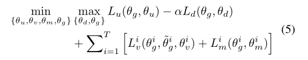

&emsp;&emsp;本文主要还是一种新的网络结构  
# 摘要  
&emsp;&emsp;此文提出了一种深度多任务模型TACO（a deep multi-Task learning model based on Adversarial-and-COoperative nets），基于**对抗和合作**模式。TACO采取了一种**分离-结合**的方式利用分解的多视角信息，其在多任务学习和半监督领域适应方面都优于现有基准。  
# 1 引言  
&emsp;&emsp;没什么可说的，就说了一下领域转移的问题，TACO的优点以及本文的贡献。  
# 2 相关工作  
&emsp;&emsp;大多数领域对抗性方法仅依靠对抗性训练来学习任务不变知识。相比之下，TACO以一种反向协作的方式解耦了任务通用特性和任务特定特性，并利用它们的互补关系来促进任务之间的细粒度知识共享。  
# 3 TACO方法  
## 3.1 模型  

  

&emsp;&emsp;Gi和Gj：分别是任务i和任务j的特征提取器，1<=i,j<=T  
&emsp;&emsp;u：代表共同特征（common features），v代表任务专有特征（task-specific features）  
&emsp;&emsp;有三种分类器：Cu为任务公有分类器；Cv为任务专有分类器；Cm为人物内分类器  
&emsp;&emsp;D：为域鉴别器  
&emsp;&emsp;H：路由器（router）  
&emsp;&emsp;TACO由5个游戏玩家组成：三个分类器加上特征提取器和域鉴别器  
&emsp;&emsp;θg,θd,θu,θv,θm分别为G、D、Cu、Cv、Cm的学习参数；L加下标分别为其损失函数。  
&emsp;&emsp;在学习任务公有特征的时候，使用领域对抗方法：需要一个最大化域鉴别器的损失的特征提取器的参数θg，同时需要一个域鉴别器参数损失最小化的θd，同时需要最小化任务公有分类器的分类损失，最终的最小博弈如下：  

  

&emsp;&emsp;学习任务专有特征时，使用分类器对抗方法：对每一个任务，鼓励其最小化其损失，同时最大化其他任务的损失。博弈游戏如下：  

  

&emsp;&emsp;所有任务的任务专有对抗损失如下：  

  

&emsp;&emsp;利用解耦的知识进一步提高模型识别能力，使用任务内分类器最小化其损失。  

  

&emsp;&emsp;采用经典集成方法将三种分类器结合起来，最终预测结果由其投票决定，如果互不同意，由置信度最高的预测决定。  

  

## 3.2 网络结构  
&emsp;&emsp;以CNN为基础的TACO如下：  

  

&emsp;&emsp;其中，需要注意的是R为梯度反转层，H为路由层。H有T个迭代周期，第一次正常N（正常反向传播），后T-1个迭代周期为R（反向传播时梯度反向）。具体算法过程如下。在t1时刻更新特征提取器的参数θg如下：  

  

&emsp;&emsp;在后面的时刻，更新参数如下（j=(i+k-1)%T）：  

  

&emsp;&emsp;最终算法流程图如下：  

  

&emsp;&emsp;Caffe、mini-batch、学习速率衰减  
# 4 实验  
&emsp;&emsp;其在多任务学习和半监督领域自适应都做了实验。  
&emsp;&emsp;作者一直在强调一点：尊重其区别结构的情况下学习特征公有和专有特征。  
