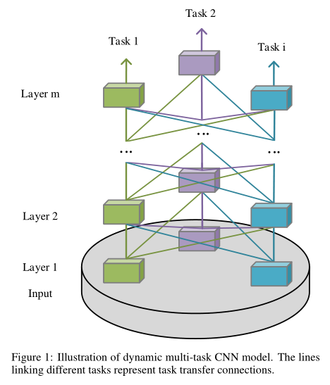
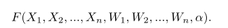
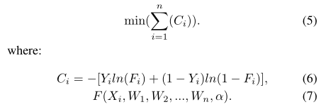
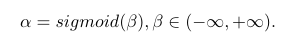
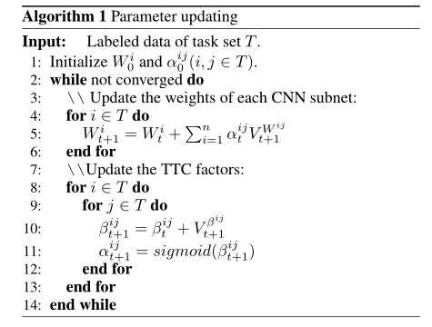
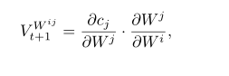
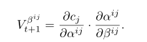
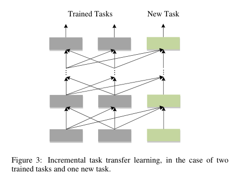

# 
Dynamic Multi-Task Learning with Convolutional Neural Network
  

# 摘要  
此文提出了一种动态的多任务CNN学习网络结构，在任务层中间加入任务传输连接Task Transfer Connection(TTC)  
# 1 引言  
预分组有可能有坏影响，且实际应用中几乎不存在。本文的DMT CNN如下图所示：  

  

# 2 动机  
恰当的任务分组使多任务学习有良好的效果，不恰当的任务分组没什么效果。  
# 3 DMT CNN模型  
任务传输连接(TTC)是一种基于梯度下降算法的动态学习方法，当αij相同时，变为传统的多任务CNN模型；当αij分组（i=j）为1个时，退化为多个单任务学习。  
DMT CNN表示如下：  

  

其优化目标如下：  

  

为了使α在0-1之间，加入辅助变量β和sigmoid如下：  

  

传统CNN模型的参数更新如下：  

  

DMT CNN模型更新如下：  

  

其中，Wi(t+1)是任务i在t+1轮的更新权重。αijt是wit对任务j的相关TTC因子，表示任务j的监督信号对i的影响。两个V是Wi和β的更新值：  

  

  

为了保持来自子网自身信息的主导地位，来自其他子网的监控信号将会减弱。因此,αijt设置为1,当i=j。为了减轻波动，使用了批量归一化。  

DMT CNN可以动态的添加任务，而已训练任务的参数保持固定。  

  

# 4 实验  
对比试验也只是和MT作比较。  
# 5 总结  
水文，不过我喜欢  
