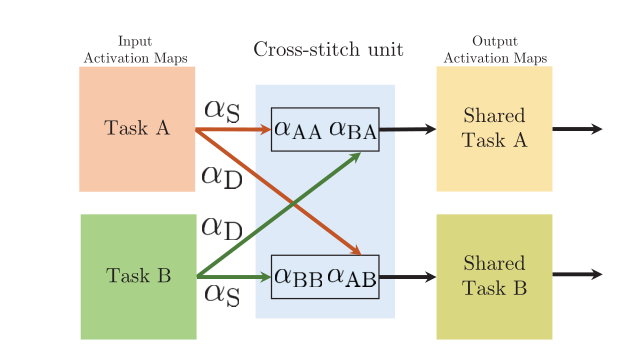
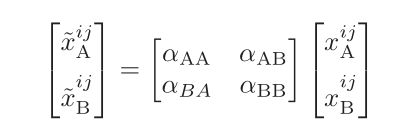
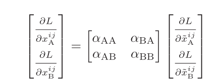
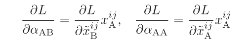
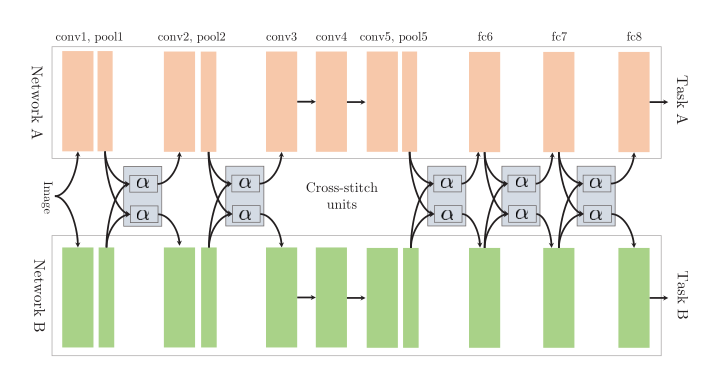

# 
Cross-stitch Networks for Multi-task Learning
  

# 摘要  
提出了十字绣单元，可以进行端到端的训练并且可以在多个任务之间进行泛化，训练样例很少的情况下，也有较好的效果。  
# 1 引言  
老论文，还在讨论如何为多任务深度学习选择适当的ConvNet网络结构。  
## 1.1 多任务共享 实证研究  
就是做了一个深层卷积网络，在不同的层切分开成为不同任务专有的层，以此来做实验。  
# 2 相关工作  
谈了谈网络和数据集  
# 3 十字绣网络  
十字绣网络尝试通过线性结合为多任务ConvNets寻找最优的共享表示，其做的实验都是：任务使用的输入是相同的单一输入。  
## 3.1 分离架构  
## 3.2 统一分离架构  
使用这种分离架构太繁琐了，要实验在哪一层进行分割，哪一层共享，因此提出的十字绣单元统一了这种结构，以一种简单的方式来学习任务专有及共享表示。  
## 3.3 十字绣网络单元  
其结构如下：  

  

激活图计算公式如下：  

  

通过十字绣反向传播的计算公式如下：  

  

L对参数α的偏导计算如下：  

  

特别地，将αAB和αBA称为αD：不同任务的值，因为他们衡量不同任务的激活值。将αAA、αBB称为αS。通过改变D和S的值，可以很轻易的改变任务共享及专有表示。  
# 4 十字绣的设计决策  
设计了一系列烧灼实验，研究该如何设计学习率和网络初始化。其中，学习率一般设置为[0,1]，网络初始化既可以分别训练初始化，也可以设置成相同的初始化然后同时训练他们。两个任务的网络结构如下：  

  

# 5 消融分析  
发现上图的结构只在池化层后面加上十字绣单元效果更好。发现学习率在设置αS和αD为(0.9,0.1)为最好。发现不同的任务在单独初始化之后再使用十字绣网络的效果更好。  
# 6 实验  
表明我们提出的十字绣方法通过学习共享表示为数据匮乏的任务提供了显著的收益  
# 7 总结  
感觉就是缺乏理论证明，效果虽然非常好。  
