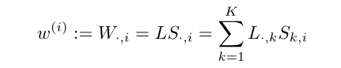

# 
深度多任务表示学习：一种张量分解方法
  

## 摘要  
线性模型对于DMTL来说是肤浅的，本文方法在网络的每一层学习任务间共享结构。方法是基于矩阵分解技术。  
## 1 引言  
提供了一种端到端的多任务学习方法。  
同构任务：每个任务对应一个输出；异构任务：每个任务对应一组唯一的输出。  
## 2 相关工作  
多任务学习的很多方法是在W上添加不同的约束。  
本文的张量因式分解包括对卷积核、全连接层权重等堆叠起来的参数的分解。  
异构的MTL，其中任务可能有不同数量的输出。  
动态DNN参数生成。  
## 3 研究方法  
### 3.1 前述  
讲述了张量定义及点积。讲了矩阵-基的知识共享，将此扩展到了多个输出上,单一输出和多输出如下：  

  

  

但是这种张量分解对于任务內输出间的共享没有帮助。也就是说单任务多输出的多任务模型是本文的重点。为了能够使张量分解在任务內输出间共享知识，本文使用了Tucker分解和Tensor Train张量分解。  
### 3.2 知识共享的矩阵分解  
Tucker分解如下：  
给定N-way张量D1×D2...×DN，Tucker分解输出一个核心张量S为K1×K2...×KN，以及N个大小为Dn×Kn的矩阵U(n)  

  

TT分解如下：  
TT分解输出2个矩阵U(1)和U(N)，尺寸分别为D1×K1和KN−1×DN。以及(N-2) 3-way张量U(n)，大小为Kn−1×Dn×Kn  

  

### 3.3 深度多任务表示学习  
每个任务，使用相同的结构学习。每个对应层的权重由权值共享结构的分解公式得到。在FC层后向传播过程，模型不直接学习3-way张量W，而是学习Tucker方法的S,U1,U2,U3TT方法的U1,U2,U3除了FC层，当前的DNN也挖掘卷积层。卷积层包含核滤波器参数，也是3-way张量H×W×CH×W×C，或4-way张量H×W×C×M。  
## 实验  
按照以下步骤初始化模型，设置张量的rank：  
首先以单任务学习方式训练DNN。然后逐层打包参数，作为张量分解的输入。在SVD应用之后，对相关的误差设置阈值，SVD获得合适的rank。因此，方法仅需要一个超参数，即最大重建误差，用以表示每一层的rank。共享只针对权值矩阵，偏置矩阵不共享。  
