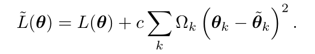
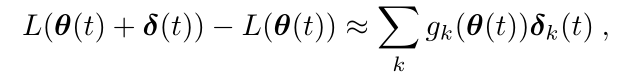
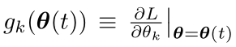
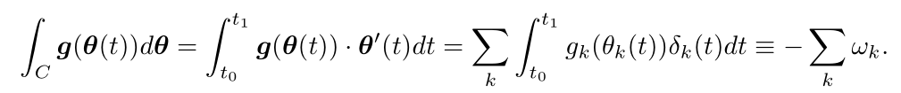
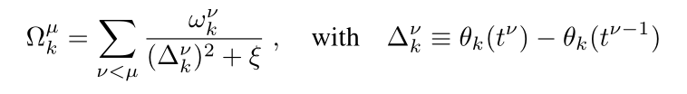

# 
Intelligent synapses for multi-task and tranfer learning
  

## 摘要  
此文迈出了将这种生物复杂性引入人工神经网络的第一步。引进了能够随时间积累信息的智能突触，并利用这一信息有效地保护旧的记忆在学习新问题时不被覆盖。将该框架应用于相关分类问题的序列学习，结果表明，该方法在保持计算效率的同时，显著降低了灾难性遗忘。  
## 1 引言  
在生物学习和机器学习中，持续学习的主要困难之一是获得解决新任务所需的知识，而不忘记在以前的任务中学到的知识。在这项工作中采用的方法是结构正则化，它将数据无关的惩罚添加到模型的参数中。研究灾难性遗忘的结构性方法可能比功能性方法更有效，因为它们不依赖于要评估的数据。  
## 2 智能突触  
我们的方法的核心是假设对于解决之前的任务很重要的突触不应该被改变，而不重要的突触可以被改变。考虑到作为每个突触k的重要性Ωk，添加一个正则化项的损失L(θ),处罚突触强度的变化相对于基线θk的重要性成正比:  

  

转向了一个局部重要性度量，该度量为每个突触在全局目标中的改进分配信用。对于参数空间的微小变化，可以用线性近似来表示目标的改善:  

  

其中：  

  

具有大梯度和经历大变化的突触对减少损失贡献最大，而具有小梯度和/或小变化的突触贡献较小。每个梯度的重要性的总和，可以写成梯度场上的路径积分：  

  

实际中计算突出重要性：  

  

本文提出的方法在本质上类似于弹性权重固结(elastic weight consolidation, EWC) (Kirkpatrick et al.， 2016)，因为正则化的形式是相同的，重要参数被更强地拉向其参考权重。然而，与EWC不同的是，此方法可以在训练过程中以最小的开销在线计算，因为它只依赖于梯度和更新的产品的运行总和。EWC依赖于Fisher信息来识别每个任务在学习参数后的一个独立阶段中必须计算的每个权重的重要性。在高维输出空间中，计算Fisher代价也很高，因为它需要对模型输出的样本的期望。  

## 3 结论  
看不懂  
