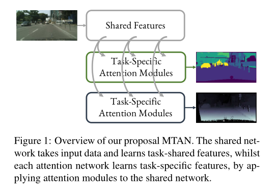
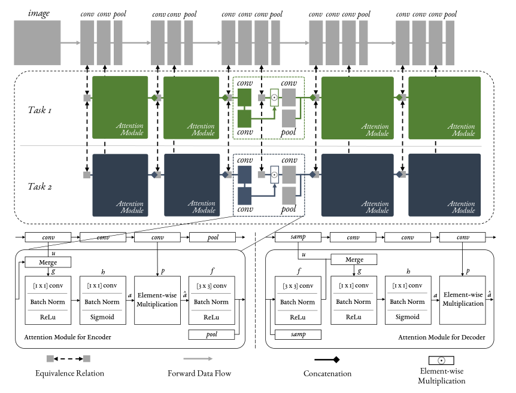
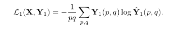
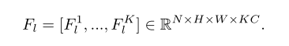
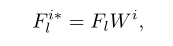
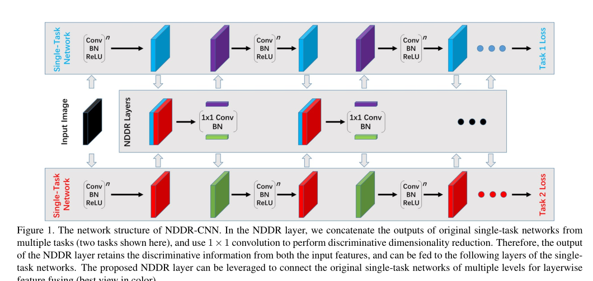
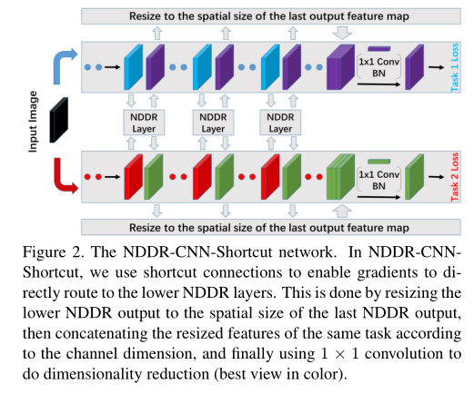
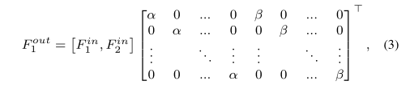

# End-to-End Multi-Task Learning with Attention  
## 摘要  
名字叫做多任务注意力网络。MTAN可以用在所有前馈网络。  
## 1 引言  
本文的多任务注意两点：网络结构（如何共享）和损失函数（如何平衡任务），其中大多数MTL算法只关注其中一点。MTAN与其他最新方法相比，具有竞争力，而不是超过，因为其具有更少的参数，可以更好的适应任务个数。  

  

## 2 相关任务  
**BatchNorm在使用注意力后是否应该使用**  
## 3 多任务注意力网络  
网络结构就是一个共享网络加K个特定于任务的注意力网络。注意力网络通过权重从共享网络里学习特定于任务的特征，共享网络又从所有特征中学习全球池化特征。  

  

还一个创新点是损失函数使用的是基于像素的（以任务不同而不同）  

  

## 总结  
这篇文章实验做得很充分  

# NDDR-CNN: Layerwise Feature Fusing in Multi-Task CNNs by Neural Discriminative Dimensionality Reduction  
## 摘要  
所谓的判别性降维，就是将如下K个任务、C个通道的特征连接起来：  

  

然后通过一个转换矩阵进行如下转换：  

  

W∈ KC×M，一般情况下M=C，为了满足于后面的CNN层。判别性降维就是W的做法：W变为C × 1 × 1 ×KC的步长为1的一维卷积，然后对W施加约束，具体做法是：在输入特征上使用批量归一化，在W上使用l2权重衰减。  

  

为了防止梯度在较低的层当中消失，因此使用了NDDR-短接方式，如下图，将多个NDDR层输出直接在最后堆叠然后改变：  

  

本篇文章还讨论了NDDR层初始化的问题，提出了一种对角初始化的方法：  

  

α和β的初始化如果为0，相当于单任务  

## 总结  
这和之前的多任务思路不太一样，每个任务有属于自己的层，且所有任务不共享任何层，而是通过为每个任务设置一个矩阵来学习从其他层中学到的东西。  
