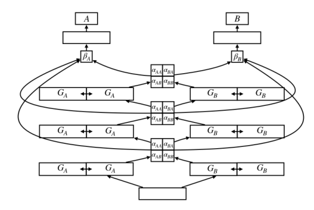
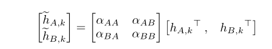
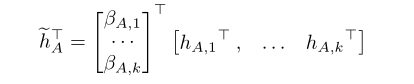
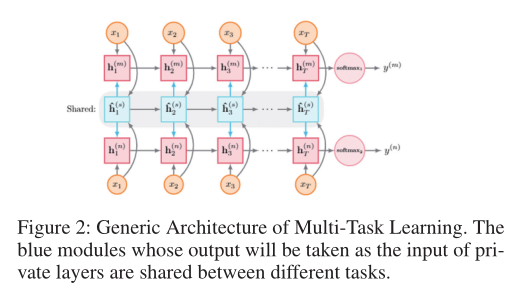
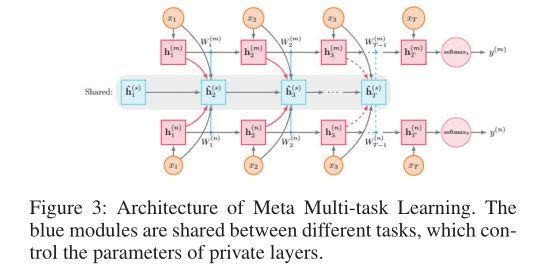
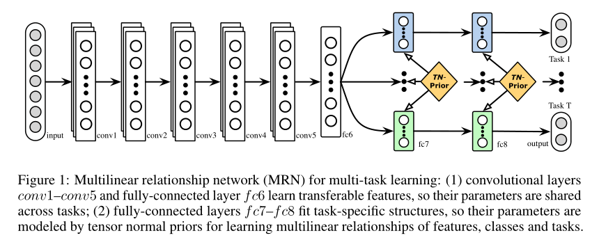
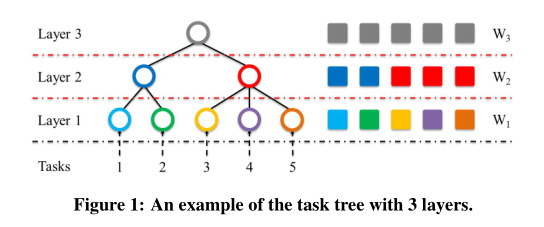

# 潜在的多任务架构学习  
## 摘要  
略  
## 引言  
(a)在深度递归神经网络之间共享哪些层；(b)这些层的哪些部分共享，以及以什么强度共享；(c)架构外层的跳跃连接混合模型  
## 多任务架构学习  

  

如图，一个闸式单元包含如下：共享底层、任务特定层、三个隐层。每个隐层表示为**两个强制正交的子空间**G。A是主任务，B是辅任务。α控制主辅任务间共享哪些子空间，β控制哪些层的输出用于预测。  
###矩阵正则化  
**这一点很重要感觉，可以学习下**  
现在我们解释更新α参数如何导致不同的矩阵正则化器。每个矩阵W包含M行，其中M是任务数。每行的长度为D，模型参数为D。子向量L m，k对应于第k层的网络m的参数。每一层由两个具有参数G m，k，1和G m，k，2的子空间组成。我们的元架构部分是由于以下观察的结果：对于松散相关的任务，如果只共享特定层中的某些功能，而许多层和子空间仍保持特定于任务的状态，则通常是有益的（Søgaard和Goldberg，2016年）。我们想在为不同任务归纳模型时学习共享的内容。为简单起见，我们首先忽略子空间，仅假设两个任务A和B。任务A和B的时间步t的第k层的输出h A，k，t和h B，k，t分别通过α参数交互（请参见图1）。为简单起见，省略t，其中αh层的输出为e h A，k是馈送到任务A的k + 1层的输出的线性组合。 a>，b>？表示将两个向量a，b R D堆叠到矩阵M R 2 D。子空间（Virtanen，Klami和Kaski，2011； Bousmalis等，2016）应该允许模型专注于参数空间不同部分的特定于任务和共享的特征。扩展α层以包含子空间，对于2个任务和2个子空间，我们获得一个α矩阵R 4 4，它不仅控制两个任务的层之间的相互作用，而且还控制它们的子空间之间的相互作用自然，我们还可以添加显式归纳法通过部分限制正则化器或增加学习的惩罚来偏向水闸网络。受共享空间成分分析工作的启发（Salzmann等人，2010年），我们增加了一项惩罚，以强制分工并阻止共享子空间和特定于任务的子空间之间的冗余。虽然网络可以从理论上学习到这种分离，但是明确的约束从经验上可以得出更好的结果，并使水闸网络可以更好地利用特定于子空间的α值。我们在每个模型的层级子空间之间引入正交约束（Bousmalis et al.2016）：= PM m = 1 PK k = 1 kG m，k，1> G m，k，2 k 2 F，其中M是任务数，K是层数，k·k 2 F是平方的Frobenius范数，G m，k，1和G m，k，2分别是第k个子空间中的第一和第二子空间第m个任务模型的层许多任务形成了从低级到更复杂的任务的隐式层次结构，在低级任务和部分复杂任务之间具有直观的协同作用。与其对这种结构进行硬编码（Søgaard和Goldberg，2016年; Hashimoto等人，2017年），如果使学习有益的话，我们可以通过将不同任务与不同层相关联来使我们的模型学习层次关系。受残差学习进展的启发（He et al.2016），我们采用了每层的跳过连接，并使用β参数进行控制。该层充当混合模型，返回专家预测的混合  

  

  

前面都些什么玩意，下面这个图看懂了，跳过连接就是把所有的层在最后进行连接，而不是层层传递  

  

复杂度降低  
## 作为水闸网络实例的前期工作  
本文将很多前边的工作说成是水闸网络的实例，十字绣、低监督等。  
# Meta Multi-Task Learning for Sequence Modeling  
Meta-LSTM  
可用于迁移学习  
不需要多说什么，直接看下面两张图就一目了然了，有一个特点：本文说Meta-LSTM可以用于单任务  

  

  

# Learning Multiple Tasks with Multilinear Relationship Networks  

  

# Learning Tree Structure in Multi-Task Learning  

  

可以看到上面这两篇就是之前综述里面的两个模型  